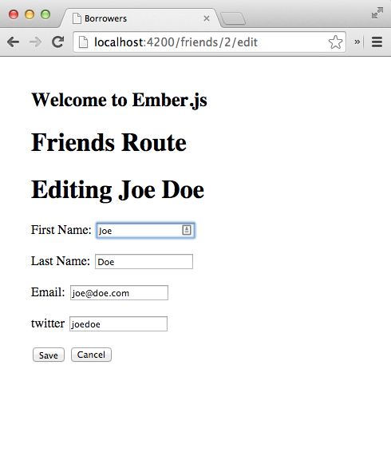
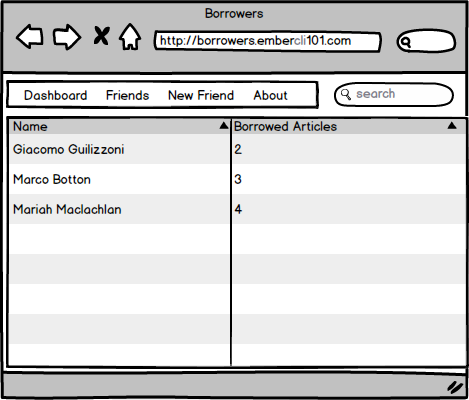
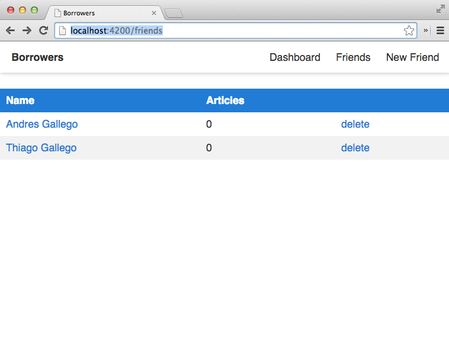
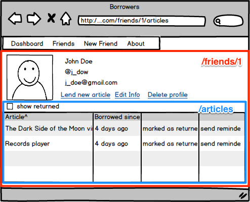
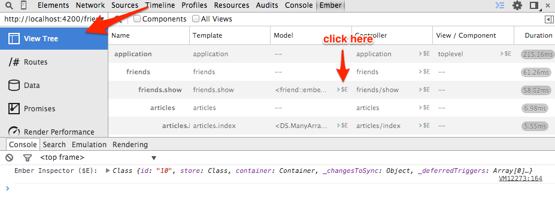
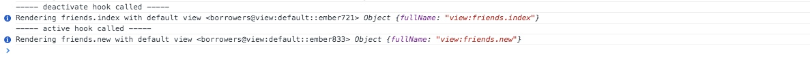

# Hands-on
In the following sections we will add some models to our app, define the interactions between them and create an interface to add friends and articles that they borrow from us.

## Adding a friend resource
The main model of our application will be called **Friend**, it represents the people who will be borrowing articles from us.

Let's add it with the **resource** generator.

~~~~~~~~
$ ember generate resource friends firstName:string lastName:string  \
       email:string twitter:string totalArticles:number
  create app/models/friend.js
  create tests/unit/models/friend-test.js
  create app/routes/friend.js
  create app/templates/friend.hbs
  create tests/unit/routes/friend-test.js
~~~~~~~~

If we open **app/models/friend.js** or **app/routes/friend.js** we
will see that they have a similar structure.

~~~~~~~~
import  Foo from 'foo';

export default Foo.extend({
});
~~~~~~~~

What is that? **ES6 Modules**!  As mentioned previously **ember-cli**
expects you to write your code using ES6 Modules,  **import Foo from
'foo'** is consuming the default export from the package **foo** and
assigning it to the variable **Foo**. **export default Foo.extend...**
is how we define what our module is going to expose, in this case we
are exporting a single value which will be a subclass of **Foo**.

T> For a better understanding of ES6 modules visit [ http://jsmodules.io/](http://jsmodules.io)

Now let's look at the model and route.

**app/models/friend.js**:

~~~~~~~~
// We are importing the default value from ember-data into the variable DS.
//
// Ember-Data exports by default a namespace (known as DS) which exposes all the
// classes and functions defined in http://emberjs.com/api/data.
//

import DS from 'ember-data';

// Define the default export for this model which will be a subclass of DS.Model.
// After this class has been defined we can export this subclass doing:
// import Friend from 'borrowers/models/friend'
//
// We can also use relative imports so if we were in other model we
// could have written
// import Friend from './friend';
//

export default DS.Model.extend({

  // DS.attr is the standard way of defining attributes with Ember-Data
  firstName: DS.attr('string'),

  // Defines an attribute called lastName of type **string**
  lastName: DS.attr('string'),

  // Ember-Data expects the attribute **email** on your friend's payload
  email: DS.attr('string'),

  twitter: DS.attr('string'),
  totalArticles: DS.attr('number')
});
~~~~~~~~

**app/routes/friend.js**:

~~~~~~~~
// Assigns the default export from **ember** into the variable Ember.
//
// The default export for the ember package is a namespace which
// contains all the classed and functions for Ember, specified in
// http://emberjs.com/api/
//
import Ember from 'ember';

// Defines the default export for this module, for now we are not
// adding anything extra // but if we want to use a Route **hook** or
// **actions** this would be the place.
//
export default Ember.Route.extend({
});
~~~~~~~~

In a future version of **Ember** we might be able to be more explicit
about the things we want to use from every module, so instead of
writing **import Ember from 'ember'** we could have **import { Route }
from 'ember'** or **import { Model } from 'ember-data'**. This is
currently possible in **ES6** using [Named Imports and Exports](http://jsmodules.io)

What about tests? If you open the tests files you will see that they are also written in ES6, we'll talk about it in a different chapter. Now let's connect to a backend and display some data.

## Connecting with a Backend
We need to consume and store our data from somewhere, in this case, I created a public API under **http://api.ember-cli-101.com** with **Ruby on Rails**. The following are the API end-points.

|Verb   | URI Pattern          |
|-------|----------------------|
|GET    | /api/articles        |
|POST   | /api/articles        |
|GET    | /api/articles/:id    |
|PATCH  | /api/articles/:id    |
|PUT    | /api/articles/:id    |
|DELETE | /api/articles/:id    |
|GET    | /api/friends         |
|POST   | /api/friends         |
|GET    | /api/friends/:id     |
|PATCH  | /api/friends/:id     |
|PUT    | /api/friends/:id     |
|DELETE | /api/friends/:id     |

If we do a **GET** request to **/api/friends** we will get a list of all our friends

~~~~~~~~
# The following output might be different for every run since the data
# in the API is changing constantly.
#
$ curl http://api.ember-cli-101.com/api/friends.json | python -m json.tool
{
    "friends": [
        {
            "email": "test@gmail.com",
            "first_name": "jon",
            "id": 1,
            "last_name": "snow",
            "twitter": "foo"
        }
    ]
}
~~~~~~~~

T> Piping JSON data to **python -mjson.tool** is an easy way to pretty
print JSON data in your console using python's JSON library. It's very
useful if we want to quickly debug JSON data.

When returning a list **Ember-Data** expects the root of your payload to be the type of your model on plural **friends**, and then an array of objects, this payload will help us to populate **Ember-Data** store.

If we want to run the server by ourselves or create our own instance
on **Heroku**, we can use the **Heroku Button** added to the repository
[borrowers-backend](https://github.com/abuiles/borrowers-backend).

Once we have created our own instance on **Heroku**, we need to install
[Heroku Toolbet](https://toolbelt.heroku.com/) and check our
application's log with **heroku logs -t --app my-app-name**.

## A word on Adapters

By default Ember-Data uses the **DS.RESTAdapter**[^restAdapter] which
expects everything to be in **camelCase** following **JavaScript**'s
coding conventions but in our example we will be working with an API
written in **Ruby on Rails** which users a different conventions for
keys and naming, everything is in **snake_case**.

We mentioned previously that everything has to be in **camelCase**
since it is what the default **Ember-Data** adapter expects but we are
allowed to extend the **DS.RESTAdapter** to write our own ones, matching
our backend's payload.

This is such a common scenario that **Ember-Data** includes by default
a **DS.ActiveModelAdapter**[^activeModelAdapter] which is modeled after
**rails-api**'s project [active_model_serializers](https://github.com/rails-api/active_model_serializers),
it is widely used in the **Ruby on Rails** world and basically helps
building the **JSON** which the API will be returning

T> Check the implementation of **DS.ActiveModelAdapter** [https://github.com/emberjs/data/blob/master/packages/activemodel-adapter/lib/system/active_model_adapter.js#L105](https://github.com/emberjs/data/blob/master/packages/activemodel-adapter/lib/system/active_model_adapter.js#L105) is just a few lines of code and helps you understand what's going on under the hood.

There are a bunch of different adapters for different projects and frameworks, some examples are:

- [ember-data-django-rest-adapter](https://github.com/toranb/ember-data-django-rest-adapter)
- [ember-data-tastypie-adapter](https://github.com/escalant3/ember-data-tastypie-adapter)
- [emberfire: FireBase adapter](https://github.com/firebase/emberfire)

We can see a longer list of adapter searching on GitHub for [ember-data adapters](https://github.com/search?q=ember-data+adapter&ref=opensearch).

[^restAdapter]: I recommend going through the documentation to get more insights on this adapter [DS.RESTAdapter](http://emberjs.com/api/data/classes/DS.RESTAdapter.html)
[^activeModelAdapter]: Documentation for [DS.ActiveModelAdapter.html](http://emberjs.com/api/data/classes/DS.ActiveModelAdapter.html)

#### Specifying our own adapter

As mentioned in the previous chapter if you are using **Ember-Data** it will **resolve** to the **DS.RESTAdapter** unless we specify something else.

To see it in action let's play with the console and examine how **Ember** tries to **resolve** things.

First go to **config/environment.js** and uncomment **ENV.APP.LOG_RESOLVER**[^uncomment-resolver] it should look like:

~~~~~~~~
  if (environment === 'development') {
    ENV.APP.LOG_RESOLVER = true;
    ENV.APP.LOG_ACTIVE_GENERATION = true;
    // ENV.APP.LOG_TRANSITIONS = true;
    // ENV.APP.LOG_TRANSITIONS_INTERNAL = true;
    ENV.APP.LOG_VIEW_LOOKUPS = true;
  }
~~~~~~~~

That line will log to the browser's console whatever **Ember** is trying to "find". Stop your **ember server** and start it again, then go to [http://localhost:4200](http://localhost:4200), click refresh and open the console, you will see

~~~~~~~~
[ ] router:main .............. borrowers/main/router
[ ] router:main .............. borrowers/router
[✓] router:main .............. borrowers/router
[ ] application:main ......... borrowers/main/application
[ ] application:main ......... undefined
[ ] application:main ......... borrowers/application
[ ] application:main ......... borrowers/applications/main
[ ] application:main ......... undefined
~~~~~~~~

That's the **Ember** resolver trying to find things, don't worry about understanding all of it now.

Coming back to the **Adapter**, open the **ember-inspector** and grab  the instance of the **Application** route

T> Remember that you can grab almost any instance of a Route,
Controller, View or Model with the **ember-inspector** and then
reference it in your console with the $E variable.

With the **ApplicationRoute** instance at hand, let's have some fun.

Let's examine what happens if we try to find all our **friends**:

~~~~~~~~
$E.store.find('friend')
[ ] adapter:friend .............borrowers/friend/adapter
[ ] adapter:friend .............undefined
[ ] adapter:friend .............borrowers/adapters/friend
[ ] adapter:friend .............undefined
[ ] adapter:application ........borrowers/application/adapter
[ ] adapter:application ........undefined
[ ] adapter:application ........borrowers/adapters/application
[ ] adapter:application ........undefined
~~~~~~~~

First, the **Resolver** tries to find an adapter at the model level:

~~~~~~~~
[ ] adapter:friend .............borrowers/friend/adapter
[ ] adapter:friend .............undefined
[ ] adapter:friend .............borrowers/adapters/friend
[ ] adapter:friend .............undefined
~~~~~~~~

We can use this if we want to change the default behavior of
**Ember-Data**, for example changing the way an URL is generated for a
resource.

Suppose your friend **hasMany('article')** and you are using nested URLs
in the backend, then the URL for an article will be
**/friends/1/articles/1** instead of **articles/1**

We can fix this overriding [buildURL](http://emberjs.com/api/data/classes/DS.RESTAdapter.html#method_buildURL):

~~~~~~~~
export default ApplicationAdapter.extend({
  buildURL: function(type, id, record) {
    return '/friends/' + record.get('friend.id') + '/articles/' + id;
  }
})
~~~~~~~~

Second, If no adapter is specified for the model, then the **Resolver**
checks if we specified an **Application** adapter, as you see it returns
**undefined** meaning we didn't specify one:

~~~~~~~~
[ ] adapter:application ........borrowers/application/adapter
[ ] adapter:application ........undefined
[ ] adapter:application ........borrowers/adapters/application
[ ] adapter:application ........undefined
~~~~~~~~

Third, If no model or application adapter is found then **Ember-Data**
falls back to the default adapter which is the **RESTAdapter**, we can
check the implementation for this directly in the
[adapterFor](https://github.com/emberjs/data/blob/131119/packages/ember-data/lib/system/store.js#L1552)
function in **Ember-Data**.

T> We can see that there is a look-up for the friend and application adapter in two
places **borrowers/friend/adapter**,  **borrowers/adapters/friend**, **borrowers/application/adapter** and **borrowers/adapters/application**. ember-cli allows us to group things which are logically related under a single directory, such structure is known as PODS. We'll work with the normal structure and at the end of the book rewrite a part of our code to be structure under PODS.

Since we want to work with a different adapter, we need to tell
**Ember** to do so, in our case we want the **DS.ActiveModelAdapter**
as our application adapter, again **ember-cli** has a generator for
adapters.

T> **ember g** is a short version of **ember generator** we'll used both interchangeably to get used to the syntax.

Run **ember g adapter application**  and that will create an application adapter like the following:

~~~~~~~~
import DS from 'ember-data';

export default DS.RESTAdapter.extend({
});
~~~~~~~~

But we don't want to use the **DS.RESTAdapter** so let's change that file to look like the following:

~~~~~~~~
import DS from 'ember-data';

export default DS.ActiveModelAdapter.extend({
  namespace: 'api'
});
~~~~~~~~

We now specify our **Adapter** and also pass a property **namespace**. The **namespace** option tells **Ember-Data** to namespace all our **API** request under **api**, so if we ask for the collection **friend** **Ember-Data** will make a request to **/api/friends**, if we don't have that then it will be just **/friends**.

Let's go back to our browser's console, grab the **ApplicationRoute** instance again fro the **ember-inspector** and ask the store for our friends.

~~~~~~~~
$E.store.find('friend')
[ ] adapter:friend ............. borrowers/friend/adapter
[ ] adapter:friend ............. undefined
[ ] adapter:friend ............. borrowers/adapters/friend
[ ] adapter:friend ............. undefined
[ ] adapter:application ........ borrowers/application/adapter
[ ] adapter:application ........ borrowers/adapters/application
[✓] adapter:application ........ borrowers/adapters/application
[✓] adapter:application ........ borrowers/adapters/application
[✓] adapter:application ........ borrowers/adapters/application
GET http://localhost:4200/api/friends 404 (Not Found)
~~~~~~~~

This time when the **Resolver** tries to find an adapter it works, because we have one specified under **applications/adapters**. We also see a failed  **GET** request to **api/friends**, it fails because we are not connected to any backend yet.

Stop the **ember server** and started again, but this time let's specify that we want all our **API** requests to be proxy to **http://api.ember-cli-101.com**, to do so we use the option **--proxy**:

~~~~~~~~
$ ember server --proxy http://api.ember-cli-101.com
version: 0.0.46
Proxying to http://api.ember-cli-101.com
Livereload server on port 35729
Serving on http://0.0.0.0:4200
~~~~~~~~

Go back to the console and load all your friends, but this time let's log  something with the response:

~~~~~~~~
$E.store.find('friend').then(function(friends) {
  friends.forEach(function(friend) {
    console.log('Hi from ' + friend.get('firstName'));
  });
});

XHR finished loading: GET "http://localhost:4200/api/friends".
Hi from jon
~~~~~~~~

If we see 'Hi from' followed by a name, we have successfully specified
our application adapter and connected to the backend. The output might
be different every time we run it since the API's data is changing.

T> If you noticed we use the name of our model in singular form, this is important, remember to reference your models always in its singular form.

[^uncomment-resolver]: [Enable ENV.APP.LOG_RESOLVER](https://github.com/abuiles/borrowers/commit/a66df6683eccedfcf185db23801bfc865e3dab3)

## Listing our friends

Now that we have successfully specified our own **Adapter** and made a request to our **API**, let's display our friends.

By convention the entering point for rendering a list of any kind of resource in Web Applications is called the **Index** which normally matches to the **Root** URL of our resource. With our friends example we do so on the backend through the following end-point
[http://api.ember-cli-101.com/api/friends.json](http://api.ember-cli-101.com/api/friends), if you visit that URL you will see a **JSON** list with all our friends.

T> If we are using Firefox or Chrome, we can use JSONView to have a readable version of **JSON** in our browser. [Firefox Version](http://jsonview.com) or [Chrome Version](https://chrome.google.com/webstore/detail/jsonview/chklaanhfefbnpoihckbnefhakgolnmc).

In our **Ember.js** application we need to specify somehow that every time we go to URL **/friends** then all our users should be loaded and that they should be displayed in the Browser, to do this we need to specify a **Route**.

[Routes](http://emberjs.com/api/classes/Ember.Route.html) are one of the main parts of **Ember.js**, they are in charge of everything related with setting up state, bootstrapping objects, specifying which template to render, etc. In our case we need a **Route** that will load all our friends from the **API** and then make them available to be render in the browser.

### Creating our first **Route**.

First, if we go to **app/router.js**, we will noticed that the **resource** generator added **this.resource('friends', function() { });**.

~~~~~~~~
// ...

Router.map(function() {
  this.resource('friends', function() { });
});

// ...
~~~~~~~~

We specify the **URLs** we want in our application inside the function passed to **Router.map**. There, we can call **this.route** or **this.resource**, the rule is: if we want a simple page which is not necessarily related with a resource then use **this.route** otherwise **this.resource**.

T> If you are wondering what is a resource, give a read to the following article on [resources](http://restful-api-design.readthedocs.org/en/latest/resources.html#resources).

Let's check the **Routes** that we have currently defined, to do so, open the **ember-inspector** and click in **Routes**.

By default **Ember.js** creates 4 routes:

- ApplicationRoute
- IndexRoute
- LoadingRoute
- ErrorRoute

We also see that the **FriendsRoute** and its children were added with
**this.resource('friends', function() { })**. **Ember** will
create an **Index**, **Loading** and **Error** **Route** if we pass a
function as second or third argument.

T> If we had defined the resource as **this.resource('friends')** leaving out the empty function, then the children wouldn't have been generated.

Since we have a **FriendsIndexRoute**, visiting
[http://localhost:4200/friends](http://localhost:4200/friends) should
be enough to list all our friends, but if we actually go there, the
only thing we will see is a message with **Welcome to Ember.js**.

Let's go to **app/templates/friends.hbs** and change it to look like the following:

{lang=handlebars}
~~~~~~~~
<h1>Friends Route</h1>
{{outlet}}
~~~~~~~~

For people familiar with Ruby on Rails, **{{outlet}}** is very similar
to the word **yield** in templates, basically it allow us to put content
into it, if we check the application templates
(**app/templates/application.hbs**) we'll found the following:

~~~~~~~~
<h2 id='title'>Welcome to Ember.js</h2>

{{outlet}}
~~~~~~~~

When Ember starts it will render the **Application Template** as the
main template, then inside **{{outlet}}** it will render the template
associated with the **Route** we are visiting, and then inside those
templates we can have more **{{outlet}}** to keep rending content.

In our friends scenario, **app/templates/friends.hbs** will get
rendered into the application's template **{{outlet}}**, and then
it'll render the **Friends Index** template into
**app/templates/friends.hbs** **{{outlet}}**

To connect everything, let's create an index template and list all our
friends. Let's run the route generator **ember g route friends/index**
and put the following content inside
**app/templates/friends/index.hbs**:

{lang=handlebars}
~~~~~~~~
<h1>Friends Index</h1>

<ul>
  {{#each}}
     <li>{{firstName}} {{lastName}}</li>
  {{/each}}
</ul>
~~~~~~~~

T> We remove **{{outlet}}** from **app/templates/friends/index.hbs** since the **Friends Index Route** won't have any nested route.

Next, we need to specify in the **Friends Index Route** the data we
want to load in this route, the part in charge of loading the data
related with a route is called the model hook, let add one to
**app/routes/friends/index.js** as follows:

~~~~~~~~
import Ember from 'ember';

export default Ember.Route.extend({
  model: function() {
    return this.store.find('friend');
  }
});
~~~~~~~~

T> Remember that the **Route** is responsible for everything related
with setting up the application state.

If we visit
[http://localhost:4200/friends](http://localhost:4200/friends) we will
see something like the following along with a list of our friends:

We played previously with **store.find** to load all our friends from
the **API** and that's what we are doing in the model hook, **Ember**
waits for this call to be completed and then when the data is loaded, it
automatically creates a **Friends Index Controller** (or we can define a
controller explicitly) and sets the property **model** with the content
returned from the **API**.

We can also pass a query or id to **store.find** like
**this.store.find('friend', 1)** or **this.store.find('friend', {active:
true})**, ending in the following requests to the API **/api/friends/1**
or **/api/friends?active=true**.

If we recall in **/app/templates/friends/index.hbs** we never mention
**model** and yet we got our friends listed with only adding **{{#each}}**
and referencing the properties of the models. What happens is
that the template is in the context of the controller created
automatically by Ember. Since the model hook returned an array,
Ember creates an instance of an special controller called
[ArrayController](http://emberjs.com/api/classes/Ember.ArrayController.html)
which facilitates how we interact with the collection in the template.

T> If the model hook returns an Object then Ember.js creates automatically an [ObjectController](http://emberjs.com/api/classes/Ember.ObjectController.html)

When we do **{{#each}}** Ember under the hood takes every element of
the collection and set it as the context of the **each** body, that's why
we can reference any of the attributes that a friend model has. We can
also write the each as follows:

{lang=handlebars}
~~~~~~~~
<ul>
  {{#each friend in model}}
    <li>{{friend.firstName}} {{friend.lastName}}</li>
  {{/each}}
</ul>
~~~~~~~~

If we wanted to display the total number of friends and the **id** for
every friend then we would just need to reference the property
**length** in the template and inside the each use **id**:

{lang=handlebars}
~~~~~~~~
<h1>Friends Index</h1>
{{! The context here is the controller}}
<h2>Total friends: {{length}}</h2>

<ul>
  {{#each}}
    {{! The context here is a friend instance }}
    <li>{{id}} - {{firstName}} {{lastName}}</li>
  {{/each}}
</ul>
~~~~~~~~

Again, because our model is a collection and it has the property
**length** when can just reference it in the template and it is
**proxied** to the controller model.

T> For the curious, the **ArrayController** extends from [Ember.ArrayProxy](http://emberjs.com/api/classes/Ember.ArrayProxy.html) which allows to forward all requests to the object enclosed in the proxy.

## Adding a new friend

We are now able to see the friends who have borrowed things from us,
but we don't have a way to add new ones. The next step would be
building support for adding a new friend.

To do this we'll need a **Friends New Route** under the resource friends which
will handle the URL **http://localhost:4200/friends/new**.

T> By convention the URL for adding a new resource is **/resource_name/new**,
editing **/resource_name/:resource_id/edit** and showing **/resource/:resource_id**.

To add the new route run the **Route** generator with the parameters **friends/new**:

~~~~~~~~
$ ember g route friends/new
installing
  create app/routes/friends/new.js
  create app/templates/friends/new.hbs
  create tests/unit/routes/friends/new-test.js
~~~~~~~~

The **Route** generator doesn't know how to create nested
routes in **router.js** so we have to fix that.

Go to **app/router.js** and make sure the route we just generate is
nested under the resource **friends**:

~~~~~~~~
this.resource('friends', function(){
  this.route('new');
});
~~~~~~~~

Add **<h1>Add a New Friend</h1>** to **app/templates/friends/new.hbs** and
navigate to **http://localhost:4200/friends/new**:

Notice how the **Friends New Route** got render in the **{{outlet}}**
inside **app/templates/friends.hbs**.

We got our **Route** and **Template** wired up but we can't add friends
yet, we need to set a new friend instance as the model of the **Friends
New Route**, create a form which will bound to the friend's attributes
and save the new friend in our backend.

Following the logic we used in the **Friends Index Route** we need to
return the model which will be the context of the **Friends New Route**
on the **model** hook function, go to **app/routes/friends/new.js** and
add the following model hook:

~~~~~~~~
import Ember from 'ember';

export default Ember.Route.extend({
  model: function() {
    return this.store.createRecord('friend');
  }
});
~~~~~~~~

We have been using the **this.store** without knowing what it is. The
[Store](http://emberjs.com/api/data/classes/DS.Store.html) is an **Ember-Data** class in charge of managing everything related with our model's data, it knows about all the records we currently have loaded in our application and has some functions which will help us to find, create, update and delete records. During the whole application life cycle there is an unique instance of the **Store** and it is inject as a property into every **Route**, **Controller**, **Serializer** and **Adapter** under the key **store**, that's why we have been calling **.store** in our **Routes** and **Controllers**.

T> If you are curious how the store is injected in every instance check the [implementation](https://github.com/emberjs/data/blob/master/packages/ember-data/lib/initializers/store_injections.js), we'll talk about this method later.

The method we are using on the model hook **store.createRecord**,
creates a new record in our application **store** but doesn't save it to
the backend, what we are doing with this record is set it as the
**model** of our **Friends New Route** and then once we have filled the
first and last name we can save it to our backend calling the method
#save() in the model.

Since we will be using the same form for adding a new friend and
editing, let's create an [Ember partial](http://emberjs.com/api/classes/Ember.Handlebars.helpers.html#method_partial) in
**app/templates/friends/-form.hbs** with the following content:

~~~~~~~~
<form {{action "save" on="submit"}}>
  

    <label>First Name:
      {{input value=firstName}}
    </label>
  

  

    <label>Last Name:
      {{input value=lastName }}
    </label>
  

  

    <label>Email:
      {{input value=email}}
    </label>
  

  

    <label>twitter
      {{input value=twitter}}
    </label>
  

  <input type="submit" value="Save"/>
  <button {{action "cancel"}}>Cancel</button>
</form>
~~~~~~~~

T> As we mentioned in conventions, we should always use kebab-case when naming our files, it applies the same for partials, in ember-cli they should start with a dash, followed by the partial name: **-form.hbs**.

Then we should modify the template **app/templates/friends/new.hbs** to include the partial:

{lang=handlebars}
~~~~~~~~
<h1>Adding New Friend</h1>
{{partial "friends/form"}}
~~~~~~~~

Now if we visit **http://localhost:4200/friends/new** the form should be displayed.

There are some new concepts in what we just did, let's talk about them.

### Partials

In **app/templates/friends.new.hbs** we used

~~~~~~~~
**{{partial "friends/form"}}**
~~~~~~~~

The **partial** method is part of
[Ember.Handlebars.helpers](http://emberjs.com/api/classes/Ember.Handlebars.helpers.html#method_partial)
class, it is used to render other templates in the context of the
current template. In our example the friend form is a perfect
candidate for a partial since we will be using the same form for
creating and editing a new friend.

Additionally you can pass a variable to **partial** if you want to
change the template dynamically, for example if you were to have a
header which changes if an user is logged-in or not.

### {{action}}

The **{{action}}** helper is one of the most useful features in
Ember.js, it allow us to bind an action in the template to an action
in the template's **Controller** or **Route**, by default it is bound to
the click action, but it can be bound to other actions.

The following button will call the action **cancel** when we click it

~~~~~~~~
<button {{action "cancel"}}>Cancel</button>
~~~~~~~~

And **<form {{action "save" on="submit"}}>** will call the action
**save** when the **onsubmit** event is fired, that is, when we click **Save**.

T> We could have written the save action  as part of the submit button, but for demonstration purposes we put it in form's **on="submit"** event.

If we go to the browser **http://localhost:4200/friends/new**, open the
console, and click **Save** and **Cancel**, we'll see 2 errors, saying
**Nothing handled the action 'save'** and **Nothing handled the action
'cancel'**.

Ember expects us to define our action handlers inside the property
**actions** in the **Controller** or **Route**. When the action is called
Ember first looks for a definition in the **Controller**, and if there is none it
goes to the **Route** and keeps bubbling until the **Application Route**.
If any of the actions returns **false** then it stops bubbling.

Let's create a controller for the **Friends New Route** and add the
actions **save** and **cancel**.

To generate the **Friends New Controller** we'll run `ember g controller friends/new
--type=object`, and then edit **app/controllers/friends/new.js** adding
the property **actions**.

~~~~~~~~
import Ember from 'ember';

export default Ember.ObjectController.extend({
  actions: {
    save: function() {
      console.log('+- save action in friends new controller');

      return true;
    },
    cancel: function() {
      console.log('+- cancel action in friends new controller');

      return true;

    }
  }
});
~~~~~~~~

If we go **http://localhost:4200/friends/new** and click save, we'll see
in the browser's console **"save action controller"**.

Let's check next how returning **true** from the action makes it bubble,
go to **app/routes/friends/new.js** and add:

~~~~~~~~
  actions: {
    save: function() {
      console.log('+-- save action bubbled up to friends new route');

      return true;
    },
    cancel: function() {
      console.log('+-- cancel action bubbled up to friends new route');

      return true;
    }
  }
~~~~~~~~

Add in **app/routes/friends.js**:

~~~~~~~~
actions: {
    save: function() {
      console.log('+--- save action bubbled up to friends route');

      return true;
    },
    cancel: function() {
      console.log('+--- cancel action bubbled up to friends route');

      return true;
    }
  }
~~~~~~~~

And then create the file **app/routes/application.js**  with:

~~~~~~~~
import Ember from 'ember';

export default Ember.Route.extend({
  actions: {
    save: function() {
      console.log('+----save action bubbled up to application route');

      return true;
    },
    cancel: function() {
      console.log('+----cancel action bubbled up to application route');

      return true;
    }
  }
});
~~~~~~~~

After adding actions in all those routes, if  we click again **save** or
**cancel** we'll see the action bubbling through every route currently
active.

~~~~~~~~
+- save action in friends new controller
+-- save action bubbled up to friends new route
+--- save action bubbled up to friends route
+---- save action bubbled up to application route
~~~~~~~~

Again, it is bubbling because we are returning true from every child
**actions**, if we want the action to stop bubbling let's say in the
**Friends Route**, we just need to return **false** in the actions specified in **app/routes/friends.js** and we'll get:

~~~~~~~~
+- save action in friends new controller
+-- save action bubbled up to friends new route
+--- save action bubbled up to friends route
~~~~~~~~

As we can see, the action didn't bubble up to the **Application Route**.

Whenever we are having trouble understanding how our actions are going to
bubble, we can go to the **ember-inspector**, click Routes and then select
**Current Routes only**:

As we can see, the action will bubble in the following order:

    1. FriendsNewController
    2. FriendsNewRoute
    3. FriendsRoute
    4. ApplicationRoute

How is this related with creating a new friend in our API? We'll
discover that after we cover the next helper, but basically on the
**save** action we'll validate our model, call **.save()** which actually
saves it to the API and finally transition to a route where we can add new articles.

### The input helper

Last we have the [input helper](http://emberjs.com/api/classes/Ember.Handlebars.helpers.html#method_input), it allows us to bind automatically a
html input field to property in our model. With the following **{{input
value=firstName}}**, when we change the value so does the property **firstName**.

If we add the following before the input buttons in **app/templates/friends/-form.hbs**

~~~~~~~~

  <h2>Friend details</h2>
  
{{firstName}}

  
{{lastName}}

~~~~~~~~

And then go to the browser, we'll see that every time we change the
first or last name field so will the description in **Frien details**.

We can also use the input helper to render other types of input like a
[checkbox](http://emberjs.com/api/classes/Ember.Handlebars.helpers.html#toc_use-as-checkbox),
to do so just specify **type='checkbox'**.

~~~~~~~~
{{input type="checkbox" name=trusted}}
~~~~~~~~

If we click the checkbox the attribute trusted will be true otherwise
false.

### Save it!

We learned about actions, **{{partial}}** and **{{input}}**, now let's
save our friend to the backend.

To do so we are going to validate the presence of all the required
fields and if they are present then call **.save()** on the model,
otherwise, we'll display an error message on the form.

First we'll modify *app/templates/friends/-form.hbs** to include a field **{{errorMessage}}**

~~~~~~~~
<form {{action "save" on="submit"}}>
  <h2>{{errorMessage}}</h2>
~~~~~~~~

We will see the error every time we try to save a record without
filling all the fields.

Then we'll implement a naive validation in
**app/controllers/friends/new.js** adding a computed property called
**isValid**:

~~~~~~~~
export default Ember.ObjectController.extend({
  isValid: Ember.computed(
    'email',
    'firstName',
    'lastName',
    'twitter',
    function() {
      return !Ember.isEmpty(this.get('email')) &&
        !Ember.isEmpty(this.get('firstName')) &&
        !Ember.isEmpty(this.get('lastName')) &&
        !Ember.isEmpty(this.get('twitter'));
    }
  ),
  actions: {
   ....
  }
});
~~~~~~~~

**Ember.computed**? that's new! Ember allow us to create functions which
will be treated as properties, they are called computed properties. In
our example **isValid** is a **computed property** which depends on the
properties **email**, **firstName**, **lastName**, and **twitter**.
When any of those properties changes the function that we passed-in
is called and the value of our property is updated with the returned value.

In our example we are checking manually that all the fields are not
empty using the
[isEmpty](http://emberjs.com/api/classes/Ember.html#method_isEmpty)
helper.

With our naive validation in place we can now modify our save and
cancel actions:

~~~~~~~~
save: function() {
    if (this.get('isValid')) {
      var _this = this;
      this.get('model').save().then(function(friend) {
        _this.transitionToRoute('friends.show', friend);
      });
    } else {
      this.set('errorMessage', 'You have to fill all the fields');
    }
  },
  cancel: function() {
    this.transitionToRoute('friends');
  }
~~~~~~~~

T> We might wonder why are we creating a copy of **this** in the variable **_this**, the reason is that we need to make a copy of **this** since the scope inside the function passed to **then** will be different. For more info in JavaScript's scope read the blog post [Scope and this in JavaScript](http://javascriptplayground.com/blog/2012/04/javascript-variable-scope-this/).

When the action **save** is called we are first checking if **isValid** is
true and if it is, then we get the model and call **.save()**, the
return of **save()** is a promise, we'll talk more about them later but
for now let's say it's an easier way to write asynchronous code in a
sync manner, the function **.then** receives a function which will be
called when the model has been saved successfully to the server, when
that happens it returns an instance of our friend and then we
transition to the route **Friends Show Friend** to see our friends
profile.

If we click save and have filled all the required fields, we'll still
get an error: ** The route friends.show was not found**, the reason is
that we haven't define a **Friends Show Route**, we'll do that in the
next chapter.

T> For a better understanding of promises I recommend the following talks from Ember.js NYC called [The Promise Land](https://www.youtube.com/watch?v=mZHO1ZTsoFk#t=2439).

Whenever we want to access a property of an Ember Object we need to
use **this.get('propertyName')**, it's almost the same as doing
**object.propertyName** but it adds extra features like handling
computed properties. If we want to change the property of an object we
use **this.set('propertyName', 'newvalue')** it's again almost
equivalent as doing **this.propertyName = 'newValue'**, but it adds
support so the observers and computed properties depending on the
property are updated accordingly.

## Viewing a friend profile

Let's start by creating a **Friends Show Route**

~~~~~~~~
$ ember g route friends/show
version: 0.0.46
installing
  create app/routes/friends/show.js
  create app/templates/friends/show.hbs
  create tests/unit/routes/friends/show-test.js
~~~~~~~~

And modify our **router.js** so **show** is as a nested route in **friends**:

~~~~~~~~
  this.resource('friends', function(){
    this.route('new');
    this.route('show', { path: ':friend_id' });
  });
~~~~~~~~

We have talked previously about **path** but not about dynamic segments.
**path: ':friend_id'** is specifying a dynamic segments,
it means that our route will be something starting with **/friends/**
follow by an id which can be like **/friends/12** or **/friends/ned-stark**,
whatever we pass to the url, it will be available on the model hook under
**params**, so we can reference it like **params.friend_id**. This will
help us to load an specific friend by visiting the url
**/friends/:friend_id**. A route can have any number of dynamic
segments e.g. **path: '/friends/:group_id/:friend_id'**.

Now that we have a **Friends Show Route**, let's start first by editing
the template in **app/templates/friends/show.hbs**:

~~~~~~~~
<ul>
  <li>First Name: {{firstName}}</li>
  <li>Last Name: {{lastName}}</li>
  <li>Email: {{email}}</li>
  <li>twitter: {{twitter}}</li>
</ul>
~~~~~~~~

Accordingly to what we have covered, the next logical step would
be to add a model hook on the **Friends Show Route** calling
**this.store.find('friend', params.friend_id)**, but if we go to
http://localhost:4200/friends/new and add a new friend, we'll be
redirected to the **Friends Show Route** and our friend will be loaded without
requiring us to write a model hook.

Why? As we have said previously Ember.js is based on convention over
configuration, the pattern of having dynamic segments like
**model_name_id** is so common that if the dynamic
segment ends with **_id** then the model hook is generated
automatically calling **this.store('model_name',
params.model_name_id)**.

### Visiting a friend profile

If we navigate to http://localhost:4200/friends we'll see all our
friends but we don't have a way to navigate to their profile!

Fear not, Ember has a helper to help us with that too, it is called  **{{link-to}}**.

Let's rewrite the content on **app/templates/friends/index.hbs** to
use the helper:

~~~~~~~~
{{#each}}
  <li>
    {{#link-to 'friends.show' this}}
      {{firstName}} {{lastName}}
    {{/link-to}}
  </li>
{{/each}}
~~~~~~~~

We are passing to **link-to** the route where we would like to go and an
instance of a friend, it will map the property **id** to the parameter
**user_id**(we could also pass **friend.id**). Then we are rendering
inside the block the content of our link tag, which would be the first
and last name of our friend.

There is something important to mention and is that if we pass an
instance of a friend to **link-to** then the model hook in your **Friends
Show Route** won't be called, if you want the hook to be called instead
of doing **{{#link-to 'friends.show' friend}}** we'll have to do
**{{#link-to 'friends.show' friend.id}}**.

T> Check this example in JS BIN  http://emberjs.jsbin.com/bupay/2/
showing the behavior of **link-to** with an object and with an id.

The resulting HTML would look like the following

~~~~~~~~
<a id="ember476" class="ember-view" href="/friends/1">
 Jon Snow
</a>
~~~~~~~~

If our friend model had a property call **fullName** we could have
written the helper like:

~~~~~~~~
  {{link-to friend.fullName 'friends.show' friend}}
~~~~~~~~

We already talked about computed properties, so let's add one called
**fullName** to **app/models/friend.js**

~~~~~~~~
import DS from 'ember-data';
import Ember from 'ember';

export default DS.Model.extend({
  firstName: DS.attr('string'),
  lastName: DS.attr('string'),
  email: DS.attr('string'),
  twitter: DS.attr('string'),
  totalArticles: DS.attr('number'),
  fullName: Ember.computed('firstName', 'lastName', function() {
    return this.get('firstName') + ' ' + this.get('lastName');
  })
});
~~~~~~~~

The computed property depends in **firstName** and **lastName**, every
time any of those properties change so will the value of
**fullName**.

Once we have the computed property, the **link-to** can be rewritten as follows:

~~~~~~~~
{{link-to friend.fullName 'friends.show' friend}}
~~~~~~~~

With that we'll me able to visit any of our friends! Next let's add support to edit a friend.

### Quick Task

1. Add a link so we can move back and forth between an friend profile
and the friends index.
2. Add a link so we can move from **app/index.hbs** to the index.

## Updating a friend profile

By now it should be clear what we need to update a friend:

1. Create a route with the **ember generator**.
2. Fix path in routes.
3. Update the template.
4. Add Controller and actions.

To create the **Friends Edit Route** we should run:

~~~~~~~~
$ ember g route friends/edit
version: 0.0.46
installing
  create app/routes/friends/edit.js
  create app/templates/friends/edit.hbs
installing
  create tests/unit/routes/friends/edit-test.js
~~~~~~~~

Then add the nested route **edit** to the resource **friends**:

~~~~~~~~
  this.resource('friends', function(){
    this.route('new');
    this.route('show', { path: ':friend_id' });
    this.route('edit', { path: ':friend_id/edit' });
  });
~~~~~~~~

T> Since the route's path follows the pattern **model_name_id** we don't
need to specify a model hook.

Then we should modify the template **app/templates/friends/edit.hbs** to
render the friend's form:

{lang=handlebars}
~~~~~~~~
<h1>Editing {{fullName}}</h1>
{{partial 'friends/form'}}
~~~~~~~~

With that in place, let's go to a friend profile and then append
**/edit** in the browser e.g. http://localhost:4200/friends/2/edit.

Thanks to the partial we have the same form as in the **new template**
without writing anything extra, if we open the browser's console and
click on **Save** and **Cancel** we'll see that nothing is handling those
actions in the **Friend Edit Controller** and that they are bubbling up
the hierarchy chain.

Let's now implement those actions, the **save** action will behave
exactly as the one in **new**, we'll do the validations and then when it
has saved successfully redirect to the profile page. **cancel** will be
different, instead of redirecting to the **Friends Index Route**, we'll
redirect back to the profile page.

We'll create the controller using **ember g controller**.

~~~~~~~~
$ ember g controller friends/edit --type=object
version: 0.0.46
installing
  create app/controllers/friends/edit.js
installing
create tests/unit/controllers/friends/edit-test.js
~~~~~~~~

T> Since we are working with an object we must specify `--type=object`
to extend from **Ember.ObjectController**.

Then we can write the same computed property for checking if the object
is valid and the save and cancel actions.

Write the following in **app/controllers/friends/edit.js**:

~~~~~~~~
import Ember from 'ember';

export default Ember.ObjectController.extend({
  isValid: Ember.computed(
    'email',
    'firstName',
    'lastName',
    'twitter',
    function() {
      return !Ember.isEmpty(this.get('email')) &&
        !Ember.isEmpty(this.get('firstName')) &&
        !Ember.isEmpty(this.get('lastName')) &&
        !Ember.isEmpty(this.get('twitter'));
    }
  ),
  actions: {
    save: function() {
      if (this.get('isValid')) {
        var _this = this;
        this.get('model').save().then(function(friend) {
          _this.transitionToRoute('friends.show', friend);
        });
      } else {
        this.set('errorMessage', 'You have to fill all the fields');
      }
      return false;
    },
    cancel: function() {
      this.transitionToRoute('friends.show', this);
      return false;
    }
  }
});
~~~~~~~~

If we refresh our browser, edit the profile and click save, we'll
see our changes applied successfully! We can also check that clicking
**cancel** take us back to the user profile.

To transition from a controller we have been using
**this.transitionToRoute**, it's a helper to do something similar to
what we do with the **{{link-to}}** helper but from within a
controller, if we were in a **Route** we could have used **this.transitionTo**.

### Refactoring

Both our **Friends New Controller** and **Friends Edit Controller** share
pretty much the same implementation, let's refactor that creating a
base class from which both will inherit.

The only thing that will be different is the **cancel** action, let's
create our base class and then override in every controller
accordingly to our needs.

Create a base controller:

~~~~~~~~
$ ember g controller friends/base --type=object
version: 0.0.46
installing
  create app/controllers/friends/base.js
installing
  create tests/unit/controllers/friends/base-test.js
~~~~~~~~

And put the following content in it

~~~~~~~~
import Ember from 'ember';

export default Ember.ObjectController.extend({
  isValid: Ember.computed(
    'email',
    'firstName',
    'lastName',
    'twitter',
    function() {
      return !Ember.isEmpty(this.get('email')) &&
        !Ember.isEmpty(this.get('firstName')) &&
        !Ember.isEmpty(this.get('lastName')) &&
        !Ember.isEmpty(this.get('twitter'));
    }
  ),
  actions: {
    save: function() {
      if (this.get('isValid')) {
        var _this = this;
        this.get('model').save().then(function(friend) {
          _this.transitionToRoute('friends.show', friend);
        });
      } else {
        this.set('errorMessage', 'You have to fill all the fields');
      }
    },
    cancel: function() {
      return true;
    }
  }
});
~~~~~~~~

We let **isValid** and **save** exactly as they were, but have no
implementation in the **cancel** action (we just let it bubble up), but
the true is that we are going to override in the both **new** and
**edit**.

We can now replace **app/controllers/friends/new.js** to inherit from **base**
and override the cancel action:

~~~~~~~~
import FriendsBaseController from './base';

export default FriendsBaseController.extend({
  actions: {
    cancel: function() {
      this.transitionToRoute('friends.index');
      return false;
    }
  }
});
~~~~~~~~

And **app/controllers/friends/edit.js** with:

~~~~~~~~
import FriendsBaseController from './base';

export default FriendsBaseController.extend({
  actions: {
    cancel: function() {
      this.transitionToRoute('friends.show', this);
      return false;
    }
  }
});
~~~~~~~~

If we don't override the action Ember will use the one specified in
the base class.

### Visiting the edit page.

We can edit a friend now but we nede a way to reach the **edit**
screen from the **user profile page**. To do that  we should add a
**{{link-to}}** in our **app/templates/friends/show.hbs**

{lang=handlebars}
~~~~~~~~
<ul>
  <li>First Name: {{firstName}}</li>
  <li>Last Name: {{lastName}}</li>
  <li>Email: {{email}}</li>
  <li>twitter: {{twitter}}</li>
  <li>{{link-to 'Edit info' 'friends.edit' this}}</li>
</ul>
~~~~~~~~

If we go to a friend's profile and click **Edit info** we'll be
taken to the edit screen page.

There is something worth mentioning here with the **{{link-to}}**
helper, if we notice both **Friends Edit Route** and **Friends Edit
Route** share the same **dynamic segment** which is **friend_id**, the
helper has been done in such way that it can identify those cases
automatically making optional the dynamic segment if we are already in
a route which is using it.

It means that if we are in **Friends Show Route** or **Friends Edit
Route**, we can move between them just referencing the route without
the dynamic segment:

{lang=handlebars}
~~~~~~~~
<li>{{link-to 'Edit info' 'friends.edit'}}</li>
~~~~~~~~

T> To see all the changes related with this section refer to
the following commit on the project repository
[Allow to update profiles](https://github.com/abuiles/borrowers/commit/79601014b1567e0ef5c2fda2cd300f3483fa6b22).

## Deleting friends

We have decided not to lend anything ever again to a couple of friends after
they took our beloved **The Dark Side of the Moon** vinyl and returned
it with scratches.

It's time to add support to delete some friends from our application,
we want to have a way to delete them directly within their profile
page or just when looking at the index.

By now it should be clear how we are going to do this, let's use
actions.

Our destroy actions will call
[model#destroyRecord()](http://emberjs.com/api/data/classes/DS.Model.html#method_destroyRecord)
and then **this.transitionTo** to the **Friends Index Route**.

Let's replace our **app/templates/friends/index.hbs** so it includes the
delete action:

{lang=handlebars}
~~~~~~~~
<h1>Friends Index</h1>

<h2>Friends: {{length}}</h2>

<table>
  <thead>
    <tr>
      <th>Name</th>
      <th></th>
    </tr>
  </thead>
  <tbody>
    {{#each}}
      <tr>
        <td>{{link-to fullName "friends.show" this}}</td>
        <td><a href="#" {{action "delete" this}}>Delete</a></td>
      </tr>
    {{/each}}
  </tbody>
</table>
~~~~~~~~

And then add the action **delete**, this time let's put
the delete action on the route **app/routes/friends/index.js**:

~~~~~~~~
import Ember from 'ember';

export default Ember.Route.extend({
  model: function() {
    return this.store.find('friend');
  },
  actions: {
    delete: function(friend) {
      friend.destroyRecord();
      return false;
    }
  }
});
~~~~~~~~

To support deleting on **Friends Show Route** we just need to add
the same link with the action delete and implement the action, again
we'll put it in the route's actions, in this case **app/routes/friends/show.js**:

~~~~~~~~
import Ember from 'ember';

export default Ember.Route.extend({
  actions: {
    delete: function(friend) {
      friend.destroyRecord();
      this.transitionTo('friends.index');
    }
  }
});
~~~~~~~~

With that we can now create, update, edit and delete any of our friends!

### Refactoring Time

If we check what we just did, we'll realize that both delete actions
are identical, except that the one in the index doesn't need to
transition since it's already in there.

For this specific scenario calling
**this.transitionTo('friends.index')** from within the **Friends Index Route**
will behave like a no-op. The reason for mentioning this is that we
could have one single implementation for the delete action and access
it via event bubbling.

We can put the delete action in **app/routes/friends.js** which is the
parent route for both **Friends Index Route** and **Friends New Route**:

~~~~~~~~
import Ember from 'ember';

export default Ember.Route.extend({
  actions: {
    save: function() {
      console.log('save action bubbled to friends route');

      return true;
    },
    cancel: function() {
      console.log('cancel action bubbled to friends route');

      return true;
    },
    delete: function(friend) {
      friend.destroyRecord();
      this.transitionTo('friends.index');
    }
  }
});
~~~~~~~~

And delete both actions from **app/routes/friends/index.js** and **app/routes/friends/show.js**

~~~~~~~~
// app/routes/friends/index.js

import Ember from 'ember';

export default Ember.Route.extend({
  model: function() {
    return this.store.find('friend');
  }
});
~~~~~~~~~

~~~~~~~~
// app/routes/friends/show.js

import Ember from 'ember';

export default Ember.Route.extend({});
~~~~~~~~

Breath slowly and let's enjoy for a couple of seconds that fresh
feeling of deleting repeated code...

Done?

Next, let's add some styling to our project, we don't want to show
this to our friends as it is right now.

## Mockups

Before changing our templates, we'll review a couple of mockups to
have an idea of how our pages are going to look like.

### Friends Index

We'll have header which will take us to a dashboard, the
friends index page and about page, additionally we can insert some
content depending on which route we are visiting, in the **Friends
Index Route** we'll see a search box to filter users.

Then we'll have a table which can be order alphabetically or by number
of items.

### Friend Profile

Our friend profile will show us their data with an avatar which we
might pull from Gravatar.

We have links to add new articles, edit their info
or delete their profile.

At the bottom we'll have the list of all the articles they have
borrowed with the option to mark them as returned or send a
reminder.

If we are careful we'll also notice that the URL looks a bit different
to what we currently have, after the friend **id** it has
**/articles** (**..com/friends/1/articles**), whenever be visit the user
profile, we'll render by default the nested resource articles, we
haven't talk about it yet,but basically we are rendering a resource
under our **Friends Show Route**, which will defer all responsibility
of managing state, handling actions, etc to a different **Controller**
and **Route**.

### Dashboard

The third mockup is dashboard where we can ask questions like how many
articles have we lent to our friends, who's the friend with more
articles and also see the number of articles per day.

## Installing Dependencies

To save time we'll be using [picnicss](http://picnicss.com) as our
base CSS and **fontello** for icons.

### Including picnicss

Since picnicss is a front-end dependency we can use **Bower** to
manage such dependency for us.

First include the following in your bower.json file

~~~~~~~~
 "picnic": "https://github.com/picnicss/picnic.git"
~~~~~~~~

Next run **bower install** and after it is done, we'll find the picnic assets under
**bower_components/picnic/**.

The fact that they are there doesn't mean that they'll be included in
our assets, we still need to tell **ember-cli** that we want to
**import** those assets into our application, to do so, we need to add
the following line to our Brocfile.js before **module.exports =
app.toTree();**

~~~~~~~~
/* global require, module */

var EmberApp = require('ember-cli/lib/broccoli/ember-app');

var app = new EmberApp();

app.import('bower_components/picnic/latest.min.css');

module.exports = app.toTree();
~~~~~~~~

**app.import** is a helper function which tells **ember-cli** to append
  **bower_components/picnic/latest.min.css** into our assets, by default
  it will put any **CSS** file we import into **/vendor.css** and any
  JavaScript file into **/vendor.js**.

If we check **app/index.html** we'll see 2 CSS files being included:

{lang=handlebars}
~~~~~~~~
<link rel="stylesheet" href="assets/vendor.css">
<link rel="stylesheet" href="assets/borrowers.css">
~~~~~~~~

The first one includes all the imported (vendor) **CSS files** and the
second one are the **CSS files** we defined under **app/styles**.

T>Why having 2 separate CSS and JavaScript files? The reason is that
vendor files are less likely to change, so we can take advantage of
caching when deploying our application, while our app CSS and JS might
change, vendor will stay the same allowing us to take advantage of the
cache.

If we refresh our browser and go to
**http://localhost:4200/assets/vendor.css** we'll see that the code for
**picnicss** is there.

### Including fontello

With (fontello)[http://fontello.com/] we'll be using a different
strategy since they don't have a custom distribution we can download
with **bower**, instead we'll download a bundle of icons and fonts
which we will manage manually putting it under **vendor/fontello**.

T>With bower dependencies we don't have to worry about keeping it
under our revision control system because bower will take care of
downloading them for us, but we have to keep track of dependencies not
managed by bower.

We can download a bundle from the following URL
http://cl.ly/3y1W1B3Y4028 and then put the content under **vendor/**,
ending up with the directory **vendor/fontello**.

Next we need to tell **ember-cli** that we want to include fontello's
CSS and fonts, we need to modify our Brocfile  as follows:

~~~~~~~~
var EmberApp = require('ember-cli/lib/broccoli/ember-app');

var app = new EmberApp();

app.import('vendor/fontello/fontello.css');
app.import('vendor/fontello/font/fontello.ttf', {
  destDir: 'font'
});
app.import('vendor/fontello/font/fontello.eot', {
  destDir: 'font'
});
app.import('vendor/fontello/font/fontello.svg', {
  destDir: 'font'
});
app.import('vendor/fontello/font/fontello.woff', {
  destDir: 'font'
});
~~~~~~~~

We are already familiar with the line to import **fontello.css**, but
not with the following ones since we have never passed any option to
**import**.

The option **destDir** is just telling **ember-cli** that we want to put
those files under a directory called **font**, if we save and refresh
our browser, **vendor.css** should include now **fontello.css** and we
can also check the files in **font** going to
http://localhost:4200/font.

T> If you want to see a diff of the changes we just did directly on
GitHub visit the following commit [90a1ea3fe](https://github.com/abuiles/borrowers/commit/90a1ea3fe6320ad1746b4c0ab4069401d2fd6247).

With that we learned the basic to include vendor files and we have now
our basic dependencies at hand, next let's start changing our
templates so they look better.

### The header

To simplify our templates we'll be using partials as much as possible,
in this case we'll create a partial to contain the code for the
navigation bar, create the file **app/templates/partials/-header.hbs**
with the following content:

{lang=handlebars}
~~~~~~~~
<nav>
  {{link-to "Borrowers" "index" class="main"}}

  <!-- responsive -->
  <input id="bmenu" class="burgercheck" type="checkbox">
  <label for="bmenu" class="burgermenu"></label>
  <!-- /responsive -->

  

    {{link-to "Dashboard" "index" class="icon-gauge"}}
    {{link-to "Friends" "friends" class="icon-users-1"}}
    {{link-to "New Friend" "friends.new" class="icon-user-add"}}
  

</nav>
~~~~~~~~

The header should always be visible in our application, in Ember the
right place to put that kind of content would be the **Application
Template** since it will contain any other template inside its
**{{outlet}}**.

Modify **app/templates/application.hbs** as follows:

{lang=handlebars}
~~~~~~~~
{{partial 'partials/header'}}

  

    {{outlet}}
  

~~~~~~~~

We are rendering the header and then wrapping the outlet in a row
using **picnicss** classes.

If we refresh, the header should display nicely.

### Friends Index

First, let's remove the **<h1>** from **app/templates/friends.hbs** so
it only contains **{{outlet}}** and then clean up
**app/templates/friends/index.hbs** so it adds the class **primary** to
the table:

{lang=handlebars}
~~~~~~~~
<table class="primary">
  <thead>
    <tr>
      <th>Name</th>
      <th>Articles</th>
      <th></th>
    </tr>
  </thead>
  <tbody>
    {{#each}}
      <tr>
        <td>{{link-to fullName "friends.show" this}}</td>
        <td>{{totalArticles}}</td>
        <td><a href="#" {{action "delete" this}}>delete</a></td>
      </tr>
    {{/each}}
  </tbody>
</table>
~~~~~~~~

Then we need to add some extra styling to the table since we want it
to be full width, so let's modify **app/styles/app.css** so it looks
like follows:

{lang=css}
~~~~~~~~
body {
  display: block;
  text-align: center;
  color: #333;
  background: #FFF;
  margin: 80px auto;
  width: 100%;
}

table {
  width: 100%;
}
~~~~~~~~

Now if we visit http://localhost:4200/friends we should see:

### New Friend And Friend profile template

Next let's modify **app/templates/friends/-form.hbs**

{lang=handlebars}
~~~~~~~~
<form {{action "save" on="submit"}}>
  <h2>{{errorMessage}}</h2>
  <fieldset>
    {{input value=firstName placeholder='First Name'}} 
    {{input value=lastName  placeholder='Last Name'}} 
    {{input value=email placeholder='email'}} 
    {{input value=twitter placeholder='twitter'}} 
    <input type="submit" value="Save" class="primary">
    <button {{action "cancel"}}>Cancel</button>
  </fieldset>
</form>
~~~~~~~~

And finally change **app/templates/friends/show.hbs**

{lang=handlebars}
~~~~~~~~

  
{{firstName}}

  
{{lastName}}

  
{{email}}

  
{{twitter}}

  
{{link-to 'Edit info' 'friends.edit' this}}

  
<a href="#" {{action "delete" this}}>delete</a>

~~~~~~~~

### The Dashboard

By default we'll use the **Application Index Route** as the dashboard,
for now we are going to create the file **app/templates/index.hbs**
and  write **<h2>Dashboard</h2>**.

Let's move on next with more functionality.

## Articles Resource

With our **Friend**s CRUD ready,we can start lending articles to them,
let's create an articles resource:

~~~~~~~~
$ ember generate resource articles description:string createdAt:date state:string notes:string
  create app/models/article.js
  create tests/unit/models/article-test.js
  create app/routes/article.js
  create app/templates/article.hbs
  create tests/unit/routes/article-test.js
~~~~~~~~

Let's check the model

~~~~~~~~
import DS from 'ember-data';

export default DS.Model.extend({
  description: DS.attr('string'),
  createdAt: DS.attr('date'),
  state: DS.attr('string'),
  notes: DS.attr('string')
});
~~~~~~~~

We have defined our **Articles** model successfully but we need to wire the relationship between **Friends** and **Articles**, let do that next.

## Defining relationships.

We have to specify that a friend can have many articles and that
articles belong to a friend, in other frameworks this is known as
**hasMany** and **belongsTo** relationships, and so they are in Ember-Data.

T> Remember Ember doesn't include data handling support by default,
it is accomplished through Ember-Data which is the official library
for this.

If we want to add a **hasMany** relationship to our models we write:

~~~~~~~~
  articles: DS.hasMany('article')
~~~~~~~~

Or we want a **belongsTo**:

~~~~~~~~
  friend: DS.belongsTo('friend')
~~~~~~~~

Using the previous relationships types, we can modify our **Article** model:

~~~~~~~~
//app/models/article.js
import DS from 'ember-data';

export default DS.Model.extend({
  createdAt:   DS.attr('date'),
  description: DS.attr('string'),
  friend:      DS.belongsTo('friend'),
  notes:       DS.attr('string'),
  state:       DS.attr('string')
});
~~~~~~~~

And our **Friend** model to include the **hasMany** to articles:

~~~~~~~~
//app/models/article.js
import DS from 'ember-data';
import Ember from 'ember';

export default DS.Model.extend({
  articles:      DS.hasMany('articles'),
  email:         DS.attr('string'),
  firstName:     DS.attr('string'),
  lastName:      DS.attr('string'),
  totalArticles: DS.attr('number'),
  twitter:       DS.attr('string'),
  fullName: Ember.computed('firstName', 'lastName', function() {
    return this.get('firstName') + ' ' + this.get('lastName');
  })
});
~~~~~~~~

With just those 2 lines we have added a relationship between our
models, now let's work on the **Articles** resource.

## Nested Articles Index

In our **Friend Profile** mockup we specify that we wanted to render
the list of articles as a nested route inside the friend profile.

If we look again at the mockup now highlighting the nested routes

The part in red corresponds to the **Friends Show Route** and the part
in blue is where all routes belonging to the resource **Articles**
will go.

We need to make a couple of changes to handle this scenario, first we
need to make sure that the **articles** is specified as a nested
resource inside **Friends Show**, let's go to our **app/router.js**
and change it to reflect this:

~~~~~~~~
this.resource('friends', function(){
  this.route('new');
  this.route('show', { path: ':friend_id' }, function() {
    this.resource('articles', function() { });
  });
  this.route('edit', { path: ':friend_id/edit' });
});
export default Router;
~~~~~~~~

Now let's open the **ember-inspector** and check our newly defined routes:

We can identify the routes and controllers that Ember expect us to
define for the new resource.

Second we need to add an **{{outlet }}** to
*app/friends/show.hbs** which is where the nested routes will render:

{lang=handlebars}
~~~~~~~~

  
{{firstName}}

  
{{lastName}}

  
{{email}}

  
{{twitter}}

  
{{link-to 'Edit info' 'friends.edit' this}}

  
<a href="#" {{action "delete" this}}>delete</a>

  {{outlet}}

~~~~~~~~

Any nested route or resource will be rendered by default into its
parent's **{{outlet}}**.

### Rendering the index.

Let's write something into **app/templates/articles/index.hbs**

{lang=handlebars}
~~~~~~~~
<h2>Articles Index</h2>
~~~~~~~~

If we visit a friend profile, we won't see anything related with
the **Articles Index Route**, why? Well, we are not visiting that
route, that's why. To get to the **Articles Index Route** we need to
modify the **link-to** in **app/templates/friends/index.hbs** to reference
the route **articles** instead of **friends.show**, but we'll still pass
the **friend** as argument since the route **articles** is nested
under **friends.show** and it has dynamic segment which is **:friend_id**

{lang=handlebars}
~~~~~~~~
<td>{{link-to fullName "articles" this}}</td>
~~~~~~~~

Now with the previous change, if we go to the friends index and visit
any profile, we'll see **Articles Index** at the bottom.

Opening the **ember-inspector** and filtering by *Current Route only**
we'll see

Routes are resolved from top to bottom, so when we navigate to
**/friends/1/articles**, it will go first to the **ApplicationRoute**
then move to **FriendsShowRoute** fetch our friend and once it is
loaded move to **ArticlesIndexRoute**.

Next we need to define the model hook for the **ArticlesIndexRoute**.

### Fetching our friend articles.

Let's add the **Articles Index Route** with the generator and reply
'no' when it ask us if we want to overwrite the template.

{lang=bash}
~~~~~~~~
$ ember g route articles/index
version: 0.0.46
installing
[?] Overwrite /borrowers/app/templates/articles/index.hbs? (Yndh) n

Overwrite /borrowers/app/templates/articles/index.hbs? No, skip
create app/routes/articles/index.js
skip app/templates/articles/index.hbs
installing
  create tests/unit/routes/articles/index-test.js
~~~~~~~~

And then in **app/routes/articles/index.js** load the data using the
model hook:

~~~~~~~~
import Ember from 'ember';

export default Ember.Route.extend({
  model: function() {
    return this.modelFor('friends/show').get('articles')
  }
});
~~~~~~~~

In the model hook we are using a new function
[this.modelFor](http://emberjs.com/api/classes/Ember.Route.html#method_modelFor)
which help us grab the model for any parent route, in this scenario,
parent routes are all the ones appearing on top of
**ArticlesIndexRoute** in the **ember-inspector**.

Once we get the model for **FriendsShowRoute** we just ask for its
articles and that's what we are returning.

We need to modify the **app/templates/articles/index.hbs** so it
displays the articles:

{lang=handlebars}
~~~~~~~~
<table class="primary">
  <thead>
    <tr>
      <th>Description</th>
      <th>Borrowed since</th>
      <th></th>
      <th></th>
    </tr>
  </thead>
  <tbody>
    {{#each}}
      <tr>
        <td>{{description}}</td>
        <td>{{createdAt}}</td>
        <td></td>
        <td></td>
      </tr>
    {{/each}}
  </tbody>
</table>
~~~~~~~~

If our friend doesn't have articles yet, we can use some help from the
**ember-inspector** and add some manually.

Let's open the **ember-inspector** and select the model from the route
*friends.show**:

Once we have the instance of the friend assigned to the variable **$E**,
let's run on the browser's console the following:

~~~~~~~~
$E.get('articles').createRecord({description: 'foo'})
$E.get('articles').createRecord({description: 'bar'})
~~~~~~~~

We will notice that our Friend Index is updating automatically with
the records we are creating.

So far we are only putting records into the store but they are not
being saved to our backend, to do that we'll need to call **save()** on
every instance, let's try to call save:

~~~~~~~~
$E.get('articles').createRecord({description: 'foo'}).save()
~~~~~~~~

And then we will notice that a **POST** is attempted to our backend
but it get's rejected because the model is not valid:

~~~~~~~~
Error: The backend rejected the commit because it was invalid: {state: can't be blank,is not included in the list}
~~~~~~~~

Let's add the route **Articles New** and the template so we can
lend new articles to our friends.

T> Check the following commit to review all the changes of the
previous chapter: [Add articles index](https://github.com/abuiles/borrowers/commit/4346a795210ba3d46d02952611f0b91f9f140434)

## Lending new articles

Let's start by adding the route, until now we have been doing it
with the generator, but this time let's do it manually.

We need to add the nested route **new** under the resource **articles**:

~~~~~~~~
import Ember from 'ember';
import config from './config/environment';

var Router = Ember.Router.extend({
  location: config.locationType
});

Router.map(function() {
  this.resource('friends', function() {
    this.route('new');
    this.route('show', { path: ':friend_id' }, function() {
      this.resource('articles', function() {
        this.route('new');
      });
    });
    this.route('edit', { path: ':friend_id/edit' });
  });
});

export default Router;
~~~~~~~~

Then let's create the route **app/routes/articles/new.js** with the model hook and actions support:

~~~~~~~~
import Ember from 'ember';

export default Ember.Route.extend({
  model: function() {
  return this.store.createRecord('article', {
      state: 'borrowed',
      friend: this.modelFor('friends/show')
    });
  },
  actions: {
    save: function() {
      var _this = this,
      model = this.modelFor('articles/new');

      model.save().then(function(){
        _this.transitionTo('articles');
      });
    },
    cancel: function() {
      this.transitionTo('articles');
    }
  }
});
~~~~~~~~

In the model hook we are using
[this.store.createRecord](http://emberjs.com/api/data/classes/DS.Store.html#method_createRecord)
which creates a new instance of a model in the store, it takes the
name of the model we are creating and its properties.

We are passing the property **friend** and **state**, the former will
make sure that the article is linked with our friend and the latter is
just setting the state attribute, we'll start it in **borrowed**.

Ember-Data allows us to specify a **defaultValue** for our attributes,
we can use that instead of doing it explicitly in the model hook. In
**app/models/article.js** let's replace the definition of **state** so
it looks as follows:

~~~~~~~~
  state: DS.attr('string', {
    defaultValue: 'borrowed'
  })
~~~~~~~~

Then we can modify our model in **app/routes/articles/new.js** so it
doesn't add the initial state:

~~~~~~~~
  model: function() {
    return this.store.createRecord('article', {
      friend: this.modelFor('friends/show')
    });
  },
~~~~~~~~

In our friends example we put the **save** and **cancel** actions in
the controller but this time we are defining it in the route, so the
question is: where do we need put this kind of actions?.

We used both strategies as an example that we can get to the same
results using either the route or controller, but the rule of thumb is
that we keep every action which modifies our application state in the
routes and use the controllers as decorators for our templates, so
actions like saving, destroy and creating new objects are best fit for
the route.

T> ## Common patterns on resource routes model hooks
T> - Edit and Show Route:  **return this.store.find('modelName', modelId)**
T> - Create Route: **return this.store.createRecord('modelName', properties)**
T> - Index Route: **return this.store.find('modelName')**

Next we need to add the new template. Since we might want to reuse the
**form** let's add it in a partial and then include it in the friends new
template.

We'll create the **-form** partial in
**app/templates/articles/-form.hbs**, remember that partials should be
named starting with a dash:

~~~~~~~~
<form>
  <h2>{{errorMessage}}</h2>
  <fieldset>
    {{input value=description placeholder='Description'}} 
    {{input value=notes  placeholder='Notes'}} 
    <button {{action "save"}} class="primary">Save</button>
    <button {{action "cancel"}}>Cancel</button>
  </fieldset>
</form>
~~~~~~~~

And then include it in **app/templates/articles/new.hbs**:

~~~~~~~~
<h2> Lending new articles</h2>
{{partial "articles/form"}}
~~~~~~~~

We are almost done, we have setup the route and template but we still
haven't add a link to navigate to the **Articles New Route**, let's
add  **link-to** to **articles.new** in
**app/templates/friends/show.hbs**:

~~~~~~~~

  
{{firstName}}

  
{{lastName}}

  
{{email}}

  
{{twitter}}

  
{{link-to 'Lend article' 'articles.new'}}

  
{{link-to 'Edit info' 'friends.edit' this}}

  
<a href="#" {{action "delete" this}}>delete</a>

  {{outlet}}

~~~~~~~~

We are creating the link just with **{{link-to 'Lend articles'
'articles.new'}}**, since we are already in the context of a
friend we don't need to specify the dynamic segment. If we want to add
the same link in the **Friends Index Route**, we'll need to
pass the parameter as **{{link-to 'Lend articles' 'articles.new'
this}}** where **this** is an instance of a **friend**.

X> ## Tasks
X>
X> Create an **Articles New Controller** and validate that the
X> model includes **description** if it is valid then let
X> the action bubble to the route otherwise set an **errorMessage**.
X>

I> Click the following link for a list of changes introduced in this
chapter [http://git.io/wYEikg](http://git.io/wYEikg).

{pagebreak}

## Computed Property Macros

In **app/controllers/friends/base.js** we define the computed property
**isValid** with the following code:

{title="Computed Property isValid"}
~~~~~~~~
  isValid: Ember.computed(
    'email',
    'firstName',
    'lastName',
    'twitter',
    function() {
      return !Ember.isEmpty(this.get('email')) &&
        !Ember.isEmpty(this.get('firstName')) &&
        !Ember.isEmpty(this.get('lastName')) &&
        !Ember.isEmpty(this.get('twitter'));
    }
  ),
~~~~~~~~

The previous code does what we expect but to be honest is not great to
read it, especially all those nested **&&'s**. As it turns out Ember
has a set of helper functions which can help us write the previous
code in a more idiomatic way using something called computed property
macros.

They are a set of functions living under **Ember.computed.** and
allows us to create computed properties in a more easy, readable and
clean way.

As an example let's take two computed property macros and write our
**isValid** on terms of them:

- [Ember.computed.and](http://emberjs.com/api/#method_computed_and)
- [Ember.computed.notEmpty](http://emberjs.com/api/#method_computed_notEmpty)

{title="Computed Property With Macros in app/controllers/friends/base.js", lang="JavaScript"}
~~~~~~~~
export default Ember.ObjectController.extend({
  hasEmail:     Ember.computed.notEmpty('email'),
  hasFirstName: Ember.computed.notEmpty('firstName'),
  hasLastName:  Ember.computed.notEmpty('lastName'),
  hasTwitter:   Ember.computed.notEmpty('twitter'),
  isValid: Ember.computed.and('hasEmail', 'hasFirstName', 'hasLastName', 'hasTwitter')

// actions omitted
~~~~~~~~

This is certainly much cleaner and less error-prone.

You can see the full list of computed properties starting with in
[Ember.computed.alias](http://emberjs.com/api/#method_computed_alias).

## Using Item controller to mark an article as returned.

We lend our favorite Whisky glass to one of our friends and now their
are returning it  we need to mark it as returned.

Our interface will look similar to the following so we can select in
the articles index the state of the article, and whenever that article has
pending changes we'll see a **save** button.

When rendering an **Ember.ArrayController** we can specify an item
controllers, which will wrap every object we have in the collection.

Item controllers are very useful since it allow us to take off
responsibility  from the model and delegate to a class which will
handle everything related with every single record, in this scenario
we'll use an item controller to wrap every element, it will include a
property called **states** which will represent the possible values
for the select.

Let's create an **articles/item** controller which we'll be used to
wrap every **article** when rendering a collection.

{title="Creating an item controller", lang="bash"}
~~~~~~~~
$ ember g controller articles/item --type=object
version: 0.0.46
installing
  create app/controllers/articles/item.js
installing
create tests/unit/controllers/articles/item-test.js
~~~~~~~~

I> Item Controllers don't have to be called 'item', we can use any
I> name but we select **item** since it help us understand its role.

And then let's modify the item controller so it looks as follows:

{title="app/controllers/articles/item.js", lang="JavaScript"}
~~~~~~~~
import  Ember from 'ember';

export default Ember.ObjectController.extend({
  states: ['borrowed', 'returned']
});
~~~~~~~~

We said previously that the main responsibility of the controller is
to serve as the template decorator, in this case it will have the
information of the possible state to select.

Next, we can use the **itemController** in
**app/templates/articles/index.hbs**, let's modify the each part so it
looks as follows:

{title="Articles Index with Item Controller", lang="handlebars"}
~~~~~~~~
    {{#each itemController='articles/item'}}
      <tr>
        <td>{{description}}</td>
        <td>{{notes}}</td>
        <td>{{createdAt}}</td>
        <td>{{view Ember.Select content=states selection=state}}</td>
        <td>
          {{#if isSaving}}
            
Saving ...

          {{else}}
            {{#if isDirty}}
              <button {{action "save" this}}>Save</button>
            {{/if}}
          {{/if}}
        </td>
      </tr>
      {{/each}}
~~~~~~~~

Here we are using 3 new things.

First, we are specifying the articles controller in the each

{title="itemController", lang="handlebars"}
~~~~~~~~
    {{#each itemController='articles/item'}}
~~~~~~~~

It will make sure that an item controller is used to render every
article, inside the **#each** the context is not longer an **article**
instance but an article controller instance.

If we open the **ember-inspector** and click on view tree, we can
notice that every item controller is display independently of its
parent controller which is the **Articles Index Controller**.

Second we are using the
[Ember.Select](http://emberjs.com/api/classes/Ember.Select.html) view,
it's basically a helper to help us render a HTML **select** element and
bind the value to a given property.

{title="", lang="handlebars"}
~~~~~~~~
<td>{{view Ember.Select content=states selection=state}}</td>
~~~~~~~~

We are passing **content** which are available options and we are
specifying to which attribute is going to be bound through the
attribute **selection**.

If we were passing a collection of object then we would have to
specify the properties **optionValuePath** and **optionLabelPath**.

I> Starting in Ember.js 1.8 the usage of Ember.Select change, instead
I> of writing  **{{view Ember.Select content=states}}** we'll have to
I> write **{{view "select" content=states}}**. We can see all
I> deprecations visiting  [http://emberjs.com/guides/deprecations](http://emberjs.com/guides/deprecations/#toc_new-usage-of-ember-select)

And third, we are using the properties **isSaving** and **isDirty**,
those properties don't belong to the item controller but to the model,
remember that the controller is only a wrapper for our model.

The previous properties are part of
[DS.Model](http://emberjs.com/api/data/classes/DS.Model.html) and they
help us to know things about our model, in the previous scenario,
**isDirty** becomes true if there is a change on the model and
**isSaving** is true if the model is trying to persist any change to
the backend.

I> ## is-attributes
I> The following are the attributes of the type **isSomething** and can be found in
I> [DS.Model documentation](http://emberjs.com/api/data/classes/DS.Model.html#property_isDeleted):
I> * isDeleted
I> * isDirty
I> * isEmpty
I> * isError
I> * isLoaded
I> * isLoading
I> * isNew
I> * isReloading
I> * isSaving
I> * isValid

If we go to the browser and try what we just did, everything should
work expect that if we click save our object doesn't get saved since
we don't have a handler for the **save** action.

We can add one in **app/routes/articles/index.js**:

{title="Add save action"}
~~~~~~~~
import Ember from 'ember';

export default Ember.Route.extend({
  model: function() {
    return this.modelFor('friends/show').get('articles');
  },
  actions: {
    save: function(model) {
      model.save();
      return false;
    }
  }
});
~~~~~~~~

I> Remember that actions always bubble to the parents, if we had a
I> **save** action in the item controller it would have been called
I> first and then bubbled up if we were returning  **true**.

Do we always require an item controller? No, for example we didn't use
one in **Friends Index**, is a good idea to use them when we want to
do something extra in the context of every object, in that way we
separate responsibilities and can test for example the item
controllers on isolation of its father, it also help us to keep our
controllers cleaner.

## Implementing auto save.

Instead of having to click the save button every time we change the
state of the model, we want it to save automatically.

First we'll rewrite our template so the button part is not included.

{title="", lang="handlebars"}
~~~~~~~~
    {{#each itemController='articles/item'}}
      <tr>
        <td>{{description}}</td>
        <td>{{notes}}</td>
        <td>{{createdAt}}</td>
        <td>{{view Ember.Select content=states selection=state}}</td>
        <td>
          {{#if isSaving}}
            
Saving ...

          {{/if}}
        </td>
      </tr>
      {{/each}}
~~~~~~~~

On the articles item controller we need to setup an observer on the
**isDirty** property and then call an **autoSave** function which will
fire the action **save**:

{title="app/controllers/articles/item.js", lang="JavaScript"}
~~~~~~~~
import Ember from 'ember';

export default Ember.ObjectController.extend({
  states: ['borrowed', 'returned'],
  autoSave: function() {
    this.send('save', this.get('model'));
  },
  isDirtyChanged: function() {
    if (this.get('isDirty') && !this.get('isSaving')) {
      Ember.run.once(this, this.autoSave);
    }
  }.on('init').observes('isDirty')
});
~~~~~~~~

The function **autoSave** is in charge of firing up an action
programmatically using **this.send**

{title="", lang="JavaScript"}
~~~~~~~~
  autoSave: function() {
    this.send('save', this.get('model'));
  }
~~~~~~~~

Then we setup an observer on the **isDirty** property, by default
observers are not setup until the function where they are specified is
consumed, so we pass **on('init')** which will call the function as soon as the controller is initialized, it help us activate the observer.

{title="", lang="JavaScript"}
~~~~~~~~
  isDirtyChanged: function() {
    if (this.get('isDirty') && !this.get('isSaving')) {
      Ember.run.once(this, this.autoSave);
    }
  }.on('init').observes('isDirty')
  ~~~~~~~~

We are checking if the model has pending changes and that it is not
currently saving anything, if both conditions are true we setup a called to **autoSave** using **Ember.run.once(this, this.autoSave)**.

The question now is: what is **Ember.run.once**? We need to emphasize
that observers are synchronous, they get called as soon as the
property they are observing changes so we can have scenarios where the
same function get's called twice, let's check the following scenario
where we observe **a** and **b**, calling an expensive operation when
either property change.

{title="Observer example", lang="JavaScript"}
~~~~~~~~
abChange: function() {
  this.expensiveOperation();
}.observes('a', 'b')
~~~~~~~~

Now if we do something like the following, then expensive operation will be called twice:

{title="", lang="JavaScript"}
~~~~~~~~
this.set('a', 2);
this.set('b', 3);
~~~~~~~~

To avoid that situation we use
[Ember.run.once](http://emberjs.com/api/classes/Ember.run.html#method_once)
which guarantees that the function passed we'll be called just once
during the current running loop, so if we set **a** and **b**
continuously the observer functions is still being called twice but
the expensive operations just once.

I> Observers require more than what we just cover so, we'll have a full
I> chapter on observes and the run loop.

## Route hooks

If we go to
[http://localhost:4200/friends/new](http://localhost:4200/friends/new)
and click cancel without entering anything or we write something and
then click cancel, we'll see the unsaved record in our **Friends
Index** anyways, it only goes away if we refresh the app.

The same happens with an article, if we try to create one but we click
cancel, it will appear in the index anyway.

[Unsaved articles](unsaved-articles.jpg)

Is important to remember that the **Ember-Data Store** not only keeps
all the data we load from the server but also the one we create on the
client, we were actually pushing a new record to the store when we did
the following on the **Clients New Route**:

{title="this.store.createRecord", lang="JavaScript"}
~~~~~~~~
  model: function() {
    return this.store.createRecord('friend');
  },
~~~~~~~~

Such record we'll live in the store with the state **new**, we can
call **save** on it which will persisted to the backend, making it
move to a different state or we can remove it and our backend will
never know about it.

So, we might be ask ourselves: but aren't we doing a **store.find** on the
**Index Route** which loads again our data from the server and
shouldn't that remove the unsaved records?

{title="app/routes/articles/index", lang="JavaScript"}
~~~~~~~~
import Ember from 'ember';

export default Ember.Route.extend({
  model: function() {
    return this.store.find('friend');
  }
});
~~~~~~~~

That's partially true, is correct that when we do **this.store.find('friend')**
a **GET** request is made to the serve, and we load our existing
records again, but instead of throwing out all the records in the
store,  **Ember-Data** merges the results, updating existing records
and leaving untouched the ones which the server doesn't know about,
that's why we see the new but unsaved record in the index.

T> ## Ember Data Gotchas
T> We should use **this.store.find** for everything related with
T> loading data, but there are some gotchas to keep in mind, we'll
T> cover them on an Ember-Data chapter.
T>

To mitigate this situation we'll need to remove from the store the
record we created if we are leaving the **Friends New Route** and the
model was not saved. How do we do that?

[Ember.Route](http://emberjs.com/api/classes/Ember.Route.html) have a
set of hooks which are called at different times during the route
lifetime, for instance we can use
[activate](http://emberjs.com/api/classes/Ember.Route.html#method_activate)
to do something when we enter a route or
[deactivate](http://emberjs.com/api/classes/Ember.Route.html#method_deactivate)
when we leave it.

Let's try them in **app/routes/friends/new.js**:

{title="Using Route Hooks", lang="JavaScript"}
~~~~~~~~
import Ember from 'ember';

export default Ember.Route.extend({
  model: function() {
    return this.store.createRecord('friend');
  },
  activate: function() {
    console.log('----- active hook called -----');
  },
  deactivate: function() {
    console.log('----- deactivate hook called -----');
  },
  // actions omitted for clarity
});
~~~~~~~~

And then visit
[http://localhost:4200/friends/new](http://localhost:4200/friends/new)
and click cancel or friends.

We should see something like the following in our browser's console:

So coming back to our original problem of where should we put the code
to clean up the unsaved record from the store, the answer is: we can
use the **deactivate** hook to do this.

Let's rewrite **app/routes/friends/new.js** so the **deactivate** hook does what we expect:

{title="Cleaning up the store on deactivate", lang="JavaScript"}
~~~~~~~~
import Ember from 'ember';

export default Ember.Route.extend({
  model: function() {
    return this.store.createRecord('friend');
  },
  deactivate: function() {
    // We grab the model loaded in this route
    //
    var model = this.modelFor('friends/new');

    // If we are leaving the Route we verify if the model is in
    // 'isNew' state, which means it wasn't saved to the backend.
    //
    if (model.get('isNew')) {

      // We call DS#destroyRecord() which removes it from the store
      //
      model.destroyRecord();
    }
  }
});
~~~~~~~~

Other scenario where is common to use the deactivate hook is on the
**Edit Routes**, for example, if we try to edit a friend and don't
save the changes but click cancel, the friend profile will still show
with whatever change we leave unsaved, to solve this problem we'll use
the **deactivate** hook but instead of checking if the model **isNew**
we'll see if **isDirty** and then call **model.rollback()** which
returns the attributes to their initial state.

{title="Using deactivate hook app/routes/friends/edit.js",  lang="JavaScript"}
~~~~~~~~
import Ember from 'ember';

export default Ember.Route.extend({
  deactivate: function() {
    var model = this.modelFor('friends/edit');

    if (model.get('isDirty')) {
      model.rollback();
    }
  }
});
~~~~~~~~

X> ## Tasks
X> We  have the same problem on the **Articles Index Route**, implement
X> the **deactivate** hook so unsaved articles are not show in the index.
