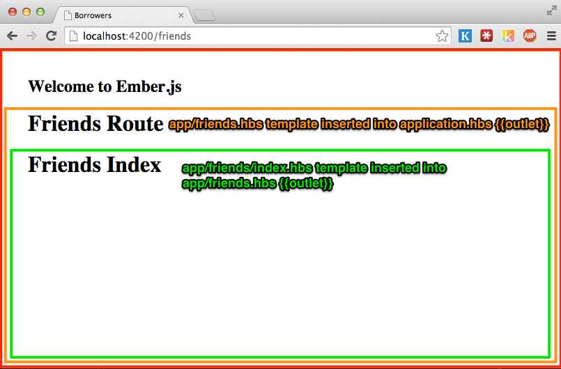
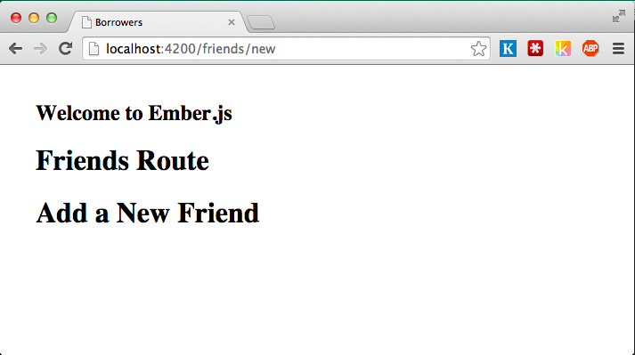
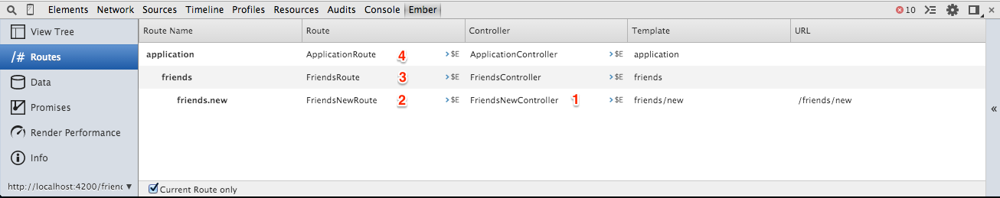

# Hands-on
In the following sections we will add some models to our app, define the interactions between them and create an interface to add friends and articles that they borrow from us.

## Adding a friend resource
The main model of our application will be called `Friend`, it represents the people who will be borrowing articles from us.

Let's add it with the `resource` generator.

~~~~~~~~
ember generate resource friends firstName:string lastName:string  \
       email:string twitter:string totalArticles:number
  create app/models/friend.js
  create tests/unit/models/friend-test.js
  create app/routes/friend.js
  create app/templates/friend.hbs
  create tests/unit/routes/friend-test.js
~~~~~~~~

If we open `app/models/friend.js` or `app/routes/friend.js` we will see that they have a similar structure (I'm going to use * just to show the basic skeleton):

~~~~~~~~
import  * from '*';

export default *.extend({
});
~~~~~~~~

What is that? `ES6 Modules`!  As mentioned previously `ember-cli` expects you to write your code using ES6 Modules,  `import * from '*'` is how we bring things from one module to other and `export default ... ` is the syntax for defining what our module is going to expose.

T> For a better understanding of ES6 modules visit [ http://jsmodules.io/](http://jsmodules.io)

Now let's look at the model and route.

`app/models/friend.js`:

~~~~~~~~
// Assign the default export from ember-data into  DS.
import DS from 'ember-data';

// Define the default export for this model as a subclass of DS.Model
export default DS.Model.extend({

  // DS.attr is the standard way of defining attributes with Ember-Data
  firstName: DS.attr('string'),

  // Defines an attribute call lastName of type `string`
  lastName: DS.attr('string'),

  // Ember-Data expects the attribute `email` on your friend's payload
  email: DS.attr('string'),

  twitter: DS.attr('string'),
  totalArticles: DS.attr('number')
});
~~~~~~~~

`app/routes/friend.js`:

~~~~~~~~
// Assign the default export from `ember` into the variable Ember
import Ember from 'ember';

// Defines the default export for this module, for now we are not adding anything extra
// but if we want to use a Route `hook` or  `actions` this would be the place.
export default Ember.Route.extend({
});
~~~~~~~~

In the future we will be able to be more explicit about the things we want to use from every module, so instead of writing `import Ember from 'ember'` we will have `import { Route } from 'ember'` or `import { Model }
from 'ember-data'`. This is currently possible in `ES6` using `Named Exports`.

What about tests? If you open the tests files you will see that they are also written in ES6, we'll talk about it in a different chapter. Now let's connect to a back-end and display some data.

## Connecting with a Backend
We need to consume and store our data from somewhere, in this case, I created a public API under `http://api.ember-cli-101.com` with `Ruby on Rails`. The following are the API end-points.

|Verb   | URI Pattern          |
|-------|----------------------|
|GET    | /api/articles        |
|POST   | /api/articles        |
|GET    | /api/articles/:id    |
|PATCH  | /api/articles/:id    |
|PUT    | /api/articles/:id    |
|DELETE | /api/articles/:id    |
|GET    | /api/friends         |
|POST   | /api/friends         |
|GET    | /api/friends/:id     |
|PATCH  | /api/friends/:id     |
|PUT    | /api/friends/:id     |
|DELETE | /api/friends/:id     |

If we do a `GET` request to `/api/friends` we will get a list of all our friends

~~~~~~~~
$ curl http://api.ember-cli-101.com/api/friends.json | python -m json.tool
{
    "friends": [
        {
            "email": "test@gmail.com",
            "first_name": "jon",
            "id": 1,
            "last_name": "snow",
            "twitter": "foo"
        }
    ]
}
~~~~~~~~

When returning a list `Ember-Data` expects the root of your payload to be the type of your model on plural `friends`, and then an array of objects, this payload will help us to populate `Ember-Data` store.

If you want to run the server yourself or create you own instance on `Heroku` I added a `Heroku Button` to the repository [borrowers-backend](https://github.com/abuiles/borrowers-backend). Once you have created your own instance on `Heroku`, install [Heroku Toolbet](https://toolbelt.heroku.com/) and check your app's log with `heroku logs -t --app your-app-name`.

## A word on Adapters

By default Ember-Data uses the `DS.RESTAdapter`[^restAdapter] which expects everything to be in `camelCase` following `JavaScript`'s coding conventions but in our example we will be working with an API written in `Ruby on Rails` which users a different conventions for keys and naming, everything is in `snake_case`.

You might be asking yourself: *didn't you say that everything has to be in `CamelCase`?*, and that's correct, but `Ember-Data` allows you to extend the `DS.RESTAdapter` to write your own ones, matching your backend's payload. This is such a common scenario that `Ember-Data` includes by default `DS.ActiveModelAdapter`[^activeModelAdapter] which is modeled after `rails-api`'s project [active_model_serializers](https://github.com/rails-api/active_model_serializers), it is  widely used in the `Ruby on Rails` world and basically helps building the `JSON` you will be returning from you API.

T> Check the implementation of `DS.ActiveModelAdapter` [https://github.com/emberjs/data/blob/master/packages/activemodel-adapter/lib/system/active_model_adapter.js#L105](https://github.com/emberjs/data/blob/master/packages/activemodel-adapter/lib/system/active_model_adapter.js#L105) is just a few lines of code and helps you understand what's going on under the hood.

There are a bunch of different adapters for different projects and frameworks, some examples are:

- [ember-data-django-rest-adapter](https://github.com/toranb/ember-data-django-rest-adapter)
- [ember-data-tastypie-adapter](https://github.com/escalant3/ember-data-tastypie-adapter)
- [emberfire: FireBase adapter](https://github.com/firebase/emberfire)

If you want to see the full list just click [here](https://github.com/search?q=ember-data+adapter&ref=opensearch).

[^restAdapter]: I recommend going through the documentation to get more insights on this adapter [DS.RESTAdapter](http://emberjs.com/api/data/classes/DS.RESTAdapter.html)
[^activeModelAdapter]: Documentation for [DS.ActiveModelAdapter.html](http://emberjs.com/api/data/classes/DS.ActiveModelAdapter.html)

#### Specifying our own adapter
As mentioned in the previous chapter if you are using `Ember-Data` it will `resolve` to the `DS.RESTAdapter` unless we specify something else.

To see it in action let's play with the console and examine how `Ember` tries to `resolve` things.

First go to `config/environment.js` and uncomment `ENV.APP.LOG_RESOLVER`[^uncomment-resolver] it should look like:

~~~~~~~~
  if (environment === 'development') {
    ENV.APP.LOG_RESOLVER = true;
    ENV.APP.LOG_ACTIVE_GENERATION = true;
    // ENV.APP.LOG_TRANSITIONS = true;
    // ENV.APP.LOG_TRANSITIONS_INTERNAL = true;
    ENV.APP.LOG_VIEW_LOOKUPS = true;
  }
~~~~~~~~

That line will log to the browser's console whatever `Ember` is trying to "find". Stop your `ember server` and start it again, then go to [http://localhost:4200](http://localhost:4200), click refresh and open the console, you will see

~~~~~~~~
[ ] router:main .............. borrowers/main/router
[ ] router:main .............. borrowers/router
[✓] router:main .............. borrowers/router
[ ] application:main ......... borrowers/main/application
[ ] application:main ......... undefined
[ ] application:main ......... borrowers/application
[ ] application:main ......... borrowers/applications/main
[ ] application:main ......... undefined
~~~~~~~~

That's the `Ember` resolver trying to find things, don't worry about understanding all of it now.

Coming back to the `Adapter`, open the `ember-inspector` and grab  the instance of the `Application` route

With the `ApplicationRoute` instance at hand, let's have some fun, first let's ask our `store` which adapter we are using

~~~~~~~~
$E.store.get('adapter')
-> "-rest"
~~~~~~~~

That's not new, we already mention that by default `Ember-Data` uses` the `RESTAdapter`.

Next let's examine what happens if we try to find all our `friends`:

~~~~~~~~
$E.store.find('friend')
[ ] adapter:friend .............borrowers/friend/adapter vendor.js:27630
[ ] adapter:friend .............undefined vendor.js:27630
[ ] adapter:friend .............borrowers/adapters/friend vendor.js:27630
[ ] adapter:friend .............undefined vendor.js:27630
[ ] adapter:application ........borrowers/application/adapter vendor.js:27630
[ ] adapter:application ........undefined vendor.js:27630
[ ] adapter:application ........borrowers/adapters/application vendor.js:27630
[ ] adapter:application ........undefined
~~~~~~~~

First, the `Resolver` tries to find an adapter at the model level, this can be useful if we want to change the default behavior of `Ember-Data`, for example changing the way an URL is generated for a resource. Suppose your friend `hasMany` `Articles` and you are using nested  URLs in the back-end, then the URL for an article will be `/friends/1/articles/1` instead of `articles/1`

~~~~~~~~
export default ApplicationAdapter.extend({
  buildURL: function(type, id, record) {
    return '/friends/' + record.get('friend.id') + '/articles/' + id;
  }
})
~~~~~~~~

Second, If no adapter is specified for the model, then the `Resolver` checks if we specified an `Application` adapter, as you see it returns `undefined` meaning we didn't specify one.

Third,  If no model or application adapter is specified then the resolver uses the default which is the `RESTAdapter`.

Since we want to work with a different adapter, we need to tell `Ember` to do so, in our case we want the `DS.ActiveModelAdapter` as our application adapter, again `ember-cli` has a generator for adapters:

Run `ember g adapter application`  and that will create an application adapter like the following:

~~~~~~~~
import DS from 'ember-data';

export default DS.RESTAdapter.extend({
});
~~~~~~~~

But we don't want to use the `DS.RESTAdapter` so let's change that file to look like the following:

~~~~~~~~
import DS from 'ember-data';

export default DS.ActiveModelAdapter.extend({
  namespace: 'api'
});
~~~~~~~~

We now specify our `Adapter` and also pass a property `namespace`. The `namespace` option tells `Ember-Data` to namespace all our `API` request under `api`, so if we ask for the collection `friend` `Ember-Data` will make a request to `/api/friends`, if we don't have that then it will be just `/friends`.

Going back to our console, let's refresh and now grab the `ApplicationRoute` instance again and ask the store for our friends.

~~~~~~~~
$E.store.find('friend')
[ ] adapter:friend ............. borrowers/friend/adapter vendor.js:27630
[ ] adapter:friend ............. undefined vendor.js:27630
[ ] adapter:friend ............. borrowers/adapters/friend vendor.js:27630
[ ] adapter:friend ............. undefined vendor.js:27630
[ ] adapter:application ........ borrowers/application/adapter vendor.js:27630
[ ] adapter:application ........ borrowers/adapters/application vendor.js:27630
[✓] adapter:application ........ borrowers/adapters/application vendor.js:27630
[✓] adapter:application ........ borrowers/adapters/application vendor.js:27630
[✓] adapter:application ........ borrowers/adapters/application vendor.js:27630
GET http://localhost:4200/api/friends 404 (Not Found)
~~~~~~~~

This time when the `Resolver` tries to find an adapter it works, because we have one specified under `applications/adapters`. We also see a failed  `GET` request to `api/friends`, it fails because we are not connected to any backend yet.

Stop the `ember server` and started again, but this time let's specify that we want all our `API` requests to be proxy to `http://api.ember-cli-101.com`, to do so we use the option `--proxy`:

~~~~~~~~
adolfo@terminus-2 ~/code/101/borrowers $ ember server --proxy http://api.ember-cli-101.com
version: 0.0.41
Proxying to http://api.ember-cli-101.com
Livereload server on port 35729
Serving on http://0.0.0.0:4200
~~~~~~~~

Go back to the console and load all your friends, but this time let's log  something with the response:

~~~~~~~~
  $E.store.find('friend').then(function(friends) {
    friends.forEach(function(friend) {
      console.log('Hi from ' + friend.get('firstName'));
    });
  });
XHR finished loading: GET "http://localhost:4200/api/friends". vendor.js:9742
Hi from jon
~~~~~~~~

If you see `Hi from jon` we have successfully  specified our application adapter and connected to a backend :)!

T> If you noticed we use the name of our model in singular form, this is important, remember to reference your models always in its singular form.

[^uncomment-resolver]: [Enable ENV.APP.LOG_RESOLVER](https://github.com/abuiles/borrowers/commit/a66df6683eccedfcf185db23801bfc865e3dab3)

## Listing our friends

Now that we have successfully specified our own `Adapter` and made a request to our `API`, let's display our friends.

By convention the entering point for rendering a list of any kind of resource in Web Applications is called the `Index` which normally matches to the `Root` URL of our resource. With our friends example we do so on the back-end through the following end-point
[http://api.ember-cli-101.com/api/friends.json](http://api.ember-cli-101.com/api/friends), if you visit that URL you will see a `JSON` list with all our friends.

T> Use [http://jsonview.com](http://jsonview.com) to have a readable version of `JSON` in your browser.

In our `Ember.js` application we need to specify somehow that every time we go to URL `/friends` then all our users should be loaded and that they should be displayed in the Browser, to do this we need to specify a `Route`.

[Routes](http://emberjs.com/api/classes/Ember.Route.html) are one of the main parts of `Ember.js`, they are in charge of everything related with setting up state, bootstrapping objects, specifying which template to render, etc. In our case we need a `Route` that will load all our friends from the `API` and then make them available to be render in the browser.

### Creating our first `Route`.

First, if we go to `app/router.js`, we will noticed that the `resource` generator added `this.resource('friends', function() { });`.

~~~~~~~~
// ...

Router.map(function() {
  this.resource('friends', function() { });
});

// ...
~~~~~~~~

We specify the `URLs` we want in our application inside the function passed to `Router.map`. There, we can call `this.route` or `this.resource`, the rule is: if we want a simple page which is not necessarily related with a resource then use `this.route` otherwise `this.resource`.

T> If you are wondering what is a resource, give a read to the following article on [resources](http://restful-api-design.readthedocs.org/en/latest/resources.html#resources).

If we were to have an about page in the URL `/about`, we could add `this.route('about')`, optionally we can pass an object with options, if we want our `AboutRoute` to be accessed through the URL `/info`, we'd use the option `path`: `this.route('about', { path: '/info' })`. By default `Ember.js` sets as path the route name, that's why we didn't have to pass `{path: '/about`}` on the first example.

Back to our `Friends Index Route`, let's check the `Routes` that we have currently defined, to do so, open the `ember-inspector` and click in `Routes`.

By default `Ember.js` creates 4 routes:

- ApplicationRoute
- IndexRoute
- LoadingRoute
- ErrorRoute

We also see that the `FriendsRoute` and its children were added with `this.resource('friends', function() { })` if we leave out the second arguments, then the children routes are not generated. `Ember.js` will create an `Index`, `Loading` and `Error` `Route` if you pass a function as second or third argument, just like with routes, you can also pass an option object and specify the `path`.

Since we have a `FriendsIndexRoute`, visiting [http://localhost:4200/friends](http://localhost:4200/friends) should be enough to list all our friends, but if we actually go there, the only thing we would see is a message with `Welcome to Ember.js`.

Go to `app/templates/friends.hbs` and add make sure it looks as follows:

~~~~~~~~
<h1>Friends Route</h1>
{{outlet}}
~~~~~~~~

For people familiar with Ruby on Rails, `{{outlet}}` is very similar to the word `yield` in templates, basically it allow us to put content into it, if we check the application templates (`app/templates/application.hbs`) we'll found the following:

~~~~~~~~
<h2 id='title'>Welcome to Ember.js</h2>

{{outlet}}
~~~~~~~~

When Ember starts it will render the `Application Template` as the main template, then inside `{{outlet}}` it will render the template associated with the `Route` we are visiting, and then inside those templates we can have more `{{outlet}}` to keep rending content.

In our friends scenario, `app/templates/friends.hbs` will get rendered into the application's template `{{outlet}}`, and then it'll render the `Friends Index` template into `app/templates/friends.hbs` `{{outlet}}`

To connect everything, let's create an index template and list all out friends. Run `ember g route friends/index` and put the following content inside `app/templates/friends/index.hbs`:

~~~~~~~~
<h1>Friends Index</h1>

<ul>
  {{#each}}
     <li>{{firstName}} {{lastName}}</li>
  {{/each}}
</ul>
~~~~~~~~

Go to  [http://localhost:4200/friends](http://localhost:4200/friends) and you will see:

We are now loading the `Friends Index Route` but we are still not seeing any of our friends, the reason is that we didn't tell the `Route` which data it should load, remember that the `Route` is the responsible for doing this, go to `app/routes/friends/index.js` and add a model hook as follows:

~~~~~~~~
import Ember from 'ember';

export default Ember.Route.extend({
  model: function() {
    return this.store.find('friend');
  }
});
~~~~~~~~

We played previously with `store.find` to load all our friend from the
`API` and that's what we are doing here again, but this time we are
returning them from the `model` hook in our `Friends Index Route`,
what `Ember` does is that it waits for this call to be completed and
then when it has some data it automatically creates a `Friends Index
Controller` (or we can define a controller explicitly) and then sets
the property `model` with the content returned from the `API`.

If we go again to [http://localhost:4200/friends](http://localhost:4200/friends) we'll see now a list of friends, listed by their first and last name.

T> You can also pass a query or id to `store.find` like `this.store.find('friend', 1)` or `this.store.find('friend', {active: true})`, ending in the following requests to the API `/api/friends/1` or `/api/friends?active=true`.

If you recall in `/app/templates/friends/index.hbs` we never mention
`model` and yet we got our friends listed with only adding `{{#each}}`
and referencing the properties of the models. What is happening is
that the template is in the context of the controller created
automatically by Ember. Since the model hook returned an array,
Ember creates an instance of an special controller called
[ArrayController](http://emberjs.com/api/classes/Ember.ArrayController.html)
which facilitates how we interact with the collection in the template.

T> If the model hook returns an Object then Ember.js creates automatically an [ObjectController](http://emberjs.com/api/classes/Ember.ObjectController.html)

When we do `{{#each}}` Ember under the hood takes every element of
the collection and set it as the context of the `each` body, that's why
we can reference any of the attributes that a friend model has. We can
also write the each as follows:

~~~~~~~~
<ul>
  {{#each friend in model}}
    <li>{{friend.firstName}} {{friend.lastName}}</li>
  {{/each}}
</ul>
~~~~~~~~

If we wanted to display the total number of friends and the `id` for
every friend then we would just need to reference the property `length`
in the template and inside the each use `id`:

~~~~~~~~
<h1>Friends Index</h1>
{{! The context here is the controller}}
<h2>Total friends: {{length}}</h2>

<ul>
  {{#each}}
    {{! The context here is a friend instance }}
    <li>{{id}} - {{firstName}} {{lastName}}</li>
  {{/each}}
</ul>
~~~~~~~~

Again, because our model is a collection and it has the property
`length` when can just reference it in the template and it is
`proxied` to the controller model.

## Adding a new friend

We are now able to see the friends who have borrowed things from us,
but we don't have a way to add new ones. The next step would be
building support for adding a new friend.

To do this we'll need a `Friends New Route` under the resource friends which
will handle the URL `http://localhost:4200/friends/new`.

T> By convention the URL for adding a new resource is `/resource_name/new`,
editing `/resource_name/:resource_id/edit` and showing `/resource/:resource_id`.

To add the new route run the `Route` generator with the parameters `friends/new`:

~~~~~~~~
adolfo@terminus-2 ~/code/101/borrowers $ ember g route friends/new
installing
  create app/routes/friends/new.js
  create app/templates/friends/new.hbs
  create tests/unit/routes/friends/new-test.js
~~~~~~~~

The `Route` generator doesn't know how to create nested
routes in `router.js` so we have to fix that.

Go to `app/router.js` and make sure the route we just generate is
nested under the resource `friends`:

~~~~~~~~
this.resource('friends', function(){
  this.route('new');
});
~~~~~~~~

Add `<h1>Add a New Friend</h1>` to `app/templates/friends/new.hbs` and
navigate to `http://localhost:4200/friends/new`:

Notice how the `Friends New Route` got render in the `{{outlet}}`
inside `app/templates/friends.hbs`.

We got our `Route` and `Template` wired up but we can't add friends
yet, we need to set a new friend instance as the model of the `Friends
New Route`, create a form which will bound to the friend's attributes
and save the new friend in our back-end.

Following the logic we used in the `Friends Index Route` we need to
return the model which will be the context of the `Friends New Route`
on the `model` hook function, go to `app/routes/friends/new.js` and
add the following model hook:

~~~~~~~~
import Ember from 'ember';

export default Ember.Route.extend({
  model: function() {
    return this.store.createRecord('friend');
  }
});
~~~~~~~~

We have been using the `this.store` without knowing what is it. The
[Store][http://emberjs.com/api/data/classes/DS.Store.html) is an `Ember-Data` class in charge of managing everything related with our model's data, it knows about all the records we currently have loaded in our application and has some functions which will help us to find, create, update and delete records. During the whole application life cycle there is an unique instance of the `Store` and it is inject as a property into every `Route`, `Controller`, `Serializer` and `Adapter` under the key `store`, that's why we have been calling `.store` in our `Routes` and `Controllers`.

T> If you are curious how the store is injected in every instance check the [implementation](https://github.com/emberjs/data/blob/master/packages/ember-data/lib/initializers/store_injections.js), we'll talk about this method later.

The method we are using on the model hook `store.createRecord`,
creates a new record in our application `store` but doesn't save it to
the back-end, what we are doing with this record is set it as the
`model` of our `Friends New Route` and then once we have filled the
first and last name we can save it to our back-end calling the method
#save() in the model.

Since we will be using the same form for adding a new friend and
editing, let's create an [Ember partial](http://emberjs.com/api/classes/Ember.Handlebars.helpers.html#method_partial) in
`app/templates/friends/-form.hbs` with the following content:

~~~~~~~~
<form {{action "save" on="submit"}}>
  

    <label>First Name:
      {{input value=firstName}}
    </label>
  

  

    <label>Last Name:
      {{input value=lastName }}
    </label>
  

  

    <label>Email:
      {{input value=phone}}
    </label>
  

  

    <label>twitter
      {{input value=email}}
    </label>
  

  <input type="submit" value="Save"}}/>
  <button {{action "cancel"}}>Cancel</button>
</form>
~~~~~~~~

Then let's remove the outlet from `app/templates/friends/new.hbs` and add
`{{partial "friends/form"}}`, if we go to
`http://localhost:4200/friends/new` we should see the form.

There are some new concepts in what we just did, let's talk about them.

### Partials

In `app/templates/friends.new.hbs` we used

~~~~~~~~
`{{partial "friends/form"}}`
~~~~~~~~

The `partial` method is part of the
[Ember.Handlebars.helpers][http://emberjs.com/api/classes/Ember.Handlebars.helpers.html#method_partial]
class, it is used to render other templates in the context of the
current template. In our example the friend form is a perfect candidate
for a partial since we will be using the same form for creating and
editing a new friend.

Additionally you can pass a variable to `partial` if you want to
change the template dynamically, for example if you were to have a
header which changes if an user is logged-in or not.

### {{action}}

The `action` helper is probably one of the most used feature in
Ember.js, this allow us to bind an action in the template to an action
in the template's `Controller` or `Route`, by default it is bound to
the click action, but it can be bound to other actions.

The following button will call the action `cancel` when we click on it

~~~~~~~~
<button {{action "cancel"}}>Cancel</button>
~~~~~~~~

While `<form {{action "save" on="submit"}}>` will call the action
`save` when `onsubmit` event is fired, that is, when we click `Save`.

If we go to the browser `http://localhost:4200/friends/new`, open the
console, and click `Save` and `Cancel`, we'll see 2 errors, saying
`Nothing handled the action 'save'.` and `Nothing handled the action
'cancel'`.

Ember expects us to define our action handlers inside the property
`actions` in the `Controller` or `Route`. When the action is called
Ember first looks for a definition in the `Controller`, and if there is none it
goes to the `Route` and keeps bubbling until the `Application Route`.
If any of the actions returns `false` then it stops bubbling.

Let's create a controller for the `Friends New Route` and add the
actions `save` and `cancel`.

Generate the `Friends New Controller` running `ember g controller friends/new
--type=object` and then go to `app/controllers/friends/new.js` and
add the property `actions`.

~~~~~~~~
import Ember from 'ember';

export default Ember.ObjectController.extend({
  actions: {
    save: function() {
      console.log('save action controller');

      return true;
    },
    cancel: function() {
      console.log('cancel action controller');

      return true;

    }
  }
});
~~~~~~~~

If we go `http://localhost:4200/friends/new` and click save, we'll see
in the browser console `"save action controller"`.

Let's check next how returning `true` from the action makes it bubble,
go to `app/routes/friends/new.js` and add:

~~~~~~~~
  actions: {
    save: function() {
      console.log('save action bubbled route');

      return true;
    },
    cancel: function() {
      console.log('cancel action bubbled to route');

      return true;
    }
  }
~~~~~~~~

Add in `app/routes/friends.js`:

~~~~~~~~
actions: {
    save: function() {
      console.log('save action bubbled to friends route');

      return true;
    },
    cancel: function() {
      console.log('cancel action bubbled to friends route');

      return true;
    }
  }
~~~~~~~~

And then create the file `app/routes/application.js`  with:

~~~~~~~~
import Ember from 'ember';

export default Ember.Route.extend({
  actions: {
    save: function() {
      console.log('save action bubbled to application route');

      return true;
    },
    cancel: function() {
      console.log('cancel action bubbled to application route');

      return true;
    }
  }
});
~~~~~~~~

After adding actions in all those routes, if  we click again `save` or
`cancel` we'll see the action bubbling through every route currently
active.

~~~~~~~~
save action controller borrowers/controllers/friends/new.js:10
save action bubbled route borrowers/routes/friends/new.js:13
save action bubbled to friends route borrowers/routes/friends.js:10
save action bubbled to application route borrowers/routes/application.js:10
~~~~~~~~

Again, it is bubbling because we are returning true from every child
`actions`, if we want the action to stop bubbling let's say in the
`Friends Route`, we just need to return `false` and we'll get:

~~~~~~~~
save action controller borrowers/controllers/friends/new.js:10
save action bubbled route borrowers/routes/friends/new.js:13
save action bubbled to friends route borrowers/routes/friends.js:10
~~~~~~~~

See? no bubbling to the `Application Route`.

Whenever we are having trouble understanding how our actions are going to
bubble, we can go to the `ember-inspector`, click Routes and then select
`Current Routes only`:

As we can see, the action will bubble in the following order:

    1. FriendsNewController
    2. FriendsNewRoute
    3. FriendsRoute
    4. ApplicationRoute

### The input helper

## Viewing a friend profile

## Updating a friend profile

## Deleting a friend

## ember-cli models
If you go to `app/models/friend.js` you will find the following:

~~~~~~~~
import DS from 'ember-data';

export default DS.Model.extend({
  firstName: DS.attr('string'),
  lastName: DS.attr('string'),
  email: DS.attr('string'),
  twitter: DS.attr('string'),
  totalArticles: DS.attr('number')
});
~~~~~~~~

## Adding Articles

With our `Friend`s CRUD ready,we can start lending articles to them, let's create a `article` model with the `model` generator:

~~~~~~~~
adolfo@terminus-2 ~/code/101/borrowers $ ember generate resource article description:string createdAt:date state:string
  create app/models/article.js
  create tests/unit/models/article-test.js
  create app/routes/article.js
  create app/templates/article.hbs
  create tests/unit/routes/article-test.js
~~~~~~~~

## Relationships

~~~~~~~~
//app/models/articles.js
import DS from 'ember-data';

export default DS.Model.extend({
  description: DS.attr('string'),
  createdAt: DS.attr('date'),
  state: DS.attr('string'),
  friend: DS.belongsTo('friend')
});
~~~~~~~~

~~~~~~~~
export default DS.Model.extend({
   lastName: DS.attr('string'),
   email: DS.attr('string'),
   twitter: DS.attr('string'),
   totalArticles: DS.attr('number'),
   articles: DS.hasMany('articles') // Ember Data has many
});
~~~~~~~~

## Async vs Sync

### Computed properties

## Finding your friends: An introduction to Routes

### Routes hooks

## You might need a Controller

### Actions

## What have a person borrowed? Nested Routes to the Rescue!

## Pretty Dates: An introduction to helpers

## Get your stuff back, a Component might help.
