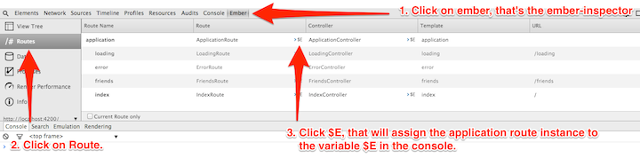
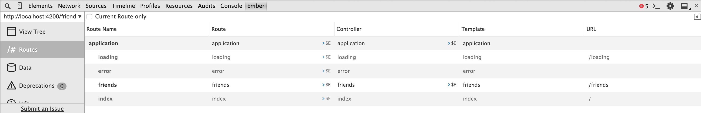
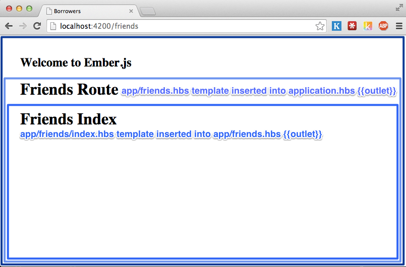
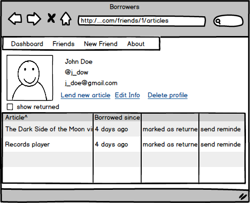

# Hands-on
In the following sections we will add models to our application,
define the interactions between them, and create an interface to add
friends, articles and allow us to keep track of the things we loaned
them.

## Adding a friend resource
The main model of our application will be called **Friend**. It
represents the people who will borrow articles from us.

Let's add it with the **resource** generator.

{title="", lang="bash"}
~~~~~~~~
$ ember generate resource friends firstName:string lastName:string  \
       email:string twitter:string
installing model
  create app/models/friend.js
installing model-test
  create tests/unit/models/friend-test.js
installing route
  create app/routes/friends.js
  create app/templates/friends.hbs
updating router
  add route friends
installing route-test
  create tests/unit/routes/friends-test.js
~~~~~~~~

If we open **app/models/friend.js** or **app/routes/friends.js**, we
will see that they have a similar structure.

{title="Object Structure", lang="JavaScript"}
~~~~~~~~
import  Foo from 'foo';

export default Foo.extend({
});
~~~~~~~~

What is that? **ES6 Modules**!  As mentioned previously, **ember CLI**
expects us to write our code using ES6 Modules. `import Foo from
'foo'` consumes the default export from the package `foo` and assigns
it to the variable `Foo`.  We use `export default Foo.extend...` to
define what our module will expose. In this case we will export a
single value, which will be a subclass of `Foo`.

T> For a better understanding of ES6 modules, visit [ http://jsmodules.io/](http://jsmodules.io).

Now let's look at the model and route.

{title="app/models/friend.js", lang="JavaScript"}
~~~~~~~~
// We import the default value from ember-data/model into the variable Model.
//
import Model from 'ember-data/model';
import attr from 'ember-data/attr';

// Define the default export for this model, which will be a subclass
// of ember data model.
//
// After this class has been defined, we can import this subclass doing:
// import Friend from 'borrowers/models/friend'
//
// We can also use relative imports. So if we were in another model, we
// could have written
// import Friend from './friend';

export default Model.extend({

  // attr is the standard way to define attributes with ember data
  firstName: attr('string'),


  // Defines an attribute called lastName of type **string**
  lastName: attr('string'),


  // ember data expects the attribute **email** on the friend's payload
  email: attr('string'),

  twitter: attr('string')
});
~~~~~~~~


{title="app/routes/friends.js", lang="JavaScript"}
~~~~~~~~
// Assigns the default export from **ember** into the variable Ember.
//
// The default export for the ember package is a namespace that
// contains all the classes and functions for Ember that are specified in
// http://emberjs.com/api/

import Ember from 'ember';

// Defines the default export for this module. For now we will not
// add anything extra, but if we want to use a Route **hook** or
// **actions** this would be the place.

export default Ember.Route.extend({
});
~~~~~~~~

In a future version of **ember** we might be able to be more explicit
about the things we want to use from every module. Instead of writing
**import Ember from 'ember'**, we could have **import { Route } from
'ember/route'** or **import { Model } from 'ember-data/model'**. This
is currently possible in **ES6** using [Named Imports and
Exports](http://jsmodules.io).

T> The following RFC [https://github.com/emberjs/rfcs/pull/68](https://github.com/emberjs/rfcs/pull/68)
T> offers more context on the move to ES6 modules.

What about tests? If we open the test files, we'll see that they are
also written in ES6. We'll talk about that in a later chapter. Now
let's connect to a backend and display some data.

## Connecting with a Backend

We need to consume and store our data from somewhere. In this case, we
created a public API (which follows JSON API)
**http://api.ember-101.com** with **Ruby on Rails**. The
following are the API end-points.

|Verb      | URI Pattern                                         |
|----------|-----------------------------------------------------|
|GET       | /friends/:friend_id/relationships/loans(.:format)   |
|POST      | /friends/:friend_id/relationships/loans(.:format)   |
|PUT|PATCH | /friends/:friend_id/relationships/loans(.:format)   |
|DELETE    | /friends/:friend_id/relationships/loans(.:format)   |
|GET       | /friends/:friend_id/loans(.:format)                 |
|GET       | /friends(.:format)                                  |
|POST      | /friends(.:format)                                  |
|GET       | /friends/:id(.:format)                              |
|PATCH     | /friends/:id(.:format)                              |
|PUT       | /friends/:id(.:format)                              |
|DELETE    | /friends/:id(.:format)                              |
|GET       | /articles/:article_id/relationships/loans(.:format) |
|POST      | /articles/:article_id/relationships/loans(.:format) |
|PUT|PATCH | /articles/:article_id/relationships/loans(.:format) |
|DELETE    | /articles/:article_id/relationships/loans(.:format) |
|GET       | /articles/:article_id/loans(.:format)               |
|GET       | /articles(.:format)                                 |
|POST      | /articles(.:format)                                 |
|GET       | /articles/:id(.:format)                             |
|PATCH     | /articles/:id(.:format)                             |
|PUT       | /articles/:id(.:format)                             |
|DELETE    | /articles/:id(.:format)                             |
|GET       | /loans/:lend_id/relationships/article(.:format)     |
|PUT|PATCH | /loans/:lend_id/relationships/article(.:format)     |
|DELETE    | /loans/:lend_id/relationships/article(.:format)     |
|GET       | /loans/:lend_id/article(.:format)                   |
|GET       | /loans/:lend_id/relationships/friend(.:format)      |
|PUT|PATCH | /loans/:lend_id/relationships/friend(.:format)      |
|DELETE    | /loans/:lend_id/relationships/friend(.:format)      |
|GET       | /loans/:lend_id/friend(.:format)                    |
|GET       | /loans(.:format)                                    |
|POST      | /loans(.:format)                                    |
|GET       | /loans/:id(.:format)                                |
|PATCH     | /loans/:id(.:format)                                |
|PUT       | /loans/:id(.:format)                                |
|DELETE    | /loans/:id(.:format)                                |


If we do a **GET** request to **http://api.ember-101.com/friends**, we will get a list of
all our friends.

~~~~~~~~
# The following output might be different for every run since the data
# in the API is changing constantly.
#
$ curl http://api.ember-101.com/friends | python -m json.tool
{
  "data": [
    {
      "id": "1",
      "type": "friends",
      "links": {
        "self": "http://api.ember-101.com/friends/1"
      },
      "attributes": {
        "first-name": "Cyril",
        "last-name": "Neveu",
        "email": "cyryl@neveu.com",
        "twitter": null
      },
      "relationships": {
        "loans": {
          "links": {
            "self": "http://api.ember-101.com/friends/1/relationships/loans",
            "related": "http://api.ember-101.com/friends/1/loans"
          }
        }
      }
    }
  ],
  "links": {
    "first": "http://api.ember-101.com/friends?page%5Blimit%5D=10&page%5Boffset%5D=0",
    "last": "http://api.ember-101.com/friends?page%5Blimit%5D=10&page%5Boffset%5D=0"
  }
}
~~~~~~~~

T> Piping JSON data to **python -m json.tool** is an easy way to pretty
print JSON data in our console using python's JSON library. It's very
useful if we want to quickly debug JSON data. Optionally, we can also use JQ https://stedolan.github.io/jq/.

The previous payload follows `JSON API` and returns a list of resource
objects which will be used to populate **ember data** store.

T> If we want to run the server by ourselves or create our own instance
T> on **Heroku**, we can use the **Heroku Button** added to the repository
T> [borrowers-backend](https://github.com/abuiles/borrowers-api).

## A word on Adapters


Ember data has two mechanism to translate request to the server and
transform incoming or outgoing data, such mechanisms are called an
adapter and serializer. By default, ember data uses the
**DS.JSONAPIAdapter**[^jsonAdapter], which expects your API to follow
[http://jsonapi.org/](http://jsonapi.org/), a specification for
building APIs in JSON. In our example, we'll be using this adapter
since our API is written using JSON API.

T>If you want to learn about JSON API while building the application
T>used as example here, then check out the book [JSON API By Example](https://leanpub.com/json-api-by-example).

Ember data doesn't force us to use this adapter, we can work with
others or create our own. One of those adapters is the active model
adapter, built for people using or following API similars to the ones
created with
[active model serializer]((https://github.com/rails-api/active_model_serializers)),
which uses a different convention for keys and naming. Everything is
in **snake_case** and objects are linked in different ways.

There are a bunch of different adapters for different projects and
frameworks.

Some of them are:

- [ember-data-django-rest-adapter](https://github.com/toranb/ember-data-django-rest-adapter)
- [ember-data-tastypie-adapter](https://github.com/escalant3/ember-data-tastypie-adapter)
- [emberfire: FireBase adapter](https://github.com/firebase/emberfire)

We can find a longer list of adapters if we search GitHub for [ember-data adapters](https://github.com/search?q=ember-data+adapter&ref=opensearch).

[^jsonAdapter]: We recommend going through the documentation to get more insights on this adapter [DS.JSONAPIAdapter](http://emberjs.com/api/data/classes/DS.JSONAPIAdapter.html).
[^activeModelAdapter]: Repository for [DS.ActiveModelAdapter.html](https://github.com/ember-data/active-model-adapter).

#### Playing with the resolver

Before going deep into our app, let's talk about something which will
be very useful while we build Ember applications and that thing is the
resolver.

The resolver is the system in charge of returning whatever Ember
requires at different stages, so if we need to load a template, route
or service it all goes through the resolver. Normally people don't
need to interact with it directly when building applications, but
knowing that it is there and being able to idenfity whatever it is
trying to do might probably come handy while debugging our
applications.

To see it in action, let's play with the console and examine how
**ember** tries to **resolve** things.

First we need to go to  `config/environment.js` and uncomment `ENV.APP.LOG_RESOLVER`. It should look like:

{title="config/environment.js", lang="JavaScript"}
~~~~~~~~
  if (environment === 'development') {
    ENV.APP.LOG_RESOLVER = true;
    ENV.APP.LOG_ACTIVE_GENERATION = true;
    // ENV.APP.LOG_TRANSITIONS = true;
    // ENV.APP.LOG_TRANSITIONS_INTERNAL = true;
    ENV.APP.LOG_VIEW_LOOKUPS = true;
  }
~~~~~~~~

That line will log whatever **ember** tries to "find" to the browser's
console. If we go to [http://localhost:4200](http://localhost:4200)
and open the console, we'll see something like the output below:

{title=""}
~~~~~~~~
[ ] router:main .............. borrowers/main/router
[ ] router:main .............. borrowers/router
[✓] router:main .............. borrowers/router
[ ] application:main ......... borrowers/main/application
[ ] application:main ......... undefined
[ ] application:main ......... borrowers/application
[ ] application:main ......... borrowers/applications/main
[ ] application:main ......... undefined
~~~~~~~~

That's the **ember** resolver trying to find things. We don't need to
worry about understanding all of it right now.

Coming back to the **adapter**, if we open the **ember-inspector** and
grab the instance of the **application** route



T> We can grab almost any instance of a Route, Controller, Component or
T> Model with the **ember-inspector** and then reference it in the
T> console with the `$E` variable. This variable is reset every time the
T> browser gets refreshed.

With the **application route** instance at hand, let's have some fun.

Let's examine what happens if we try to find all our **friends**:

{title=""}
~~~~~~~~
$E.store.findAll('friend')
[ ] model:friend   .............borrowers/friend/model
[ ] model:friend   .............borrowers/models/friend
[✓] model:friend   .............borrowers/models/friend
[✓] model:friend   .............borrowers/models/friend
[✓] model:friend   .............borrowers/models/friend
[ ] adapter:friend .............borrowers/friend/adapter
[ ] adapter:friend .............undefined
[ ] adapter:friend .............borrowers/adapters/friend
[ ] adapter:friend .............undefined
[ ] adapter:application ........borrowers/application/adapter
[ ] adapter:application ........undefined
[ ] adapter:application ........borrowers/adapters/application
[ ] adapter:application ........undefined
~~~~~~~~

First, the **resolver** tries to find an adapter at the model level:

{title=""}
~~~~~~~~
[ ] adapter:friend .............borrowers/friend/adapter
[ ] adapter:friend .............undefined
[ ] adapter:friend .............borrowers/adapters/friend
[ ] adapter:friend .............undefined
~~~~~~~~

We can use this if we want to change the default behavior of **ember data**. For example, changing the way an URL is generated for a
resource.

Second, if no adapter is specified for the model, then the
**resolver** checks if we specified an **application** adapter. As we
can see, it returns **undefined**, which means we didn't specify one:

{title=""}
~~~~~~~~
[ ] adapter:application ........borrowers/application/adapter
[ ] adapter:application ........undefined
[ ] adapter:application ........borrowers/adapters/application
[ ] adapter:application ........undefined
~~~~~~~~

Third, if no model or application adapter is found, then **ember data**
falls back to the default adapter, the **JSONAPIAdapter**. We can
check the implementation for this directly in the
[adapterFor](https://github.com/emberjs/data/blob/131119/packages/ember-data/lib/system/store.js#L1552)
function in **ember data**.

{#pods-adapter}
I>We can see that there is a look up for the friend and application
I>adapter in two places **borrowers/friend/adapter**,
I>**borrowers/adapters/friend**, **borrowers/application/adapter** and
I>**borrowers/adapters/application**. ember CLI allows us to group
I>things that are logically related under a single directory. This
I>structure is known as PODS. At the time of this writing a new
I>structure has been propossed for Ember projects and will become the
I>default, more information can be found in the following RFC https://github.com/emberjs/rfcs/pull/143

Once ember data has resolved the adapter it tries to follow the logic
to fetch all objects for a given resource. In ours we'll find an error
like the following.

{title=""}
~~~~~~~~
GET http://localhost:4200/friends 404 (Not Found)
~~~~~~~~

The requests failed because we aren't connected to any backend.

We need to stop the **ember server** and start again, but this time
let's specify that we want all our **API** requests to be proxy to
**http://api.ember-101.com**. To do so we use the option
**--proxy**:

{title="Running ember server", lang="bash"}
~~~~~~~~
$ ember server --proxy http://api.ember-101.com
Proxying to http://api.ember-101.com
Livereload server on port 35729
Serving on http://0.0.0.0:4200
~~~~~~~~

Let's go back to the console and load all our friends, but this time
logging something with the response:

~~~~~~~~
$E.store.findAll('friend').then(function(friends) {
  friends.forEach(function(friend) {
    console.log('Hi from ' + friend.get('firstName'));
  });
});

XHR finished loading: GET "http://localhost:4200/friends".
Hi from Cyril
~~~~~~~~

If we see 'Hi from' followed by a name, we have successfully connected
to the backend. The output might be different every time we run it
since the API's data is changing.

T>When calling the store method, we used the name of our model in singular
T>form. This is important.  We always reference the models in their
T>singular form.

## Listing our friends

Now that we have successfully made a request to our **API**, let's
display our friends.

By convention, the entering point for rendering a list of any kind of
resource in web applications is called the **Index**. This normally
matches to the **Root** URL of our resource. With our friends example,
we do so on the backend through the following end-point
[http://api.ember-101.com/friends](http://api.ember-101.com/friends).
If we visit that URL, we will see a **JSON** list with all our
friends.

T> If we are using Firefox or Chrome, we can use JSONView to have a readable version of **JSON** in our browser.
T> [Firefox Version](http://jsonview.com) or [Chrome Version](https://chrome.google.com/webstore/detail/jsonview/chklaanhfefbnpoihckbnefhakgolnmc).

In our ember application, we need to specify somehow that every
time we go to URL **/friends**, then all our users should be loaded and
displayed in the browser. To do this we need to specify a **Route**.

[Routes](http://emberjs.com/api/classes/Ember.Route.html) are one of
the main parts of **ember**. They are in charge of everything
related to setting up state, bootstrapping objects, specifying which
template to render, etc. In our case, we need a **Route** that will
load all our friends from the **API** and then make them available to
be rendered in the browser.

### Creating our first Route.

First, if we go to **app/router.js**, we will notice that the **resource** generator added **this.route('friends');**.

{title="app/router.js", lang="JavaScript"}
~~~~~~~~
// ...

Router.map(function() {
  this.route('friends');
});

// ...
~~~~~~~~

We specify the **URLs** we want in our application inside the function
passed to **Router.map**. There, we can declare new routes calling **this.route**.

Let's check the **Routes** that we have currently defined. To do so,
open the **ember-inspector** and click on **Routes**.



By default, **ember** creates 4 routes:

- ApplicationRoute
- IndexRoute
- LoadingRoute
- ErrorRoute

We also see that the friends route was added with
**this.route('friends')**. if we pass a function as second
or third argument, **ember** will create an **Index**,
**Loading**, and **Error** **Route**.

We can modify our route passing an empty function

{title="app/router.js", lang="JavaScript"}
```
this.route('friends', function() {
});
```

And then if we check the inspector, the children routes are automatically
generated for the friends route.

I> When we define a route leaving out the empty function, then the
I> children routes are not generated.

Since we just added a friends index route, visiting
[http://localhost:4200/friends](http://localhost:4200/friends) should
be enough to list all our friends. But if we actually go there, the
only thing we will see is a message with **Welcome to Ember**.

Let's go to **app/templates/friends.hbs** and change it to look like the following:

{title="app/templates/friends.hbs", lang="handlebars"}
~~~~~~~~
<h1>Friends Route</h1>
{{outlet}}
~~~~~~~~

For people familiar with Ruby on Rails, **{{outlet}}** is very similar
to the word **yield** in templates. Basically it allows us to put content
into it. If we check the application templates
(**app/templates/application.hbs**), we'll find the following:

{title="app/templates/application.hbs", lang="handlebars"}
~~~~~~~~
<h2 id='title'>Welcome to Ember</h2>

{{outlet}}
~~~~~~~~

When ember starts, it will render the **application template** as the
main template. Inside **{{outlet}}**, it will render the template
associated with the **Route** we are visiting. Then, inside those
templates, we can have more **{{outlet}}** to keep rendering content.

In our friends scenario, **app/templates/friends.hbs** will get
rendered into the application's template **{{outlet}}**, and then
it will render the **friends index** template into
**app/templates/friends.hbs** **{{outlet}}**.

To connect everything, let's create an index template and list all our
friends. Let's run the route generator **ember g route friends/index**
and put the following content inside
**app/templates/friends/index.hbs**:

{title="app/templates/friends/index.hbs", lang="handlebars"}
~~~~~~~~
<h1>Friends Index</h1>

<ul>
  {{#each model as |friend|}}
    <li>{{friend.firstName}} {{friend.lastName}}</li>
  {{/each}}
</ul>
~~~~~~~~

T> We remove **{{outlet}}** from **app/templates/friends/index.hbs**
T> since the **friends index route** won't have any nested route.

Next, we need to specify in the **friends index route** the data we
want to load in this route. The part in charge of loading the data
related to a route is called the model hook. Let's add one to
**app/routes/friends/index.js** as follows:

{title="app/routes/friends/index.js", lang="JavaScript"}
~~~~~~~~
import Ember from 'ember';

export default Ember.Route.extend({
  //
  // Here we are using ES6 syntax for functions!
  // We can use this out of the box with ember-cli
  // thanks to the addon ember-cli-babel
  //
  // To learn more about ES6, check http://s.abuiles.com/bwWo
  //
  model() {
    return this.store.findAll('friend');
  }
});
~~~~~~~~

I> Remember that the **Route** is responsible for everything related
I> to setting up the application state.

If we visit
[http://localhost:4200/friends](http://localhost:4200/friends) we will
see something like the following along with a list of our friends:



We played previously with **store.findAll** to load all our friends from
the **API** and that's what we are doing in the model hook. **ember**
waits for this call to be completed. When the data is loaded, it
automatically creates a friends index controller (or we can define a
controller explicitly) and sets the property **model** with the content
returned from the **API**.

I>
I> Controller will be deprecated in next versions of ember
I> so we'll explore how to work without them in upcoming chapters.
I> We'll still need to use them for some things, so let's not worry
I> if we hear that controllers are disappearing.
I>

We can also use `store.findRecord` or `store.queryRecord` if we want
to load a record by a given id or appending query parameters to the
request URL, such as **this.store.findRecord('friend', 1)** or
**this.store.query('friend', {active: true})**, which creates
the following requests to the API **/api/friends/1** or
**/api/friends?active=true**.

When we do **{{#each model as |friend|}}**, ember takes
every element of the collection and set it as **friend**, the
collection which is what the model hook returned is referenced as
**model**.

If we want to display the total number of friends and the **id** for
every friend, then we just need to reference **model.length** in the
template and inside the each use **friend.id**:

{title="app/templates/friends/index.hbs", lang="handlebars"}
~~~~~~~~
<h1>Friends Index</h1>
{{! The context here is the controller}}
<h2>Total friends: {{model.length}}</h2>

<ul>
  {{#each model as |friend|}}
    <li>{{friend.id}} - {{friend.firstName}} {{friend.lastName}}</li>
  {{/each}}
</ul>
~~~~~~~~

Again, because our model is a collection and it has the property
**length**, we can just reference it in the template as
**model.length**.

## Adding a new friend

We are now able to list our friends, but we don't have a way to add
new friends. The next step is to build support for adding a new
friend.

To do this we'll need a **friends new route** under the route friends,
which will handle the URL **http://localhost:4200/friends/new**.

T> By convention, the URL for adding a new resource is
T> **/resource_name/new**. For editing a resource, use
T> **/resource_name/:resource_id/edit** and for showing a resource, use
T> **/resource/:resource_id**.

To add the new route, let's run the route generator with the
parameters **friends/new**:

~~~~~~~~
$ ember g route friends/new
installing route
  create app/routes/friends/new.js
  create app/templates/friends/new.hbs
updating router
  add route friends/new
installing route-test
  create tests/unit/routes/friends/new-test.js
~~~~~~~~

If we go to **app/router.js** we'll see that the **new** route was nested
under the route **friends**:

{title="app/router.js", lang="JavaScript"}
~~~~~~~~
this.route('friends', function(){
  this.route('new');
});
~~~~~~~~

Let's add the following content on the new template:

{title="app/templates/friends/new.hbs", lang="handlebars"}
~~~~~~~~
<h1>Add a New Friend</h1>
~~~~~~~~

And then navigate to http://localhost:4200/friends/new:


Notice how the **friends new route** got rendered in the
**{{outlet}}** inside **app/templates/friends.hbs**.


We got our **route** and **template** wired up, but we can't add
friends yet. We need to set a new friend instance as the model of the
**friends new route**, and then create a form that will bind to the
friend's attributes, and save the new friend in our backend.

Following the logic we used in the **friends index route**, we need to
return the model that will be the context of the **friends new route**.

We need to edit **app/routes/friends/new.js** and add the following
model hook:

{title="app/routes/friends/new.js", lang="JavaScript"}
~~~~~~~~
import Ember from 'ember';

export default Ember.Route.extend({
  model() {
    return this.store.createRecord('friend');
  }
});
~~~~~~~~

We have been using the **this.store** without knowing what it is. The
[Store](http://emberjs.com/api/data/classes/DS.Store.html) is an **ember data** class in charge of managing everything related to our model's data. It knows about all the records we currently have loaded in our application and it has some functions that will help us to find, create, update, and delete records. During the whole application life cycle there is a unique instance of the **Store**, and it is injected as a property into every **Route**, **Controller**, **Serializer**, and **adapter** under the key **store**. That's why we have been calling **.store** in our **Routes** and **Controllers**.

T> The following shows how the store is injected in every instance: [store_injections](https://github.com/emberjs/data/blob/v1.13.5/packages/ember-data/lib/initializers/store-injections.js).


The method we are using on the model hook **store.createRecord**
creates a new record in our application **store**, but it doesn't save
it to the backend. What we will do with this record is set it as the
**model** of our **friends new route**. Then, once we have filled the
first and last names, we can save it to our backend calling the method
`#save()` in the model.

Since we will be using the same form for adding a new friend and
editing, let's create an
[Ember component](http://emberjs.com/api/classes/Ember.Component.html)
to contain the form, we can generate the component with the generator,
`ember g component friends/edit-form` and add the following content:

{title="app/templates/components/friends/edit-form.hbs", lang="handlebars"}
~~~~~~~~
<form {{action "save" on="submit"}}>
  <p>
    <label>First Name:
      {{input value=model.firstName}}
    </label>
  </p>
  <p>
    <label>Last Name:
      {{input value=model.lastName }}
    </label>
  </p>
  <p>
    <label>Email:
      {{input value=model.email}}
    </label>
  </p>
  <p>
    <label>Twitter:
      {{input value=model.twitter}}
    </label>
  </p>
  <input type="submit" value="Save"/>
  <button {{action "cancel"}}>Cancel</button>
</form>
~~~~~~~~

Then we should modify the template **app/templates/friends/new.hbs**
to include the component:

{title="app/templates/friends/new.hbs", lang="handlebars"}
~~~~~~~~
<h1>Adding New Friend</h1>
{{friends/edit-form}}
~~~~~~~~

Now if we visit **http://localhost:4200/friends/new**, the form should be displayed.

There are some new concepts in what we just did. Let's talk about them.

### Components

In **app/templates/friends/new.hbs** we used

{title="Using component in app/templates/friends/new.hbs", lang="handlebars"}
~~~~~~~~
{{friends/edit-form model=model}}
~~~~~~~~

This is how components are rendered, we'll have a whole section to talk
about components, but for now let's say that they are isolated
"templates", they don't know anything about the context surrounding
them, so we need to pass down all the necessary data for it to display
correctly. In our example, the component required a property called
"model" to work, so we are assigning our "current context" model to the
component's model.

The friend form is a perfect candidate for a component since we will
be using the same form to create and edit a new friend. The only
difference will be how "save" and "cancel" will behave under both
scenarios.

### {{action}}

The **{{action}}** helper is one of the most useful features in
ember. It allows us to bind an action in the template to an action in
the **component**, **controller** or **route**. By default
it is bound to the click action, but it can be bound to other actions.

The following button will call the action **cancel** when we click it.

~~~~~~~~
<button {{action "cancel"}}>Cancel</button>
~~~~~~~~

And **<form {{action "save" on="submit"}}>** will call the action
**save** when the **onsubmit** event is fired; that is, when we click **Save**.

T> We could have written the save action as part of the submit button,
T> but for demonstration purposes we put it in the form's **on="submit"**
T> event.

If we go to the browser **http://localhost:4200/friends/new**, open the
console, and click **Save** and **Cancel**, we'll see two errors. The first says
**Nothing handled the action 'save'** and the second **Nothing handled the action
'cancel'**.

Ember expects us to define our action handlers inside the property
**actions** in the **component**, **controller** or **route**. When
the action is called, ember looks for the definition in the
current context, so if we are inside the component, it will look at
the component.

Let's go to the component and add the actions **save** and **cancel**.

{title="app/components/friends/edit-form.js", lang="JavaScript"}
~~~~~~~~
import Ember from 'ember';

export default Ember.Component.extend({
  actions: {
    save() {
      console.log('+- save action in edit-form component');
    },
    cancel() {
      console.log('+- cancel action in edit-form component');
    }
  }
});
~~~~~~~~

If we go to **http://localhost:4200/friends/new** and click save,
we'll see in the browser's console **"save action in edit-form
component"**.

This action is running on the context of the component so if we do
`this.get('model')` we'll get the record created on the model's hook
because we passed it down as an argument when rendering the component.

A component not only receives objects but we can also pass it actions,
by default the actions need to be specified in the context where we are
calling it, and to do so we use the action helper too.

Let's edit our `friends/new` template to add the save
and cancel action, it should look like the following now:

{title="app/templates/friends/new.hbs", lang="handlebars"}
~~~~~~~~
{{friends/edit-form
  model=model
  save=(action "save")
  cancel=(action "cancel")
}}
~~~~~~~~

After adding the actions, we'll see the following error in the console:

{line-numbers=off, title="", lang=""}
~~~~~~~~
Uncaught Error: An action named 'save' was not found in (generated friends.new controller).
~~~~~~~~

The issue here is that we didn't specify an action in the
`friends/new` controller. As mentioned previously controllers will be
replaced eventually but for now if we want to connect a component with
its surrounding context then we need to use controllers too.

We can create a controller using the controller generator like `ember
g controller friends/new` and then let's add the `save` and `cancel`
actions:

{line-numbers=off, title="app/controllers/friends/new", lang=""}
~~~~~~~~
import Ember from 'ember';

export default Ember.Controller.extend({
  actions: {
    save(model) {
      console.log('+--- save action called in friends new controller');
    },
    cancel() {
      console.log('+--- cancel action called in friends new controller');
    }
  }
});
~~~~~~~~

Now the route renders again but we won't see the actions in the
controller being called yet, the reason is that we need to call the
passed action from the component's action. To do so, let's change our component as follows:

{line-numbers=off, title="app/components/friends/edit-form.js", lang="javascript"}
~~~~~~~~
import Ember from 'ember';

export default Ember.Component.extend({
  actions: {
    save() {
      console.log('+- save action in edit-form component');

      //
      // We are calling the save action passed down when rendering the
      // component: action=(action "save")
      //
      this.save(this.get('model'));
    },
    cancel() {
      console.log('+- cancel action in edit-form component');

      //
      // We are calling the cancel action passed down when rendering the
      // component: action=(action "cancel")
      //
      this.cancel();
    }
  }
});
~~~~~~~~

How is this related to creating a new friend in our API? We'll
discover that after we cover the next helper. On the **save** action
in the component, we'll validate our model, and if it is valid
call the action in the controller which will take care of calling
**.save()**, which saves it to the API, and finally transition to a
route where we can add new articles.

### The input helper

Last we have the [input helper](http://emberjs.com/api/classes/Ember.Templates.helpers.html#method_input). It allows us to automatically bind an
html input field to a property in our model. With the following **{{input
value=firstName}}**, changing the value changes the property **firstName**.

Let's modify our component's template to include the following before the form:

{title="app/templates/components/friends/edit-form.hbs", lang="handlebars"}
~~~~~~~~
<div>
  <h2>Friend details</h2>
  <p>{{model.firstName}}</p>
  <p>{{model.lastName}}</p>
</div>
~~~~~~~~

And then go to the browser, we'll see that every time we change the
first or last name field, this will change the description in **Friend details**.

We can also use the input helper to render other types of input such as a
[checkbox](http://emberjs.com/api/classes/Ember.Checkbox.html).
To do so, simply specify **type='checkbox'**.

~~~~~~~~
{{input type="checkbox" name=trusted}}
~~~~~~~~

If we click the checkbox, the attribute trusted will be
true. Otherwise, it will be false.

### Save it!

We learned about actions, **{{component}}**, and **{{input}}**. Now
let's save our friend to the backend.

To do so, we are going to validate the presence of all the required
fields. If they are present, call the action `save` which will call  **.save()** on the model.
Otherwise, we'll see an error message on the form.

First we'll modify **app/templates/components/friends/edit-form.hbs** to include a field **{{errorMessage}}**.

{title="app/templates/components/friends/edit-form.hbs", lang="handlebars"}
~~~~~~~~
<form {{action "save" on="submit"}}>
  <h2>{{errorMessage}}</h2>
~~~~~~~~

We will see the error every time we try to save a record without first
filling in all the fields.


Then we'll implement a naive validation in
**app/components/friends/edit-form.js** by adding a computed property
called **isValid**:

{title="app/components/friends/edit-form.js", lang="JavaScript"}
~~~~~~~~
export default Ember.Component.extend({
  isValid: Ember.computed(
    'model.email',
    'model.firstName',
    'model.lastName',
    'model.twitter',
    {
      get() {
        return !Ember.isEmpty(this.get('model.email')) &&
          !Ember.isEmpty(this.get('model.firstName')) &&
          !Ember.isEmpty(this.get('model.lastName')) &&
          !Ember.isEmpty(this.get('model.twitter'));
      }
    }
  ),
  actions: {
   ....
  }
});
~~~~~~~~

**Ember.computed**? That's new! ember allows us to create functions
that will be treated as properties. These are called computed
properties. In our example, **isValid** is a **computed property**
that depends on the properties **model.email**, **model.firstName**,
**model.lastName**, and **model.twitter**.  When any of those
properties changes, the function that we passed-in is called and the
value of our property is updated with the returned value.

In our example, we are manually checking that all the fields are not
empty by using the
[isEmpty](http://emberjs.com/api/classes/Ember.html#method_isEmpty)
helper.

With our naive validation in place, we can now modify our save and
cancel actions:

{title="actions in app/components/friends/edit-form.js", lang="JavaScript"}
~~~~~~~~
actions: {
  save() {
    console.log('+- save action in edit-form component');
    if (this.get('isValid')) {
      this.get('model').save().then((friend) => {
        //
        // This function gets called if the HTTP request succeeds
        //
        //
        // We are calling the save action passed down when rendering
        // the component: action=(action "save")
        //
        return this.save(friend);
      }, (err) => {
        //
        // This gets called if the HTTP request fails.
        //
        this.set('errorMessage', 'there was something wrong saving the model');
      });
    } else {
      this.set('errorMessage', 'You have to fill all the fields');
    }
  },
  cancel() {
    console.log('+- cancel action in edit-form component');

    //
    // We are calling the cancel action passed down when rendering the
    // component: action=(action "cancel")
    //
    this.cancel();
  }
}
~~~~~~~~

When the action **save** is called, we are first checking if
**isValid** is true, then we get the model and call **.save()**. The
return of **save()** is a promise, which allows us to write
asynchronous code in a sync manner. The function **.then** receives a
function that will be called when the model has been saved
successfully to the server. When this happens, it returns an instance
of our friend and then we can call the save action specified in the
controller, in this function we'll put the logic to transiton to the
route **friends show** where we can see our friend's profile.


If we click save and have filled all the required fields, we'll see
that nothing happens after saving a new friend, but the action `save`
was called in the controller. Let's change the controller as follows
to include the transition logic:

{line-numbers=off, title="app/controllers/friends/new", lang=""}
~~~~~~~~
import Ember from 'ember';

export default Ember.Controller.extend({
  actions: {
    save(model) {
      console.log('+--- save action called in friends new controller');

      this.transitionToRoute('friends.show', model);
    },
    cancel() {
      console.log('+--- cancel action called in friends new controller');
    }
  }
});
~~~~~~~~

If we save a friend once more, we'll get an error: `The route
friends/show was not found`. This is because we haven't defined a
**friends show route**. We'll do that in the next chapter.

T> For a better understanding of promises, look at the following talk from Ember NYC called [The Promise Land](https://www.youtube.com/watch?v=mZHO1ZTsoFk#t=2439).

Whenever we want to access a property of an ember object, we need to
use **this.get('propertyName')**. It's almost the same as doing
**object.propertyName**, but it adds extra features like handling
computed properties. If we want to change the property of an object, we
use **this.set('propertyName', 'newvalue')**. Again, it's almost
equivalent to doing **this.propertyName = 'newValue'**, but it adds
support so the observers and computed properties that depend on the
property are updated accordingly.

## Viewing a friend profile

Let's start by creating a **friends show route**

~~~~~~~~
$ ember g route friends/show --path=:friend_id
installing route
  create app/routes/friends/show.js
  create app/templates/friends/show.hbs
updating router
  add route friends/show
installing route-test
  create tests/unit/routes/friends/show-test.js
~~~~~~~~

I> ##Route Generator
I>When creating a new route we can define a custom path for the route
I>with the option `--path`.  We can see the options for every generator
I>with `ember generate route --help`

If we open **app/router.js**, we'll see the route **show** nested
under **friends**.

{title="app/router.js", lang="JavaScript"}
~~~~~~~~
  this.route('friends', function() {
    this.route('new');

    this.route('show', {
      path: ':friend_id'
    });
  });
~~~~~~~~

We have talked previously about **path** but not about dynamic segments.
**path: ':friend_id'** is specifying a dynamic segment.
This means that our route will start with **/friends/**
followed by an id that will be something like **/friends/12** or **/friends/ned-stark**.
Whatever we pass to the URL, it will be available on the model hook under
**params**, so we can reference it like **params.friend_id**. This will
help us to load a specific friend by visiting the URL
**/friends/:friend_id**. A route can have any number of dynamic
segments (e.g., **path: '/friends/:group_id/:friend_id'**.)

Now that we have a **friends show route**, let's start first by editing
the template in **app/templates/friends/show.hbs**:

{title="app/templates/friends/show.hbs", lang="handlebars"}
~~~~~~~~
<ul>
  <li>First Name: {{model.firstName}}</li>
  <li>Last Name: {{model.lastName}}</li>
  <li>Email: {{model.email}}</li>
  <li>twitter: {{model.twitter}}</li>
</ul>
~~~~~~~~

According to what we have covered, the next logical step would be to
add a model hook on the **friends show route** by calling
**this.store.findRecord('friend', params.friend_id)**. However, if we
go to http://localhost:4200/friends/new and add a new friend, we'll be
redirected to the **friends show route** and our friend will be loaded
without requiring us to write a model hook.

Why? As we have said previously, ember is based on convention over
configuration. The pattern of having dynamic segments like
**model_name_id** is so common that if the dynamic segment ends with
**_id**, then the model hook is generated automatically and it calls
**this.store('model_name', params.model_name_id)**.


### Visiting a friend profile

We can navigate to http://localhost:4200/friends to see all of our
friends, but we don't have a way to navigate to their profiles!

Fear not, ember has a helper for that as well, and it is called  **{{link-to}}**.

Let's rewrite the content on **app/templates/friends/index.hbs** to
use the helper:

{title="app/templates/friends/index.hbs", lang="handlebars"}
~~~~~~~~
{{#each model as |friend|}}
  <li>
    {{#link-to 'friends.show' friend}}
      {{friend.firstName}} {{friend.lastName}}
    {{/link-to}}
  </li>
{{/each}}
~~~~~~~~

When we pass our intended route and an instance of a friend to
**link-to**, it maps the property **id** to the parameter
**friend_id**(we could also pass **friend.id**). Then, inside the
block, we render the content of our link tag, which would be the first
and last name of our friend.

One important item to mention is that if we pass an
instance of a friend to **link-to**, then the model hook in the
**friends show route** won't be called. If we want the hook to be
called, instead of doing `{{#link-to 'friends.show' friend}}`, we'll
have to do `{{#link-to 'friends.show' friend.id}}`.

I>Check this example in JS BIN  http://emberjs.jsbin.com/bupay/2/
I>that shows the behavior of **link-to** with an object and with an id.

The resulting HTML will look like the following

{title="Output for link-to helper", lang="HTML"}
~~~~~~~~
<a id="ember592" href="/friends/1" class="ember-view">
  Cyril Neveu
</a>
~~~~~~~~

If our friend model had a property called **fullName**, we could have
written the helper with this other form of `link-to` which doesn't
include the block:

{title="Using a computed for the link content", lang="handlebars"}
~~~~~~~~
{{link-to friend.fullName "friends.show" friend}}
~~~~~~~~

We already talked about computed properties, so let's add one called
**fullName** to **app/models/friend.js**

{title="app/models/friend.js", lang="JavaScript"}
~~~~~~~~
import Model from 'ember-data/model';
import attr from 'ember-data/attr';
import { belongsTo } from 'ember-data/relationships';
import Ember from 'ember';

export default Model.extend({
  firstName: attr('string'),
  lastName: attr('string'),
  email: attr('string'),
  twitter: attr('string'),
  fullName: Ember.computed('firstName', 'lastName', {
    get() {
      return this.get('firstName') + ' ' + this.get('lastName');
    }
  })
});
~~~~~~~~

The computed property depends on **firstName** and **lastName**. Any
time either of those properties changes, so will the value of
**fullName**.

Once we have the computed property, we can rewrite **link-to** without
the block as follows:

{title="Using friend.fullName in app/templates/friends/index.hbs", lang="handlebars"}
~~~~~~~~
{{link-to friend.fullName "friends.show" friend}}
~~~~~~~~

Now we'll be able to visit any of our friends! Next, let's add support
to edit a friend.

### Quick Task

1. Add a link so we can move back and forth between a friend's profile and the friends index.
2. Add a link so we can move from **app/templates/index.hbs** to the list of friends (might need to generate the missing template).

## Updating a friend profile

By now it should be clear what we need to update a friend:

1. Create a route with the **ember generator**.
3. Update the template.
4. Add Controller and actions.

To create the **friends edit route** we should run:

~~~~~~~~
$ ember g route friends/edit --path=:friend_id/edit
installing route
  create app/routes/friends/edit.js
  create app/templates/friends/edit.hbs
updating router
  add route friends/edit
installing route-test
  create tests/unit/routes/friends/edit-test.js
~~~~~~~~

The nested route **edit** should looks as follows under the the
resource **friends**:

{title="app/router.js", lang="JavaScript"}
~~~~~~~~
  this.route('friends', function() {
    this.route('new');

    this.route('show', {
      path: ':friend_id'
    });

    this.route('edit', {
      path: ':friend_id/edit'
    });
  })
~~~~~~~~

T> Since the route's path follows the pattern **model_name_id**, we
T> don't need to specify a model hook.

Then we should modify the template **app/templates/friends/edit.hbs**
to render the edit friend component:

{title="app/templates/friends/edit.hbs", lang="handlebars"}
~~~~~~~~
<h1>Editing {{model.fullName}}</h1>
{{friends/edit-form
  model=model
}}
~~~~~~~~

With that in place, let's go to a friend's profile and then append
**/edit** in the browser (e.g., http://localhost:4200/friends/2/edit.)


Thanks to the component, we have the same form as in the **new
template** without writing anything extra. If we open the browser's
console and click on **Save** and **Cancel**, we'll see error because
we didn't pass down the `save` and `cancel` actions which our
component depends on.

Let's create a `friends.edit` controller and implement those
actions. The **save** action will behave exactly as the one in
**new**. The action **cancel** will be different; instead of
redirecting to the **friends index route**, we'll redirect back to the
profile page.

We'll create the controller using **ember g controller**.

~~~~~~~~
$ ember g controller friends/edit
installing controller
  create app/controllers/friends/edit.js
installing controller-test
  create tests/unit/controllers/friends/edit-test.js
~~~~~~~~

And then we can add the save and cancel actions:

{title="app/controllers/friends/edit.js", lang="handlebars"}
~~~~~~~~
import Ember from 'ember';

export default Ember.Controller.extend({
  actions: {
    save(model) {
      this.transitionToRoute('friends.show', model);
    },
    cancel(model) {
      this.transitionToRoute('friends.show', model);
    }
  }
});
~~~~~~~~

After adding the actions, if we go to the edit template and click
cancel or save we'll still see an error. The problem is that we didn't
specify the actions when rendering the component. Let's change the
edit form to pass the actions `save` and `cancel`.

{title="app/templates/friends/edit.hbs", lang="handlebars"}
~~~~~~~~
<h1>Editing {{model.fullName}}</h1>
{{friends/edit-form
  model=model
  save=(action "save")
  cancel=(action "cancel")
}}
~~~~~~~~

If we refresh our browser, edit the profile, and click save, we'll see
our changes applied successfully. But if we click **cancel** it won't
work as expected. The reason is that `cancel` need to receive the
model as parameter.

We can fix it by going to the `friends/edit-form` component and call
cancel with the model.

{line-numbers=off, title="app/components/friends/edit-form.js", lang="javascript"}
~~~~~~~~
import Ember from 'ember';

export default Ember.Component.extend({
  // ...
  actions: {
    // ...
    cancel() {
      this.cancel(this.get('model'));
    }
  }
});
~~~~~~~~

To transition from a controller, we have been using
**this.transitionToRoute**. It's a helper that behaves similarly to
the **{{link-to}}** helper but from within a controller. If we were in
a **Route**, we could have used **this.transitionTo**.

### Visiting the edit page.

We can edit a friend now, but we need a way to reach the **edit**
screen from the **user profile page**. To do that, we should add a
**{{link-to}}** in our **app/templates/friends/show.hbs**.

{title="app/templates/friends/show.hbs", lang="handlebars"}
~~~~~~~~
<ul>
  <li>First Name: {{model.firstName}}</li>
  <li>Last Name: {{model.lastName}}</li>
  <li>Email: {{model.email}}</li>
  <li>twitter: {{model.twitter}}</li>
  <li>{{link-to "Edit info" "friends.edit" model}}</li>
</ul>
~~~~~~~~

If we go to a friend's profile and click **Edit info**, we'll be taken
to the edit screen page.

## Deleting friends

We have decided not to lend anything to a couple of friends ever again
after they took our beloved **The Dark Side of the Moon** vinyl and
returned it with scratches.

It's time to add support to delete some friends from our application.
We want to be able to delete them directly within their profile
page or when looking at the index.

By now it should be clear how we will do this. Let's use
actions.

Our destroy actions will call
[model#destroyRecord()](http://emberjs.com/api/data/classes/DS.Model.html#method_destroyRecord)
and then **this.transitionTo** to the **friends index route**.

Let's replace our **app/templates/friends/index.hbs** so it includes the
delete action:

{title="app/templates/friends/index.hbs", lang="handlebars"}
~~~~~~~~
<h1>Friends Index</h1>

<h2>Friends: {{model.length}}</h2>

<table>
  <thead>
    <tr>
      <th>Name</th>
      <th></th>
    </tr>
  </thead>
  <tbody>
    {{#each model as |friend|}}
      <tr>
        <td>{{link-to friend.fullName "friends.show" friend}}</td>
        <td><a href="#" {{action "delete" friend}}>Delete</a></td>
      </tr>
    {{/each}}
  </tbody>
</table>
~~~~~~~~

And then add the action **delete* to the controller.

{title="app/controllers/friends/index.js", lang="JavaScript"}
~~~~~~~~
import Ember from 'ember';

export default Ember.Controller.extend({
  actions: {
    delete(friend) {
      friend.destroyRecord();
    }
  }
});
~~~~~~~~

To support deletion on **friends show route**, we just need to add
the same link with the action delete and implement the action in the controller.

{title="app/controllers/friends/show.js", lang="JavaScript"}
~~~~~~~~
import Ember from 'ember';

export default Ember.Route.extend({
  actions: {
    delete(friend) {
      friend.destroyRecord().then(() => {
        this.transitionToRoute('friends.index');
      });
    }
  }
});
~~~~~~~~

With that we can now create, update, edit, and delete any of our
friends!

Next, let's add some styling to our project. We don't want to show
this to our friends as it is right now.

## Mockups

Before changing our templates, we'll review a couple of mockups to
have an idea of how our pages are going to look.

### Friends Index


We'll have a header that will take us to a dashboard, the friends
index page, and about page. Additionally, we can insert some content
depending on which route we are visiting. In the **Friends Index
Route** we'll see a search box to filter users.

Then we'll have a table that can be ordered alphabetically or by
number of items.

### friend profile



Our friend profile will show us the user's data with an avatar that we
might pull from Gravatar.

We have links to add new articles, edit the user's info,
or delete the user's profile.

At the bottom we'll have the list of all the articles the user has
borrowed with options to mark them as returned or to send a
reminder.

If we are careful, we'll also notice that the URL looks a little different
from what we currently have. After the friend **id**, we see
**/articles** (**..com/friends/1/articlesloans**). Whenever we visit the user
profile, the nested resource articles will be rendered by default. We
haven't talked about it yet, but basically we are rendering a resource
under our **friends show route** that will defer all responsibility
of managing state, handling actions, etc. to a different **Controller**
and **Route**.


## Installing Dependencies

To save time, we'll be using [Basscss](http://www.basscss.com/) as our
base CSS and **fontello** for icons.

### Including Basscss

Basscss is distributed through `npm` or downloading directly from a CDN, but for our example we want to compile it ourselves and put it into our `vendor.css`. To do, let's download the source file and put it in the directory `vendor`.

{title="Adding Basscss to the project", lang="bash"}
~~~~~~~~
curl https://npmcdn.com/basscss@7.1.1/css/basscss.min.css > vendor/basscss.min.css
~~~~~~~~

The fact that a file is in the vendor directory doesn't mean that
they'll be included in our assets. We still need to tell **ember CLI**
that we want to **import** those assets into our application. To do
so, we need to add the following line to our ember-cli-build.js before
`return app.toTree();`

{title="Adding Basscss to the ember-cli-build.js"}
~~~~~~~~
/* global require, module */
var EmberApp = require('ember-cli/lib/broccoli/ember-app');

module.exports = function(defaults) {
  var app = new EmberApp(defaults, {
  });

  app.import('vendor/basscss.min.css');

  return app.toTree();
};
~~~~~~~~

**app.import** is a helper function that tells **ember CLI** to append
**vendor/basscss.min.css** into our assets.
**By default it will put any **CSS** file we import into
****/vendor.css** and any JavaScript file into **/vendor.js**.

If we check **app/index.html**, we'll see 2 CSS files included:

{title="app/index.html", lang="handlebars"}
~~~~~~~~
<link rel="stylesheet" href="assets/vendor.css">
<link rel="stylesheet" href="assets/borrowers.css">
~~~~~~~~

The first one contains all the imported (vendor) **CSS files** and the
second one contains the **CSS files** defined under **app/styles**.

I>Why do we have two separate CSS and JavaScript files?  Vendor files are
I>less likely to change, so we can take advantage of caching when we
I>deploy our application. While our app CSS and JS might change, vendor
I>files will stay the same, allowing us to take advantage of the cache.

After modifying our `ember-cli-build.js` we need to stop and start the
server again so the changes are applied. Once we have done that, we
can refresh our browser and go to
**http://localhost:4200/assets/vendor.css**, we'll see that the code
for **Basscss** is there.

### Including fontello

Because [fontello](http://fontello.com/) doesn't have a custom
distribution either, we can't download it with **bower**, we'll
download a bundle of icons and fonts that we can manage manually by
putting it under **vendor/fontello**.

I>With bower dependencies, we don't have to worry about keeping things
I>under our revision control system because bower will take care of
I>downloading them for us. Howevever, we do have to keep track of
I>dependencies not managed by bower.

We can download a bundle from the following URL
https://www.dropbox.com/s/bo2gi770ydxjc9v/fontello.zip?dl=0 and then
put the content under **vendor/**, which will give us the directory
**vendor/fontello**.

In order to tell **ember CLI** that we want to include fontello's
CSS and fonts, we need to modify our Brocfile  as follows:

{title="ember-cli-build.js", lang="JavaScript"}
~~~~~~~~
/* global require, module */
var EmberApp = require('ember-cli/lib/broccoli/ember-app');

module.exports = function(defaults) {
  var app = new EmberApp(defaults, {
  });

  app.import('vendor/fontello/fontello.css');

  app.import('vendor/fontello/font/fontello.ttf', {
    destDir: 'assets/font'
  });
  app.import('vendor/fontello/font/fontello.eot', {
    destDir: 'assets/font'
  });
  app.import('vendor/fontello/font/fontello.svg', {
    destDir: 'assets/font'
  });
  app.import('vendor/fontello/font/fontello.woff', {
    destDir: 'assets/font'
  });
  app.import('vendor/fontello/font/fontello.woff2', {
    destDir: 'assets/font'
  });

  app.import('vendor/basscss.min.css');

  return app.toTree();
};

~~~~~~~~

We are already familiar with the line to import **fontello.css**, but
the following ones are new to us since we have never passed any option
to **import**.

The option **destDir** tells **ember CLI** that we want to put those
files under a directory called **assets/font**. If we save and refresh our
browser, **vendor.css** should now include **fontello.css**.

With that, we know the basics of including vendor files. Now that we
have our basic dependencies on hand, let's improve the appearance of
our templates.

### The header

We'll use components to simplify our templates. In this case, our
component contains the code for the navigation bar. Let's create a component call `nav-bar` and add the following content:

{title="app/templates/components/nav-bar.hbs", lang="handlebars"}
~~~~~~~~
<header class="h2 border">
  <nav class="flex item-center bg-white">
    {{link-to "Borrowers" "index" class="p2"}}
    {{link-to "Dashboard" "index" class="p2 icon-gauge"}}
    {{link-to "Friends" "friends" class="p2 icon-users-1"}}
    {{link-to "New Friend" "friends.new" class="p2 icon-user-add"}}
  </nav>
</header>
~~~~~~~~

The header should always be visible in our application. In ember, the
right receptacle for that content would be the application template
since it will contain any other template inside its **{{outlet}}**.

Modify **app/templates/application.hbs** as follows:

{title="app/templates/application.hbs", lang="handlebars"}
~~~~~~~~
{{nav-bar}}

<main class="clearfix">
  {{outlet}}
</main>
~~~~~~~~

We will render the header and wrap the outlet in a row using
**basscss** classes.

If we refresh, the header should display nicely.

### Friends Index

First, let's remove the **<h1>** from **app/templates/friends.hbs** so
it only contains **{{outlet}}**. Next, clean up
**app/templates/friends/index.hbs** so it adds the class **primary** to
the table:

{title="app/templates/friends/index.hbs", lang="handlebars"}
~~~~~~~~
<table class="mt3 fit">
  <thead class="p1 h2">
    <tr class="white bg-blue">
      <th>Name</th>
      <th></th>
    </tr>
  </thead>
  <tbody class="p1 h3">
    {{#each model as |friend|}}
      <tr>
        <td class="border-bottom">
          {{link-to friend.fullName "friends.show" friend}}
        </td>
        <td class="border-bottom">
          <a href="#" {{action "delete" friend}}>Delete</a>
        </td>
      </tr>
    {{/each}}
  </tbody>
</table>
~~~~~~~~

Now if we visit http://localhost:4200/friends, our friends and
navigation bar should look nicer.

### New Friend And Friend profile template

Let's edit `app.css` with the following:

{line-numbers=off, title="app/styles/app.css", lang=""}
~~~~~~~~
.borrowers-form .input,
.borrowers-form textarea{
    width: 100%;
    font-size: 1.5em;
    border: 1px solid rgba(196,197,200,.6);
    padding: 30px;
    margin-bottom: 20px;
}
~~~~~~~~

And then edit the `friends/edit-form` component:

{title="app/templates/components/friends/edit-form.hbs", lang="handlebars"}
~~~~~~~~
<form {{action "save" on="submit"}} class="col-8 px2 mx-auto borrowers-form">
  {{#if errorMessage}}
    <h2 class="white bg-red p1">{{errorMessage}}</h2>
  {{/if}}
  {{input value=model.firstName placeholder="First Name" class="input fit"}}<br>
  {{input value=model.lastName  placeholder="Last Name" class="input fit"}}<br>
  {{input value=model.email     placeholder="Email" class="input fit"}}<br>
  {{input value=model.twitter   placeholder="Twitter" class="input fit"}}<br>
  <button {{action "cancel"}} class="btn h3 border white bg-gray p2 mr2 col-3">Cancel</button>
  <input type="submit" value="Save" class="btn h3 white bg-green border p2 mr2 col-3">
</form>
~~~~~~~~

And let's center `friends/new` with the following:

{line-numbers=off, title="app/templates/friends/new", lang=""}
~~~~~~~~
<div class="center" >
  <h1>Add a New Friend</h1>
  {{friends/edit-form
  model=model
  save=(action "save")
  cancel=(action "cancel")
  }}
</div>
~~~~~~~~

And finally, change **app/templates/friends/show.hbs**.

{title="app/templates/friends/show.hbs", lang="handlebars"}
~~~~~~~~
<div class="col-8 px2 mx-auto p1 h2 center">
  <p class="">{{model.firstName}}</p>
  <p class="">{{model.lastName}}</p>
  <p class="">{{model.email}}</p>
  <p class="">{{model.twitter}}</p>
  <p class="">{{link-to "Edit info" "friends.edit" model}}</p>
  <p class=""><a href="#" {{action "delete" model}}>delete</a></p>
</div>
~~~~~~~~

### The Dashboard

By default, we'll use the **application index route** as the dashboard.
For now, we are going to create the file **app/templates/index.hbs**
and write a simple title:

{title="app/templates/index.hbs", lang="handlebars"}
~~~~~~~~
**<h2>Dashboard</h2>**.
~~~~~~~~

Let's move on with more functionality.

## Articles Resource

With our **Friends** CRUD ready, let's create a similar interface to
add articles to our system.

Let's create an articles resource:

~~~~~~~~
$ ember generate resource articles name:string
  create app/models/article.js
  create tests/unit/models/article-test.js
  create app/routes/articles.js
  create app/templates/articles.hbs
  create tests/unit/routes/articles-test.js
~~~~~~~~

Let's check the model:

{title="app/models/article.js", lang="JavaScript"}
~~~~~~~~
import Model from 'ember-data/model';
import attr from 'ember-data/attr';

export default Model.extend({
  name: attr('string')
});
~~~~~~~~

We have defined our **Articles** model successfully, but we need to
create a full interface so we can add or remove articles to our
system. We'll add two more tabs to our navigation header, one to list
all articles and the other one to add new ones.

{line-numbers=off, title="app/templates/components/nav-bar.hbs", lang="handlebars"}
~~~~~~~~
<header class="h2 border">
  <nav class="flex item-center bg-white">
    {{link-to "Borrowers" "index" class="p2"}}
    {{link-to "Dashboard" "index" class="p2 icon-gauge"}}
    {{link-to "Friends" "friends" class="p2 icon-users-1"}}
    {{link-to "New Friend" "friends.new" class="p2 icon-user-add"}}
    {{#link-to "articles" class="p2 icon-motorcycle"}}
      <span></span>Articles
    {{/link-to}}
    {{link-to "New Article" "articles.new" class="p2"}}
  </nav>
</header>
~~~~~~~~

After adding this, we'll see an error in the console because we
haven't created yet the route for new articles.

Let's create the routes for creating, editing and showing
articles. They will be very similar to what we did for friends.

{line-numbers=off, title="CRUD routes for articles ", lang="bash"}
~~~~~~~~
$ ember g route articles/index
$ ember g route articles/new
$ ember g route articles/show --path=:article_id
$ ember g route articles/edit --path=:article_id/edit
~~~~~~~~

And then we can wire the functionality following a similar pattern to
the one we did for friends. Add a model hook in the index and then
render every article. Create a `edit-form` component for articles. Use
the `edit-form` in the `new` and `edit` route.

The `articles index` route should look like the following:

{line-numbers=off, title="app/routes/articles/index.js", lang="javascript"}
~~~~~~~~
import Ember from 'ember';

export default Ember.Route.extend({
  model() {
    return this.store.findAll('article');
  }
});
~~~~~~~~

And for the template we can reuse the one from friends:

{line-numbers=off, title="app/templates/articles/index.hbs", lang="handlebars"}
~~~~~~~~
<table class="mt3 fit">
  <thead class="p1 h2">
    <tr class="white bg-blue">
      <th>Name</th>
      <th></th>
    </tr>
  </thead>
  <tbody class="p1 h3">
    {{#each model as |article|}}
      <tr>
        <td class="border-bottom">
          {{link-to article.name "articles.show" article}}
        </td>
        <td class="border-bottom">
          <a href="#" {{action "delete" article}}>Delete</a>
        </td>
      </tr>
    {{/each}}
  </tbody>
</table>
~~~~~~~~

Next we need to create the component for the article form:

{line-numbers=off, title="", lang=""}
~~~~~~~~
$ ember g component articles/edit-form
~~~~~~~~

And add the following to the component's template:

{line-numbers=off, title="app/templates/components/articles/edit-form.hbs", lang="handlebars"}
~~~~~~~~
<form {{action "save" on="submit"}} class="col-8 px2 mx-auto borrowers-form">
  {{#if errorMessage}}
    <h2 class="white bg-red p1">{{errorMessage}}</h2>
  {{/if}}
  {{input value=model.name placeholder="Article name" class="input fit"}}<br>
  <button {{action "cancel"}} class="btn h3 border white bg-gray p2 mr2 col-3">Cancel</button>
  <input type="submit" value="Save" class="btn h3 white bg-green border p2 mr2 col-3">
</form>
~~~~~~~~

Next, let's modify the component so it does the validation and saves the
model:

{line-numbers=off, title="app/components/articles/edit-form.js", lang="javascript"}
~~~~~~~~
import Ember from 'ember';

export default Ember.Component.extend({
  isValid: Ember.computed.notEmpty('model.name'),
  actions: {
    save() {
      if (this.get('isValid')) {
        this.get('model').save().then((friend) => {
          return this.save(friend);
        }, () => {
          this.set('errorMessage', 'there was something wrong saving the model');
        });
      } else {
        this.set('errorMessage', 'You have to fill all the fields');
      }
    },
    cancel() {
      //
      // We are calling the cancel action passed down when rendering the
      // component: action=(action "cancel")
      //
      this.cancel(this.get('model'));
    }
  }
});
~~~~~~~~

Then, we need to change the articles new template to render the
component:

{line-numbers=off, title="app/templates/articles/new.hbs", lang="handlebars"}
~~~~~~~~
<div class="center" >
  <h1>New Article</h1>
  {{articles/edit-form
    model=model
    save=(action save)
    cancel=(action cancel)
  }}
</div>
~~~~~~~~

If we go to http://localhost:4200/articles/new we'll see an error in the conole saying: `An action could not be made for `save` in <borrowers@controller:articles/new`.

If we look again at the template above, we'll notice that the syntax to
call the action is slighty different to the one we use in friends
new. Instead of passing the name of the action as a string, we are
calling it as if it were a property in the controller.

This is another way of using actions, and they are called closure
actions. Introduced in the RFC
[0050-improved-actions.md](https://github.com/emberjs/rfcs/blob/master/text/0050-improved-actions.md),
these allow us to pass functions directly as actions. This means we
don't need to define the action in the `action` object and we can
just bind any function defined in the controller.

To make `save` and `cancel` work, let's create the the articles new
controller running `ember g controller articles/new` and then add the
following content:

{line-numbers=off, title="app/controllers/articles/new.js", lang="javascript"}
~~~~~~~~
import Ember from 'ember';

export default Ember.Controller.extend({
  save(model) {
    console.log('save action called in articles new');
  },
  cancel() {
    console.log('cancel action called in articles new');
  }
});
~~~~~~~~

Once we have defined the actions in the controller then the template
should render. Next, if we try to save a new article, we'll see that
it doesn't work. The reason is that we didn't create a model hook on
the articles new route. Let's do that next:

{line-numbers=off, title="app/routes/articles/new.js", lang=""}
~~~~~~~~
import Ember from 'ember';

export default Ember.Route.extend({
  model() {
    return this.store.createRecord('article');
  }
});
~~~~~~~~

We will leave as a task the rest of the routes, templates and
actions. We still need to support edit, delete and show for
articles. Also, use closure actions.

I> The commit [Add CRUD for articles](https://github.com/abuiles/borrowers-2016/commit/02d8aa23501c9f8be6d636af94ed30a7d366c371)
I>includes all the changes we did here and the ones left as an exercise.

## Defining relationships.

We'll be using a join model to keep track of who borrowed what. The
name for this join model will be "loan". A loan belongs to one friend
and one article. Friends and articles can have many loans.

In other frameworks this is known as **hasMany** and
**belongsTo** relationships, and so are they in ember data.

I>Remember, ember doesn't include data handling support by default.
I>This is accomplished through ember data, which is the official library
I>for this.

If we want to add a **hasMany** relationship to our models, we write:

~~~~~~~~
  loans: hasMany('loans')
~~~~~~~~

Or we want a **belongsTo**:

~~~~~~~~
  friend: DS.belongsTo('friend')
~~~~~~~~

Let's run the resource generator to create the loan model:

{line-numbers=off, title="", lang="bash"}
~~~~~~~~
$ ember g resource loans notes:string returned:boolean  createdAt:date friend:belongsTo article:belongsTo
~~~~~~~~

If we open the loan model, it will look something like the following:

{line-numbers=off, title="app/models/loan.js", lang=""}
~~~~~~~~
import Model from 'ember-data/model';
import attr from 'ember-data/attr';

//
// We can export hasMany or belongsTo depending on the type of the
// relationship.
//
import { belongsTo } from 'ember-data/relationships';

export default Model.extend({
  notes: attr('string'),
  returned: attr('boolean'),
  createdAt: attr('date'),
  friend: belongsTo('friend'),
  article: belongsTo('article'),
});
~~~~~~~~


Next, using the relationship types, we can modify our **Article** model:

{title="app/models/article.js", lang="JavaScript"}
~~~~~~~~
import Model from 'ember-data/model';
import attr from 'ember-data/attr';
import { hasMany } from 'ember-data/relationships';

export default Model.extend({
  name: attr('string'),
  loans: hasMany('loan')
});
~~~~~~~~

And our **Friend** model:

{title="app/models/friend.js", lang="JavaScript"}
~~~~~~~~
import Model from 'ember-data/model';
import attr from 'ember-data/attr';
import { hasMany } from 'ember-data/relationships';
import Ember from 'ember';

export default Model.extend({
  firstName: attr('string'),
  lastName: attr('string'),
  email: attr('string'),
  twitter: attr('string'),
  loans: hasMany('loan'),
  fullName: Ember.computed('firstName', 'lastName', {
    get() {
      return this.get('firstName') + ' ' + this.get('lastName');
    }
  })
});
~~~~~~~~

With those two lines, we have added a relationship between our
models. Now let's work on the **loans** resource.


## Nested Loans Index

In our **friend profile**, we specified that we wanted to render
the list of articles as a nested route inside the friend profile.

To handle this scenario. We need to make sure that **loans**
is specified as a nested resource inside **friends show**. Let's go to
our **app/router.js** and change it to reflect this:

{title="app/router.js", lang="JavaScript"}
~~~~~~~~
import Ember from 'ember';
import config from './config/environment';

const Router = Ember.Router.extend({
  location: config.locationType
});

Router.map(function() {
  this.route('friends', function() {
    this.route('new');

    // Here we are nesting loans under friends/show.
    this.route('show', {
      path: ':friend_id'
    }, function() {
      this.route('loans', {resetNamespace: true}, function() {
      });
    });

    this.route('edit', {
      path: ':friend_id/edit'
    });
  });
});

export default Router;
~~~~~~~~

D> ## What is resetNamespace?
D> When nesting routes, ember by default combines the parent routes to
D> form the final route name. In the example above if we had excluded
D> `resetNamespace: true` then the final name for the articles routes
D> would have been `friends/show/loans` instead of `loans`. Also
D> the resolver would have expected us to define our route files inside
D> the `friends show route` directory instead of the top level
D> `articles`. This is a common pattern to use when working with nested
D> resources.


Now let's open the **ember-inspector** and check our newly defined
routes.

We can identify the routes and controllers that ember expects us to
define for the new resource.

Next we need to add an **{{outlet }}** to
**app/templates/friends/show.hbs**, which is where the nested routes will render:

{title="app/templates/friends/show.hbs", lang="handlebars"}
~~~~~~~~
<div class="clearfix flex p3 h2">
  <div class="">
    
    <p class="">{{model.fullName}}</p>
    <p class="">{{model.email}}</p>
    <p class="">{{model.twitter}}</p>
    <p class="">{{link-to "Edit info" "friends.edit" model}}</p>
    <p class=""><a href="#" {{action "delete" model}}>Delete</a></p>
  </div>
  <div class="flex-auto ml1 loans-container">
    {{outlet}}
  </div>
</div>
~~~~~~~~

Any nested route will be rendered by default into its parent's
**{{outlet}}**.

### Rendering the index.

Let's create a new file called **app/templates/loans/index.hbs**
and write the following:

{title="app/templates/loans/index.hbs", lang="handlebars"}
~~~~~~~~
<h2>Loans Index</h2>
~~~~~~~~

If we visit a friend profile, we won't see anything related with
the **loans index route**. Why? Well, we are not visiting that
route, that's why. To get to the **loans index route**, we need to
modify the **link-to** in **app/templates/friends/index.hbs** to reference
the route **loans** instead of **friends.show**. We'll still pass
the **friend** as an argument since the route **loans** is nested
under **friends.show** and it has the dynamic segment **:friend_id**.

{title="app/templates/friends/index.hbs", lang="handlebars"}
~~~~~~~~
<td>{{link-to friend.fullName "loans" friend}}</td>
~~~~~~~~

Now, with the previous change, if we go to the friends index and visit
any profile, we'll see **Loans Index** at the bottom.

If we open the **ember-inspector** and filter by *Current Route
only**, we'll see `loans.index` at the last route.

Routes are resolved from top to bottom, so when we navigate to
**/friends/1/loans** it will go first to the **application route**,
then move to **friends show route** to fetch our friend. Once it is
loaded, it will move to **loans index route**.

Next we need to define the model hook for the **loans index route**.

### Fetching our friend loans.

Let's add the **loans index route** to the generator and reply
'no' when it asks us if we want to overwrite the template.

{title="", lang="bash"}
~~~~~~~~
$ ember g route loans/index
installing route
[?] Overwrite app/templates/articles/index.hbs? (Yndh) n

[?] Overwrite app/templates/articles/index.hbs? No, skip
  create app/routes/articles/index.js
  skip app/templates/articles/index.hbs
updating router
  add route articles/index
installing route-test
  create tests/unit/routes/articles/index-test.js
~~~~~~~~

In **app/routes/loans/index.js**, load the data using the model
hook:

{title="app/routes/loans/index.js", lang="JavaScript"}
~~~~~~~~
import Ember from 'ember';

export default Ember.Route.extend({
  model() {
    return this.modelFor('friends/show').get('loans');
  }
});
~~~~~~~~

In the model hook, we are using a new function
[this.modelFor](http://emberjs.com/api/classes/Ember.Route.html#method_modelFor)
that helps us grab the model for any parent route. In this scenario,
parent routes are all the ones appearing on top of **articles index
route** in the **ember-inspector**.

Once we get the model for **friends show route**, we simply ask for
its loans. And that's what we are returning.

We need to modify the **app/templates/loans/index.hbs** so it
displays the loans:

{title="app/templates/loans/index.hbs", lang="handlebars"}
~~~~~~~~
<table>
  <thead>
    <tr>
      <th>Description</th>
      <th>Borrowed since</th>
      <th></th>
      <th></th>
    </tr>
  </thead>
  <tbody>
    {{#each model as |loan|}}
      <tr>
        <td>{{loan.article.name}}</td>
        <td>{{loan.notes}}</td>
        <td>{{loan.createdAt}}</td>
        <td></td>
        <td></td>
      </tr>
    {{/each}}
  </tbody>
</table>
~~~~~~~~

If our friend hasn't borrowed any article yet, we can use the
**ember-inspector** to create a loan manually.

Let's open the **ember-inspector** and select the model in the route `friends.show`.

Once we have the instance of a friend assigned to the variable **$E**,
let's run the following on the browser's console:

~~~~~~~~
$E.get('loans').createRecord({notes: 'foo'})
$E.get('loans').createRecord({notes: 'bar'})
~~~~~~~~

We will see that our loans list updates automatically with the created
records.

So far we are only putting records into the store, but they are not
being saved to the backend. To do that we'll need to call **save()**
on every instance. Let's try to call save:

~~~~~~~~
$E.get('loans').createRecord({notes: 'test'}).save()
~~~~~~~~

We will notice that a **POST** is attempted to our backend,
but it gets rejected because the model is not valid:

~~~~~~~~
Error: The backend rejected the commit because it was invalid.
~~~~~~~~

And if we look at the response in the network tab, we'll see that
there is an error with the message `article - can't be blank`. Let's
grab an article and then create a loan including the article.

~~~~~~~~
$E.get('store').findAll('article')
article = $E.get('store').peekAll('article').get('firstObject')
$E.get('loans').createRecord({notes: 'a loan', article: article}).save()
~~~~~~~~

In the previous snippet, we are using two methods from ember data's
store, the first makes a request to download all the available
articles in the API and puts them in the store, and the second one is
"fetching" all the records from the store (without firing a HTTP
request) and we call `firstObject` with returns the first record in the
list.

Then, with that record we are creating a new loan.

Let's add the route **loans new** and the template so we can lend
new articles to our friends.

## Lending new articles

Let's start by adding the route. We've done it
with the generator up to this point, but now we'll do it manually.

We need to add the nested route **new** under the resource **loans**:

{title="app/router.js", lang="JavaScript"}
~~~~~~~~
import Ember from 'ember';
import config from './config/environment';

var Router = Ember.Router.extend({
  location: config.locationType
});

Router.map(function() {
  this.route('friends', function() {
    this.route('new');

    this.route('show', {
      path: ':friend_id'
    }, function() {
      this.route(loans, {resetNamespace: true}, function() {
        this.route('new');
      });
    });

    this.route('edit', {
      path: ':friend_id/edit'
    });
  });

  // ...
});

export default Router;
~~~~~~~~

Then let's create the route **app/routes/loans/new.js** with the
model hook:

{title="app/routes/loans/new.js", lang="JavaScript"}
~~~~~~~~
import Ember from 'ember';

export default Ember.Route.extend({
  model() {
    return this.store.createRecord('loan', {
      friend: this.modelFor('friends/show')
    });
  }
});
~~~~~~~~

In the model hook we use
[this.store.createRecord](http://emberjs.com/api/data/classes/DS.Store.html#method_createRecord),
which creates a new instance of a model in the store. It takes the
name of the model we're creating and its properties.

We pass the property **friend**, which will make sure that the loan is
linked with our friend. For the article we still need to add something
like a select where the user can choose an article.

Ember data allows us to specify a **defaultValue** for our attributes.
We can use that to set notes as an empty string. In
**app/models/loan.js**, let's replace the definition of **notes** so
it looks as follows:

{title="app/models/loan.js", lang="JavaScript"}
~~~~~~~~
  notes: DS.attr('string', {defaultValue: ''})
~~~~~~~~

Next we need to add the **new** template. Since we might want to reuse
the **form**, let's add it as a component and then include it in the
template.

We can follow a similar pattern to the one used with articles and
friends. Let's create a component called **loans/edit-form** and
then pass the necessary data for it to function properly.

Let's run the following command: `ember g component loans/edit-form` and then edit the template with the form.

{title="app/templates/components/loans/edit-form.hbs", lang="handlebars"}
~~~~~~~~
<form {{action "save" on="submit"}} class="">
  {{#if errorMessage}}
    <h2 class="white bg-red p1">{{errorMessage}}</h2>
  {{/if}}
  <label>Select an article</label>
  <select class="select">
    <option>Article 1</option>
    <option>Article 2</option>
    <option>Article 3</option>
  </select>
  <br>
  {{textarea value=model.notes placeholder="Notes" class="textarea" cols="50" rows="10"}}
  <br>
  <button {{action "cancel"}} class="btn border white bg-gray">Cancel</button>
  <input type="submit" value="Save" class="btn white bg-green border">
</form>
~~~~~~~~

Then include it in **app/templates/loans/new.hbs**:

{title="app/templates/loans/new.hbs", lang="handlebars"}
~~~~~~~~
{{loans/edit-form model=model class="ml3"}}
~~~~~~~~

We almost have the basics ready. We have set up the route and
template, but we still haven't added a link to navigate to the
**articles new route**. Let's add **link-to** to **articles.new** in
**app/templates/friends/show.hbs**:

{title="app/templates/friends/show.hbs", lang="handlebars"}
~~~~~~~~
<div class="clearfix flex p3 h2">
  <div class="">
    
    <p class="">{{model.fullName}}</p>
    <p class="">{{model.email}}</p>
    <p class="">{{model.twitter}}</p>
    <p>{{link-to "Lend article" "loans.new"}}</p>
    <p class="">{{link-to "Edit info" "friends.edit" model}}</p>
    <p class=""><a href="#" {{action "delete" model}}>Delete</a></p>
  </div>
  <div class="flex-auto ml1 loans-container">
    {{outlet}}
  </div>
</div>
~~~~~~~~

We are creating the link with `{{link-to "Lend article"
"loans.new"}}`. Since we're already in the context of a
friend, we don't need to specify the dynamic segment. If we want to add
the same link in the **friends index route**, we'll need to
pass the parameter as **{{link-to "Lend article" "loans.new"
friend}}** where **friend** is an instance of a **friend**.

### Completing the form

We have the route, template and component for new loans but the select
is not showing the list of articles that we can loan to a
friend. Let's build that next, and then connect the `cancel` and
`save` actions.

Instead of building the select ourselves, we are going to use an addon
called [ember-power-select](http://www.ember-power-select.com/) which
give us a nice select component.

Ember addons offer us an easy way to share code and augment ember-cli,
we'll be building one in a subsequent chapter, but for now, let's
start consuming them.

We can install the addon running the ember install command, we need to
stop the ember-cli server and then run the following:

{line-numbers=off, title="", lang="bash"}
~~~~~~~~
ember install ember-power-select
~~~~~~~~

Once our addon has been installed, we can edit the `loans/edit-form` to use it:

{line-numbers=off, title="app/templates/components/loans/edit-form.hbs", lang="handlebars"}
~~~~~~~~
<form {{action "save" on="submit"}} class="borrowers-form">
  {{#if errorMessage}}
    <h2 class="white bg-red p1">{{errorMessage}}</h2>
  {{/if}}
  <label>Select an article</label>
  {{#power-select class="select"
     selected=model.article
     options=articles
     onchange=(action (mut model.article)) as |article|}}
    {{article.name}}
  {{/power-select}}
  <br>
  {{textarea value=model.notes
    placeholder="Notes"
    class="textarea"
  }}
  <br>
  <button {{action "cancel"}} class="btn border white bg-gray">Cancel</button>
  <input type="submit" value="Save" class="btn white bg-green border">
</form>
~~~~~~~~

As we can see, the addon takes as options the current selected option,
which in our example would be `model.article`. Then it takes the list
of options which will be used to populate the select and also has an
action which gets called every time the selection changes.

In the action we are using the `mut` helper which give us a special
action to update a property. The following `onchange=(action (mut
model.article))` can be read as "On change, change the property
`model.article` which the selected valued". We are not seeing the
parameter, but the addon passes it explicitly.

We could have also written a function in the component like the following:

{line-numbers=off, title="", lang="javascript"}
~~~~~~~~
changeArticle(article) {
  this.set('model.article', article)
}
~~~~~~~~

And then pass it as the `onchange` action: `onchange=(action changeArticle)`.

If we start the server and go to the form for new loans, we'll see
that the select is being displayed but the articles are not listed,
the reason for that is that we haven't populated the articles
attribute.

To do so, we'll be creating a computed property in the component and then calling `store.findAll`, let's go to `loans/edit-form` component an add the following:

{line-numbers=off, title="app/components/loans/edit-form.js", lang="javascript"}
~~~~~~~~
import Ember from 'ember';

export default Ember.Component.extend({
  //
  // By default the store is not injected into components, so we use
  // the "inject.service" helper to make it available.
  //
  store: Ember.inject.service(),
  articles: Ember.computed({
    get() {
      //
      // Since we are using Ember.inject.service, we need to call the
      // store using the get helper
      //
      return this.get('store').findAll('article');
    }
  }).readOnly()
});
~~~~~~~~

Now if we refresh again, we'll see that the list of articles are now
in the select.

Next, we need to bind the `new` and `cancel` actions.

After successfully making a new loan or clicking cancel, we want to
navigate back to the `loans.index` for the friend. To do so, let's
write an action in the controller that we can use in both scenarios.

Let's create the controller using the generator: `ember g controller
loans/new` and then add the following content:

{line-numbers=off, title="app/controllers/loans/new.js", lang="javascript"}
~~~~~~~~
import Ember from 'ember';

export default Ember.Controller.extend({
  backToIndex(friend) {
    this.transitionToRoute('loans.index', friend);
  }
});
~~~~~~~~

Then in the `loans.new` template, pass down the action:

{line-numbers=off, title="app/templates/loans/new.hbs", lang="handlebars"}
~~~~~~~~
{{loans/edit-form model=model back=(action backToIndex) class="ml3"}}
~~~~~~~~

And finally we need to connect the `back` action in the component and
change the way we call the `save` and `cancel` actions:

{line-numbers=off, title="app/components/loans/edit-form.js", lang="javascript"}
~~~~~~~~
import Ember from 'ember';

export default Ember.Component.extend({
  //
  // By default the store is not injected into components, so we use
  // the "inject.service" helper to make it available.
  //
  store: Ember.inject.service(),
  articles: Ember.computed({
    get() {
      //
      // Since we are using Ember.inject.service, we need to call the
      // store using the get helper
      //
      return this.get('store').findAll('article');
    }
  }).readOnly(),
  //
  // Save and cancel are not declared inside actions key, we'll be
  // using it as closure actions.
  //
  save() {
    //
    // We probably want to verify here that the model has an article
    // before saving
    //
    this.get('model').save().then((model) => {
      this.back(model.get('friend'));
    }, () => {
      this.set(
        'errorMessage',
        'there was something wrong saving the loan'
      );
    });
  },
  cancel() {
    this.back(this.get('model.friend'));
  }
});
~~~~~~~~

To finish, we need to change the `save` and `cancel` actions so we use
the closure action format instead of "quoted" format.

{title="app/templates/components/loans/edit-form.hbs", lang="handlebars"}
~~~~~~~~
<form {{action save on="submit"}} class="borrowers-form">
  {{#if errorMessage}}
    <h2 class="white bg-red p1">{{errorMessage}}</h2>
  {{/if}}
  <label>Select an article</label>
  {{#power-select class="select"
     selected=model.article
     options=articles
     onchange=(action (mut model.article)) as |article|}}
    {{article.name}}
  {{/power-select}}
  <br>
  {{textarea value=model.notes
    placeholder="Notes"
    class="textarea"
  }}
  <br>
  <button {{action cancel}} class="btn border white bg-gray">Cancel</button>
  <input type="submit" value="Save" class="btn white bg-green border">
</form>
~~~~~~~~

If we go to a friend profile and click "Lend article", we'll be able
to create a new loan.


{pagebreak}

## Computed Property Macros

In **app/components/friends/edit-form.js**, we define the computed
property **isValid** with the following code:

{title="Computed Property isValid in app/components/friends/edit-form.js", lang="JavaScript"}
~~~~~~~~
  isValid: Ember.computed(
    'model.email',
    'model.firstName',
    'model.lastName',
    'model.twitter',
    {
      get() {
        return !Ember.isEmpty(this.get('model.email')) &&
          !Ember.isEmpty(this.get('model.firstName')) &&
          !Ember.isEmpty(this.get('model.lastName')) &&
          !Ember.isEmpty(this.get('model.twitter'));
      }
    }
  ),
~~~~~~~~

Although the previous code does what we expect, it is not the most
pleasant to read, especially with all those nested **&&'s**. As it
turns out, Ember has a set of helper functions that will allow us to
write the previous code in a more idiomatic way using something called
computed property macros.

Computed property macros are a set of functions living under
**Ember.computed.** that allow us to create computed properties in an
easier, more readable and clean way.


As an example, let's take two computed property macros and write our
**isValid** on terms of them:

- [Ember.computed.and](http://emberjs.com/api/classes/Ember.computed.html#method_and)
- [Ember.computed.notEmpty](http://emberjs.com/api/classes/Ember.computed.html#method_notEmpty)


{title="Computed Property With Macros in app/components/friends/edit-form.js", lang="JavaScript"}
~~~~~~~~
export default Ember.Controller.extend({
  hasEmail:     Ember.computed.notEmpty('model.email'),
  hasFirstName: Ember.computed.notEmpty('model.firstName'),
  hasLastName:  Ember.computed.notEmpty('model.lastName'),
  hasTwitter:   Ember.computed.notEmpty('model.twitter'),
  isValid:      Ember.computed.and(
    'hasEmail',
    'hasFirstName',
    'hasLastName',
    'hasTwitter'
  ),

// actions omitted
~~~~~~~~

This is certainly much cleaner and less error-prone than original
implementation.

We can see the full list of computed properties under the
[Ember.computed
namespace](http://emberjs.com/api/classes/Ember.computed.html).


## Using components to mark a loan as returned.

We previously lent our favorite bike to one of our friends and they
just returned it. We need to mark the item as returned.

We'll add a select in the loans index, so we can mark an item as
returned or borrowed. Whenever that loan has pending changes, we'll
see a **save** button.

Using components we'll encapsulate the behavior per row into its own
class, removing responsibility from the model and delegating it to a
class. This class will handle how every row should look and
additionally when it should fire a save depending on the state of
every loan.

We'll create an **loans/loan-row** component which will wrap
every element.  We'll pass the necessary data to render the list of
possible states and also the loan.

Let's create the **loans/loans-row** using the components
generator.

{title="Creating an component", lang="bash"}
~~~~~~~~
ember g component loans/loan-row
~~~~~~~~

Let's modify the component so it looks as follows:

{title="app/components/loans/loan-row.js", lang="JavaScript"}
~~~~~~~~
import  Ember from 'ember';

export default Ember.Component.extend({
  tagName: 'tr',
  loan: null // passed-in
});
~~~~~~~~

We are specifying that the html tag for this component is going to be a
`tr` meaning that whatever content we put in the template, it will be
wrapped in table row using the HTML tag **tr**, by default it is a
**div**. Also we defined two properties `loan` and `loanStates`
with value `null` and the comment: "passed-in". It will help people
consuming the component to identify which data they should pass-in.

We need to add the the markup for the component as follows:

{title="app/templates/components/loans/loan-row.hbs", lang="handlebars"}
~~~~~~~~
<td>{{loan.article.name}}</td>
<td>{{loan.notes}}</td>
<td>{{loan.createdAt}}</td>
<td>
  {{input type="checkbox" checked=loan.returned}}
</td>
<td>
  {{#if loan.isSaving}}
    <p>Saving ...</p>
  {{else if loan.hasDirtyAttributes}}
    <button {{action save loan}}>Save</button>
  {{/if}}
</td>
~~~~~~~~

In the template we are defining the cells for every loan row and
reading the value from the "passed-in" property loan, also we are
calling the action `save`, which we are passing in.

We are also using the properties **loan.isSaving** and
**loan.hasDirtyAttributes**, which belong to the loan we
passed-in.

The previous properties are part of
[DS.Model](http://emberjs.com/api/data/classes/DS.Model.html) and they
help us to know things about a model. In the previous scenario,
**loan.hasDirtyAttributes** becomes true if there is a change to the model and
**loan.isSaving** is true if the model tries to persist any changes to
the backend.

Before using our components, let's create the `loans.index` controller
and add a function called `save` which we'll use to save changes in a
loan.

Let's add the following content after running `ember g controller loans/index`:

{title="app/controllers/loans/index.js", lang="handlebars"}
~~~~~~~~
import Ember from 'ember';

export default Ember.Controller.extend({
  save(loan) {
    return loan.save();
  }
});
~~~~~~~~

Now let's use our component in the loans index template:

{title="app/templates/loans/index.hbs", lang="handlebars"}
~~~~~~~~
<table>
  <thead>
    <tr>
      <th>Article</th>
      <th>Notes</th>
      <th>Borrowed since</th>
      <th></th>
      <th></th>
    </tr>
  </thead>
  <tbody>
    {{#each model as |loan|}}
      {{loans/loan-row
        loan=loan
        save=(action save)
      }}
    {{/each}}
  </tbody>
</table>
~~~~~~~~

We are iterating over every loan in the model and then rendering an
loans-row component for each of them, we are passing as attributes the
loan, bounding the save action to another action which is also called
save.

I> In upcoming versions of ember, we'll be able to use components as
I> if they were just another HTML tag, so we could write
I> <loans/loan-row> instead of {{loans/article-row}}.

If we open the **ember-inspector**, open the view tree and then select
components, we will notice that every component is displayed
independently.


I> ## is-attributes
I> The following are the attributes of the type **isSomething** and can be found in
I> [DS.Model documentation](http://emberjs.com/api/data/classes/DS.Model.html#property_isDeleted):
I> * isDeleted
I> * hasDirtyAttributes
I> * isEmpty
I> * isError
I> * isLoaded
I> * isLoading
I> * isNew
I> * isReloading
I> * isSaving
I> * isValid

If we go to the browser and try what we just created, everything should
work.

## Implementing auto save.

Instead of clicking the save button every time we change the
state of the model, we want it to save automatically.

We'll rewrite our template so the save button is not included and then
use the [input helper action](https://guides.emberjs.com/v2.5.0/templates/input-helpers/#toc_actions) to call save.

{title="app/templates/components/loans/loan-row.hbs", lang="handlebars"}
~~~~~~~~
<td>{{loan.article.name}}</td>
<td>{{loan.notes}}</td>
<td>{{loan.createdAt}}</td>
<td>
  {{input type="checkbox" checked=loan.returned click=(action save loan)}}
</td>
<td>
  {{#if loan.isSaving}}
    <p>Saving ...</p>
  {{/if}}
</td>
~~~~~~~~

We are doing something new here, we are passing the argument to the
action in the action itself like `action save loan`, this is one of
the cool things we can do with closure actions.

Now, every time we change the state of the loan, the `save`
action will be called.

## Route hooks

If we go to
[http://localhost:4200/friends/new](http://localhost:4200/friends/new)
and click cancel without entering anything, or we write something and
then click cancel, we'll still see the unsaved record in our **friends
index**. It only goes away if we refresh the app.


The same happens with an article. If we try to create one but we click
cancel, it will appear in the index anyway.


The **ember data store** not only keeps all the data we load from the
server, but it also keeps the one we create on the client. We were
actually pushing a new record to the store when we did the following
on the **friends new route**:

{title=""app/routes/friends/new.js", lang="JavaScript"}
~~~~~~~~
  model() {
    return this.store.createRecord('friend');
  },
~~~~~~~~

Such records will live in the store with the state **new**. We can
call **save** on it, which will persist it to the backend and make it
move to a different state, or we can remove it and our backend will
never know about it.

We might ask ourselves: but aren't we doing a **store.findAll** on the
**friends index route**, which loads our data again from the server? And
shouldn't that remove the unsaved records?

That's partially true. It is correct that when we do **this.store.findAll('friend')**,
a **GET** request is made to the server. When we load our existing
records again, instead of throwing out all the records in the
store, **ember data** merges the results, updating existing records
and leaving untouched the ones that the server doesn't know about.
That's why we see the new but unsaved record in the index.

To mitigate this situation, if we are leaving the **friends new
route** and the model was not saved, we need to remove the record from
the store. How do we do that?


[Ember.Route](http://emberjs.com/api/classes/Ember.Route.html) has a
set of hooks that are called at different times during the route
lifetime. For instance, we can use
[activate](http://emberjs.com/api/classes/Ember.Route.html#method_activate)
to do something when we enter a route,
[deactivate](http://emberjs.com/api/classes/Ember.Route.html#method_deactivate)
when we leave it or
[resetController](http://emberjs.com/api/classes/Ember.Route.html#method_resetController)
to reset values on some actions.

Let's try them in **app/routes/friends/new.js**:

{title="Using Route Hooks in app/routes/friends/new.js", lang="JavaScript"}
~~~~~~~~
import Ember from 'ember';

export default Ember.Route.extend({
  model() {
    return this.store.createRecord('friend');
  },
  activate() {
    console.log('----- activate hook called -----');
  },
  deactivate() {
    console.log('----- deactivate hook called -----');
  },
  resetController: function (controller, isExiting, transition) {
    if (isExiting) {
      console.log('----- resetController hook called -----');
    }
  }
});
~~~~~~~~

And then visit
[http://localhost:4200/friends/new](http://localhost:4200/friends/new)
and click cancel or friends.

We should see something like the following in our browser's console:


Coming back to our original problem of the unsaved record in the
store, we can use the **resetController** hook to clean up our state.

Let's rewrite **app/routes/friends/new.js** so the **resetController** hook does what we expect:

{title="Cleaning up the store on resetController in app/routes/friends/new.js", lang="JavaScript"}
~~~~~~~~
import Ember from 'ember';

export default Ember.Route.extend({
  model() {
    return this.store.createRecord('friend');
  },
  resetController(controller, isExiting) {
    if (isExiting) {
      // We grab the model from the controller
      //
      var model = controller.get('model');

      // Because we are leaving the Route we verify if the model is in
      // 'isNew' state, which means it wasn't saved to the backend.
      //
      if (model.get('isNew')) {

        // We call DS#destroyRecord() which removes it from the store
        //
        model.destroyRecord();
      }
    }
  }
});
~~~~~~~~

Another scenario where it is common to use the resetController hook
involves the **edit routes**. For example, if we try to edit a friend
and don't save the changes but click cancel, the friend profile will
show whatever change we leave unsaved. To solve this problem we'll use
the **resetController** hook, but instead of checking if the model
**isNew**, we'll call **model.rollback()**. This will return the
attributes to their initial state if the model `hasDirtyAttributes`.

{title="Using resetController hook app/routes/friends/edit.js",  lang="JavaScript"}
~~~~~~~~
import Ember from 'ember';

export default Ember.Route.extend({
  resetController(controller, isExiting) {
    if (isExiting) {
      var model = controller.get('model');
      model.rollback();
    }
  }
});
~~~~~~~~


X>## Tasks
X>We have the same problem on the routes, **articles.index**,
X>*articles.new** and **loans.new**. Implement the **resetController**
X>hook so unsaved articles and loans are not shown in the index.
