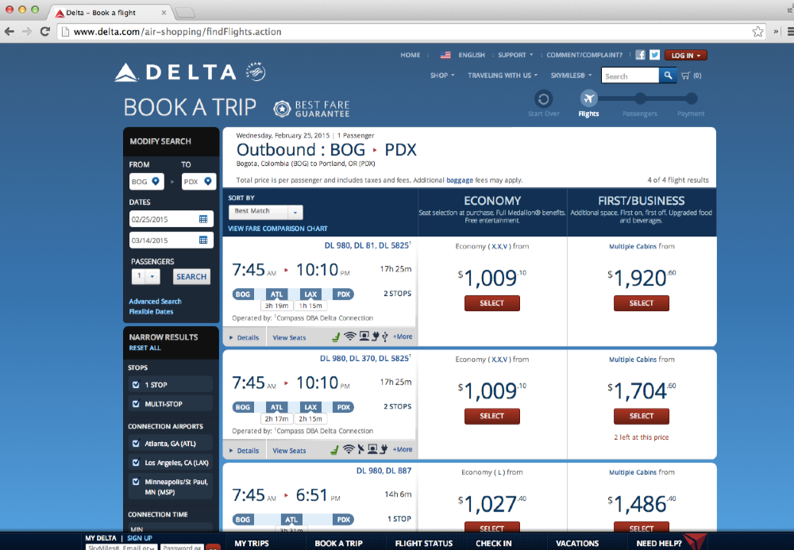

# Driving our application state through the URL

In JSConf EU 2013, [Tom Dale](https://twitter.com/tomdale) gave a talk
called
[Stop Breaking the Web](http://2013.jsconf.eu/speakers/tom-dale-stop-breaking-the-web.html).

Tom talks about the importance of the URL and how we should give it a
higher priority in our applications. Ideally, the URL should be able to
reflect our application state in such a way that we can easily reference it, bookmark it, or share it with others.

Some of us have probably experienced some frustration when
visiting a website that has search functionality but
loses our selections between page reloads, or that doesn't allow us to easily share
what we see with others.

Airline websites offer an example of this issue. The following image shows
Delta's website after searching for flights to the next EmberConf.

The URL after the search is
http://www.delta.com/air-shopping/findFlights.action, which doesn't
really tell us anything about the screen we are visiting. If we copy
and paste the URL in another browser, we'll get a bunch of
errors and not the search we originally performed.

Now let's do a search on [hipmunk](https://www.hipmunk.com). This website places greater
value on the functionality of the URL.

The search above results in the following:
[flights/MDE-to-PDX#!dates=Aug23,Aug31&pax=1](https://www.hipmunk.com/flights/MDE-to-PDX#!dates=Aug23,Aug31&pax=1).
Isn't that beautiful? Just by reading the URL, we know our destination
and the dates of our trip. Clicking the URL takes us
to the original search we see in the image. Suppose we want someone to
buy the ticket for us; we can simply share the URL and be done with it.

Ember also appreciates the beauty of a functional URL. In fact, our
applications are driven by URLs that we specify in **app/router.js**.
This doesn't mean we are immune from building bad applications that don't
respect the URL, but at least it gives us the tools to avoid these
issues and invites us to think better about our URLs.

## Sorting friends.

When visiting the friends index, we want to be able to sort them by
clicking on the **Name** or **Articles** column and then toggle
ascending or descending between clicks.

We'll add 2 properties to our friends index controller: **sortBy** and
**sortAscending**.

To change our sort field dynamically, we will create a function
`setSortBy` that will receive as parameter the field we want to sort
our properties by.

We'll also toggle the property `sortAscending` every time we call the
action `setSortBy`. For example, if it's `true` then it becomes
`false` and vice versa.

{title="app/controllers/friends/index.js", lang="JavaScript"}
~~~~~~~~
import Ember from 'ember';

export default Ember.Controller.extend({
  sortAscending: true,
  //
  // We'll use sortBy to hold the name of the field we want to sort by.
  //
  sortBy: 'first-name',
  //
  // The setSortBy function receives the name of the function and
  // toggle `sortAscending`. The function `toggleProperty`  comes from the
  // [Observable Mixin](http://emberjs.com/api/classes/Ember.Observable.html)
  // it switches a boolean property between false and true.
  //
  setSortBy: function(fieldName) {
    this.set('sortBy', fieldName);
    this.toggleProperty('sortAscending');

    console.log('Sorting by ', fieldName);
    console.log('Sorting Asc?: ', this.get('sortAscending'));

    return false;
  },
  actions: {
    delete(friend) {
      friend.destroyRecord();
    }
  }
});
~~~~~~~~

Now we need to call the `setSortBy` action in the
**app/templates/friends/index.hbs**

{title="app/templates/friends/index.hbs", lang="handlebars"}
~~~~~~~~
<table class="mt3 fit">
  <thead class="p1 h2">
    <tr class="white bg-blue">
      <th {{action setSortBy "first-name"}}> Name</th>
      <th></th>
    </tr>
  </thead>
  <tbody class="p1 h3">
    {{#each model as |friend|}}
      <tr>
        <td class="border-bottom">
          {{link-to friend.fullName "loans" friend}}
        </td>
        <td class="border-bottom">
          <a href="#" {{action "delete" friend}}>Delete</a>
        </td>
      </tr>
    {{/each}}
  </tbody>
</table>
~~~~~~~~

Let us add add some CSS so we have a cursor on the name column:

{title="app/styles/app.css", lang="CSS"}
~~~~~~~~
[data-ember-action] {
  cursor: pointer;
}
~~~~~~~~

Now if we go to http://localhost:4200/friends and click on **Name**,
we'll see that our action is being fired and something like the
following logged to the browser's console:

~~~~~~~~
Sorting by  first-name
Sorting Asc?:  false
Sorting by  totalArticles
Sorting Asc?:  true
~~~~~~~~

But our list is not changing and we don't see the URL changing either,
we need to refresh our model every time those values change and also
the URL. To achieve this we'll use a useful feature called [Query
Parameters](http://emberjs.com/guides/routing/query-params/) that
allows us to persist application state in the URL as parameters,
generating URLs like `/friends?sort=first-name`.

## Query Parameters

To use query parameters we need to specify a property called
`queryParams` in the controller associated with this route, and then
list every property that should persist as query parameter.

In our scenario we'll modify the controller as follows:

{title="app/controllers/friends/index.js", lang="JavaScript"}
~~~~~~~~
import Ember from 'ember';

export default Ember.Controller.extend({
  queryParams: ['sortBy', 'sortAscending'],
  sortAscending: true,
  sortBy: 'first-name',
  // ...
~~~~~~~~

If we visit http://localhost:4200/friends the URL won't have any
query parameters, but as soon as we click any of the headers the query
parameters will change. Query parameters are only included when
the default value for the property changes. In our case, that would be
when `sortAscending` changes to something different from `true` and
`sortBy` to something different from `first-name`.

Now we can refresh the browser or copy the URL into a new tab and
we'll see the same query parameters, but the data is still not
changing, we'll see how to fix that shortly.

We can also use query params with the `link-to` helper. If we want
a link to the friends index sorted by `first-name`, we can write it
like this: `{{#link-to 'friends' (query-params
sortBy="first-name")}}Friends{{/link-to}}`

## Refreshing the model when query parameters changes

By default the model hook won't be called if any of the query
parameters change, but there are scenarios where this can be the
desired behavior. For example, when we are using pagination, or if we
want to do server side sorting, under that scenario we'll ask the API
for the users sorted by a given field in ascending or descending
order.

Let's use the query parameters to change our friends order, since our
JSONAPI supports `sort`, we can have the route make a
full transition when any of the `queryParams` change. To do this,
we'll need to specify a property in the route called `queryParams`
where we explicitly mark the parameters that we want to cause a full
transition.

{title="app/routes/friends/index.js", , lang="JavaScript"}
~~~~~~~~
import Ember from 'ember';

export default Ember.Route.extend({
  queryParams: {
    sortBy: {
      refreshModel: true
    },
    sortAscending: {
      refreshModel: true
    }
  },
  model(params) {
    //
    // We use now store.query and pass include in the options
    //

    let query = { include: 'loans,loans.article' };

    // We check if this value is passed
    if (params.sortBy) {
      query.sort = params.sortBy;

      // If sortBy is passed we check if sortAscending is false,
      // and use the JSONAPI syntax for descending sort
      // http://jsonapi.org/format/#fetching-sorting
      //
      if (!params.sortAscending) {
        query.sort = `-${query.sort}`;
      }
    }
    return this.store.query('friend', query);
  }
});
~~~~~~~~

Now every time we change `sortBy` or `sortAscending`, the model hook
for **app/routes/friends/index.js** will be called, making a request
to the API similar to the following and our friends list will be
updated accordingly:

~~~~~~~~
/friend?sort=first-name
~~~~~~~~

## Further Reading

Query parameters is one of the best documented features on Ember. We
recommend the official guide for more information: [http://emberjs.com/guides/routing/query-params/](https://guides.emberjs.com/v2.6.0/routing/query-params/).
